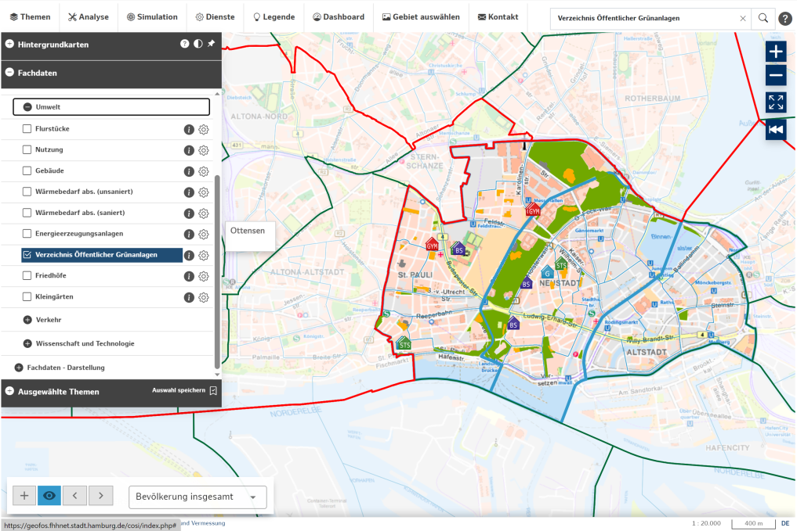
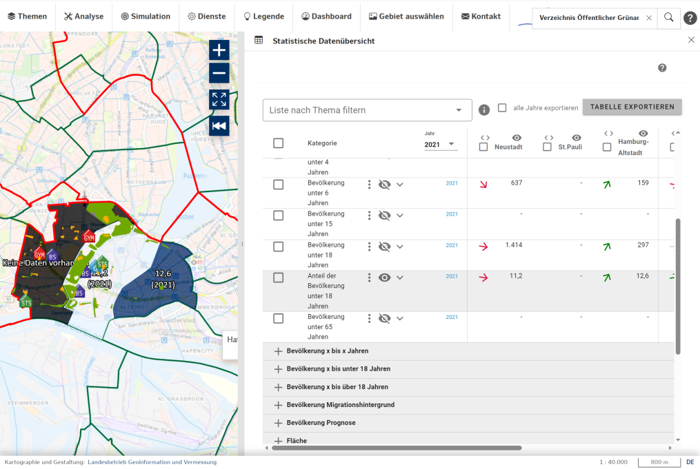
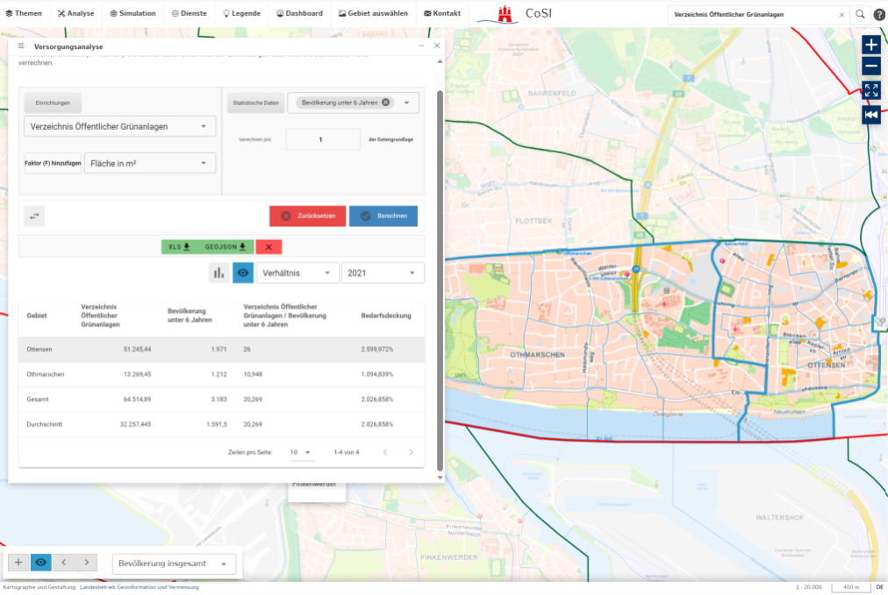
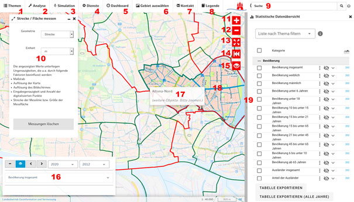
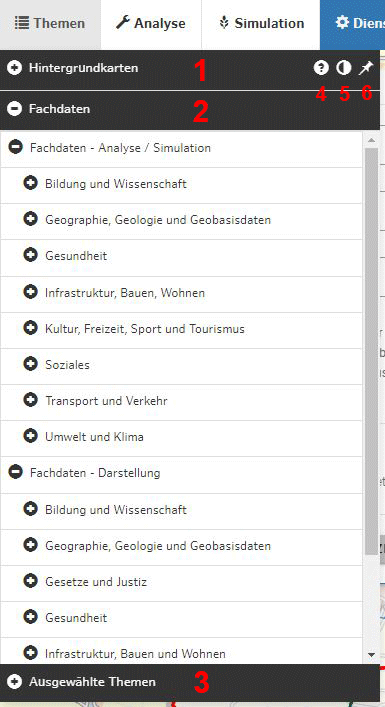
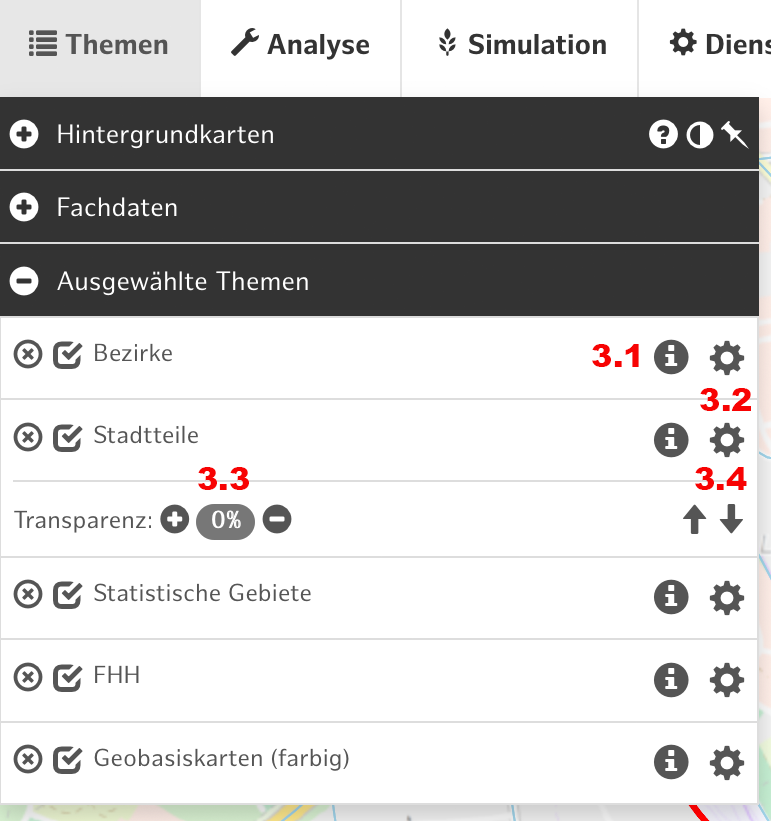
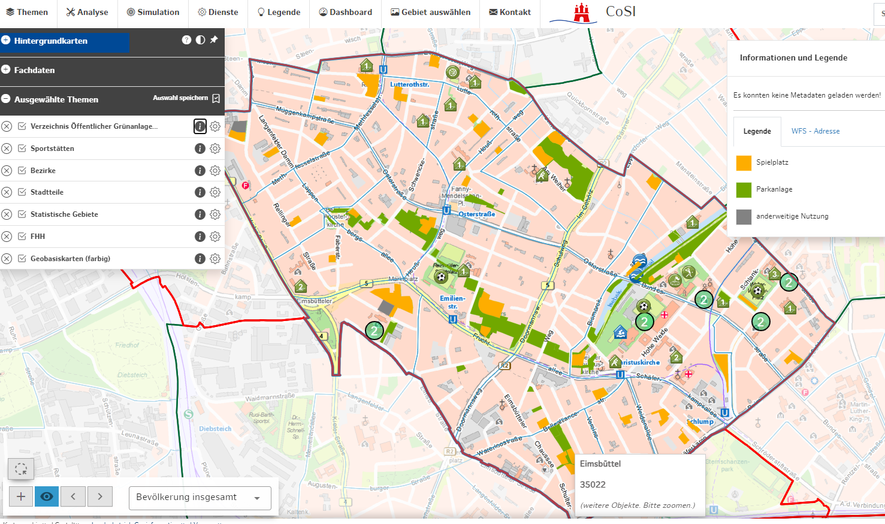

# **CoSI** 
## Cockpit Städtische Infrastrukturen
#### GIS + datenbasierte Analyse- und Planungstools in der Hamburger Stadtverwaltung
___

___

### Nutzerhandbuch

**3. Phase**   
**Version 1.3.0**  

___
### Projektmitarbeiter und -mitarbeiterinnen CoSI I bis III
___

- Alexandra Knapke, HafenCity Universität Hamburg
- Antje Widmayer, BA Hamburg-Nord
- Bertram Hillmann, a3rtgm GbR
- Christian Bähnisch, HiTec e.V.
- Daniel Schulz, HafenCity Universität Hamburg
- Dennis Rupnow, HiTec e.V.
- Feng Feng, LGV Hamburg
- Gabriela Gabbert, BA Hamburg-Nord
- Prof. Dr. Gesa Ziemer, HafenCity Universität Hamburg
- Hendrik Landgrebe, BA Hamburg-Nord
- Ingo Bruns, BA Hamburg-Nord
- Jannes Süpke, Senatskanzlei Hamburg, ITD
- Johanna Fischer, HafenCity Universität Hamburg
- Nicola Stradtmann, HafenCity Universität Hamburg
- Nihal Hegde, HafenCity Universität Hamburg
- Ogeigha Koroyin, HiTec e.V. 
- Paul Linnow, HafenCity Universität Hamburg
- Peter Duensing, Senatskanzlei Hamburg, ITD
- Sebastian Duden, LGV Hamburg
- Till Wewer, Senatskanzlei Hamburg, ITD
- Yuxiang Zhang, HafenCity Universität Hamburg  

### Stand
09/23

### Keywords
GIS, Dashboard, Data Driven Urban Planning, Social Infrastructure, Urban Data Platform, Data Visualization, Planning Support Tools, Demand Driven Decision Making  

___
## Zusammenfassung
___

Bei der Planung städtischer und sozialer Infrastruktur sind Entscheidungsprozesse in der öffentlichen Verwaltung häufig durch langwierige Verfahren und eine fragmentierte Datengrundlage charakterisiert. D.h. Bedarfe werden teilweise  spät erkannt, oder die Konkretisierung der Planung verzögert sich durch das aufwendige Beschaffen von strukturierten Informationen.\
Das vorliegende Handbuch beschreibt das *Cockpit Städtische Infrastrukturen* für Hamburg als digitales Analyse- und Planungswerkzeug, welches mithilfe eines leicht zugänglichen User-Interface statistische und georeferenzierte Daten bündelt, visualisiert und integriert, um Planungsbedarfe zu identifizieren und Planungsprozesse zu beschleunigen.  
  
Dazu wurden die durch die *Urban Data Platform* der Stadt Hamburg aufgebauten Datenbankstrukturen und die Funktionalität des Masterportals genutzt, um eine kartenbasierte Webapplikation zu etablieren, welche den Quartiersplanenden der Stadt eine Reihe von Analysefunktionen zur Verfügung stellt, um auf der Verwaltungsebene der statistischen Gebiete soziodemographische Zusammenhänge zu identifizieren, Trends zu erkennen sowie Verhältnisse zwischen dem existierenden Infrastrukturangebot und den relevanten Zielgruppen zu ermitteln. Das Werkzeug soll im Folgenden helfen, Standorte und Potentiale für die Entwicklung von Infrastruktur zu finden. Die Ergebnisse dieser Analysen können direkt aus CoSI heraus visualisiert und als Entscheidungs- und Diskussionsgrundlage verwendet werden. Der Workflow folgt dabei einer dreistufigen Logik von der *Visualisierung* von Daten, über die *Analyse*, also der kontextuellen Verknüpfung von Information, bis zur *Simulation* von Maßnahmen und Ableitung ihrer  Auswirkungen.  
  
Um die technischen und inhaltlichen Anforderungen des Initialisierungs-Projekts aufzustellen, wurden im Vorfeld ab Sommer 2018 eine Reihe von Stakeholder- und Userstory-Workshops mit den Mitgliedern der Hamburger Verwaltung auf verschiedenen Ebenen durchgeführt. 

CoSI wurde dann von Juni 2019 bis September 2023 in den Projekten CoSI I bis III in einem agilen Verfahren, basierend auf der SCRUM-Methode, durch ein interdisziplinäres Team der HCU Hamburg und des LGV Hamburg entwickelt. Nutzerinnen und Nutzer waren dabei von Beginn an über die AG CoSI einbezogen und konnten den jeweils neuesten Entwicklungsstand im Arbeitsalltag evaluieren, so dass aktuelle Anforderungen an Funktionen und Daten fortlaufend in die Planung der Sprints eingegangen sind. Ab Mitte 2020 wurde das Verfahren in den Produktivbetrieb überführt. Seitdem steht allen berechtigt interessierten Mitarbeiterinnen und Mitarbeitern innerhalb der FHH – im Sommer 2023 waren es über 1500 - eine fortlaufend aktualisierte Produktivversion von CoSI zur Verfügung. 

Datenbedarfe aus der AG CoSI und von den Nutzenden der Produktivversion werden fortlaufend erfasst und an den Urban Data Hub des LGV übergeben, Datenverantwortliche lokalisiert und die Datenbestände unter Berücksichtigung potenzieller Datenschutzrichtlinien öffentlich oder FHH-intern über die Urban Data Platform (UDP) zur Verfügung gestellt.
Es werden auch Integrationsmöglichkeiten für das Tool in die tägliche Arbeit von Behörden und Fachämtern eruiert. Die CoSI-Projekte haben diese Informationen gebündelt, in Workshops mit der AG CoSI und Anwendenden vertiefte Funktionskonzepte erarbeitet und diese in den Themenbereichen Visualisierung, Analyse und Simulation integriert. So wurde ein Planungs-, Kollaborations- und Kommunikationstool entwickelt, welches konzeptuell auf viele weitere Themenbereiche angewendet werden kann.

Diese Weiterentwicklung von CoSI und den zu Grunde liegenden Datenbeständen im Urban Data Portal in enger Zusammenarbeit mit den Nutzenden soll auch nach den Projekten CoSI I bis III fortgeführt werden. Dazu ist im Lebenslagenmanagement der BWFGB eine moderne fachliche Leitstelle geplant.
  

___
## Inhalt
___
- CoSI: Cockpit Städtische Infrakstrukturen
  - [Datenmodell und Infrastruktur](#datenmodell-und-infrastruktur)
  - [Module](#module)
   - [Themen (Layer)](#themen-layer)
   - [Analyse](#analyse)
      - [Einwohnerabfrage](#einwohnerabfrage)
      - [Erreichbarkeitsanalyse](#erreichbarkeitsanalyse)
         - [Erreichbarkeit ab einem Referenzpunkt](#erreichbarkeit-ab-einem-referenzpunkt)
         - [Erreichbarkeit im Gebiet](#erreichbarkeit-im-gebiet)
         - [Erreichbarkeit entlang einer Route](#erreichbarkeit-entlang-einer-route)
      - [Vergleichbare Gebiete ermitteln](#vergleichbare-gebiete-ermitteln)
      - [Filter](#filter)
      - [Versorgungsanalyse](#versorgungsanalyse)
      - [DIPAS](#dipas)
      - [Graphenvisualisierung](#graphenvisualisierung)
    - [Simulation](#simulation)
      - [Einrichtungen anlegen](#einrichtungen-anlegen)
      - [Einrichtungen bearbeiten](#einrichtungen-bearbeiten)
      - [Wohnungsbauquartiere anlegen](#wohnquartiere-anlegen)
    - [Dienste](#dienste)
      - [Geodaten Importieren](#geodaten-importieren)
      - [Sitzung Speichern/Laden](#sitzung-speichern-und-laden)
      - [Vorlagen](#vorlagen)
    - Dashboard
      - [Statistische Datenübersicht](#statistische-datenuebersicht)
      - [Einrichtungsübersicht](#einrichtungsuebersicht)
    - [Gebietsauswahl](#gebietsauswahl)
    - [Kartenanalyse regionalstatistischer Daten](#kartenanalyse-regionalstatistischer-daten)
    - [Ergebnisverzeichnis](#ergebnisverzeichnis)
    - [Manuelle Flächenauswahl](#manuelleflaechenauswahl)
    - [Auswahlmanager](#auswahlmanager)
    - [Flächen stylen](#flaechen-stylen)

___
## Datenmodell und Infrastruktur
___
  
CoSI ermöglicht ganz ähnlich wie der FHH-Atlas die Anzeige verschiedener Fachdaten unterschiedlicher Behörden und Ämter in der Karte, wie z.B. dem digitalen Grünplan (BUKEA) oder den Öffentlichen Schulen (BSB).

*Abb. a: Anzeige von Themen auf der Karte wie im FHH-Atlas.*

Als wesentliche Erweiterung können zudem regionalstatistische Daten des Statistikamts Nord für statistische Gebiete, Stadtteile, Bezirke oder ganz Hamburg angezeigt werden.

*Abb. b: Anzeige statistischer Daten auf der Karte und im Dashboard.*

Die Daten werden aber nicht nur in Karte und Tabelle nebeneinander dargestellt, sondern können mit CoSIs Analysefunktionen analysiert und in Beziehung gesetzt werden, indem z.B. ein sozialräumliches Angebot wie Spielplätze, gemessen als Spielplatzfläche in Quadratmetern, mit dem Bedarf der Bevölkerung, gemessen als Anzahl der Kinder z.B. unter 6 Jahren, in der Versorgungsanalyse ausgewertet werden können.

*Abb. c: Analysefunktionen, hier Versorgungsanalyse.*

Darüber hinaus erlaubt CoSI, in die Datensätze “einzugreifen”: sie zu filtern, zu durchsuchen oder für die Darstellung von Planungsszenarien im laufenden Programm zu verändern (s. Simulation).

### Regionalstatistische Daten
Die Daten des StaNord liegen für alle Verwaltungsebenen der FHH (statistische Gebieten, Stadtteile, Bezirke und die Gesamtstadt) vor. Sie umfassen je nach Ebene über 120 Indikatoren, welche sich in folgende Kategorien gliedern:  

   - Bevölkerung
   - Bevölkerung ab x Jahren
   - Bevölkerung unter x Jahren
   - Bevölkerung x bis x Jahren
   - Bevölkerung x bis unter 18 Jahren
   - Bevölkerung x bis über 18 Jahren
   - Bevölkerung Migrationshintergrund
   - Fläche
   - Haushalte
   - Sozialversicherungspflichtige
   - Arbeitslose
   - SGB II Leistungen
   - Grundsicherung im Alter
   - Wohnen
   - Wahlbeteiligung
   - Verkehr
   - Infrastruktur
   - Bevölkerungsbewegung

Diese Datensätze beinhalten Zeitreihen, welche je nach Datensatz von ca. 2012 an erfasst sind und jährlich erweitert werden.

*Hinweis: Aus datenschutzrechtlichen Gründen werden bereits vom Datenbereitsteller solche Datensätze herausgefiltert, welche bei sensiblen Daten auf einzelne Individuen zurückverfolgbar wären. Diese Datensätze sind mit "–" oder mit "Keine Daten" ausgewiesen.*

### Fachdaten
CoSI bietet ganz ähnlich wie der FHH-Atlas Fachdatensätze in einem Themenbaum an. Während der FHH-Atlas grundsätzlich alle auf der Urban Data Platform verfügbaren und innerhalb der FHH freigegebenen Datensätze anzeigt, wird für CoSI in Abstimmung mit der Nutzendengruppe AG CoSI eine Auswahl getroffen. Dies dient der Übersicht und ermöglicht den Test und ggf. die Anpassung der Analysefunktionen an die angebotenen Daten.

Die Fachdatensätze, welche derzeit in CoSI eingebunden sind oder zukünftig noch eingebunden werden, werden als Geodienste von unterschiedlichsten Dateneignern (dies sind vor allem Behörden und Bezirksämter, aber prinzipiell sind auch Vereine oder Privatunternehmen denkbar.) bereitgestellt und in CoSI, wie im FHH-Atlas, über die URL des jeweiligen Dienstes abgerufen. Viele der Datensätze in ihrer aufbereiteten Form sind aus den Verhandlungs- und Koordinationsprozessen des Urban Data Hub hervorgegangen, über den sich die Behörden und Datenhalter der FHH auf gemeinsame Standards und regelmäßige Veröffentlichungen verständigen.

### Prognosedaten
Die Prognosedaten enthalten die prognostizierte jährliche Bevölkerungsentwicklung in den Stadtteilen Hamburgs nach vier Altersgruppen und Geschlecht bis zum Jahr 2035. Stichtag ist jeweils der 31.12.

Aus Gründen der statistischen Geheimhaltung der zugrunde liegenden Ausgangsdaten werden die vier kleinsten Stadtteile Hamburgs nur in Kombination mit einem größeren angrenzenden Stadtteil ausgewiesen.

Die Einzeldaten sind jeweils auf volle fünf gerundet.
Die Daten werden auf unregelmäßiger Basis vom Statistikamt Nord herausgegeben.

### Analyse
Analysedaten sind all jene (als WFS, s. Geodienste) eingebundenen Datensätze, welche für die Verwendung mit den CoSI-Analyse- (und in Zukunft Simulations-) Werkzeugen konfiguriert wurden. D.h. jedes Objekt (Feature, z.B. Kita oder Grünfläche) ist dabei einzeln hinterlegt und kann mit seiner geografischen Position und Ausdehnung betrachtet werden.

### Darstellung
Darstellungsdaten sind auf Absprache mit den Fachplanerinnen und Fachplanern ausgewählte Datensätze aus dem FHH-Netz, welche durch das zugrundeliegende Geoportal (Masterportal) in der Karte visualisiert und mit einer Legende versehen werden. Per Klick kann der Datensatz für die jeweilige Koordinate aus dem Datensatz abgerufen werden. Im Gegensatz zu den Analysedaten liegen die Darstellungsdaten gegenwärtig nicht als einzelne Objekte, sondern als gekacheltes/gerastertes Bild vor (WMS, s. Geodienste).

### Geodienste
Alle in CoSI und dem FHH-Atlas dargestellten Daten werden von den Bereitstellern als Dienst vorgehalten. Der Dienst liefert über eine URL Datensätze der jeweiligen Datenbank in einem maschinenlesbaren Format. Über zusätzliche Parameter kann die Anfrage (Request) spezifiziert oder (z.B. auf einen geografischen Ausschnitt) eingegrenzt werden. 

### WMS
Ein WMS (Web Map Service) liefert Geodaten / Karten als Rasterbilder (PNG), welche zunächst einmal ohne Hintergrundinformation in der Karte angezeigt werden. Gleichzeitig können die Legende des Datensatzes oder Informationen zu einer bestimmten Koordinate über weitere Requests abgerufen werden.

### WFS
Der WFS (Web Feature Service) liefert im Gegensatz zum WMS keine fertige Kartenansicht, sondern ein rohes Datenobjekt, bei dem der Datensatz jedes geografischen Objekts (Punkt, Linie, Fläche, etc.) inkl. seiner Attribute (z.B. eine Schule mitsamt ihrem Schultyp, ihrer Schülerzahl, Mailadresse und Nachmittagsangebot) einzeln übermittelt wird. Die Visualisierung (das Styling) der Daten erfolgt dann anhand vorgegebener oder mitgelieferter Konfigurationen innerhalb der Applikation. Dies ist rechenintensiver für den Anwendenden und weniger kontrollierbar von Seiten des Datenbereitstellers, bietet jedoch die Möglichkeit mit den Objekten innerhalb des Portals direkt zu interagieren oder sie zu verändern.  

___
## Module
___
### Überblick 
CoSI bietet verschiedene Module (nachfolgend oft auch als "Werkzeuge" oder "Tools" bezeichnet") an, die bestimmte Funktionen zur Erstellung, Verwaltung und Analyse von Daten bereitstellen. Nachfolgend finden Sie die Übersicht über alle im UI zur Verfügung stehenden Funktionen:

*Abb. d: Das CoSI User-Interface.*

1. **Themenbau/ Layer** (s. Themen)
2. **Analyse**
      1. [Manuelle Flächenauswahl für Fachdaten](./021manuelleflaechenauswahl)
      2. [Einwohnerabfrage](./002einwohnerabfrage)
      3. [Erreichbarkeitsanalyse](./003erreichbarkeitsanalyse)
      4. [Vergleichbare Gebiete ermitteln](./004vergleichbaregebieteermitteln)
      5. [Filter](./005filter)
      6. Strecke/ Fläche messen
      7. [Versorgungsanalyse](./006versorgungsanalyse)
      8. [DIPAS](./007dipas)
      9. [Datenvisualisierung](./008graphenvisualisierung)

3. **Simulation**
      1. [Einrichtungen anlegen](./009einrichtungenanlegen)
      2. [Einrichtungen bearbeiten](./010einrichtungenbearbeiten)
      2. [Wohnungsbauquartiere anlegen](./011wohnquartiereanlegen)

4. **Dienste**
      1. Zeichnen/ Schreiben
      2. Karte drucken
      3. Mousehover ein-/ ausschalten
      4. [Geodaten Importieren](./013geodatenimportieren)
      5. WMS hinzufügen
      6. [Sitzung speichern/laden](./014sitzungspeichern)
      7. [Vorlagen](./015vorlagen)

5. **Dashboard**
      1. [Statistische Datenübersicht](./016statistischedatenuebersicht)
      2. [Einrichtungsübersicht](./017einrichtungsuebersicht)
6. **[Gebiete auswählen](./018gebietsauswahl)**
7. **Kontaktformular**
8. **Legende** (s. Legende)
9. **Suchleiste**
10. **Werkzeugfenster**
   > Aktive Werkzeuge werden in verschiebbaren Fenstern angezeigt.
11. **Hereinzoomen**
12. **Herauszoomen**
13. **Vollbildansicht aktivieren/ deaktivieren**
14. **Zurück zur Startansicht**
15. **[Kartenanalyse regionalstatistischer Daten](./019kartenvisualisierung)**
16. **Tooltip** (sog. Mousehover)
   > Zeigt das Gebiet und andere Elemente wie Tooltipps unter dem Mauszeiger an. Kann unter "Dienste" via "Mousehover ein-/ausschalten" deaktiviert werden.
18. **Ausgewählte Gebiete**
   > Ausgewählte Gebiete werden dargestellt mit einer blauen Umrandung.
19. **Sidebar**
   > Das Dashboard und der Filter werden in einer Sidebar angezeigt. Die Sidebar kann in ihrer Breite angepasst werden. (s. Dashboard)

### Themen (Layer)
___
Layer können aus dem Reiter "Themen" jederzeit zugeschaltet oder ausgeschaltet werden. Die Themen sind unter dem Reiter Fachdaten sortiert. Beim Zuschalten sollte mit bedacht werden, dass sich Ladezeiten entsprechend verlängern können. Verzögerungen können vorkommen, wenn zu Beginn kein Planungsgebiet festgelegt wurde. Dann müssen die Daten für das gesamte Hamburger Gebiet geladen werden. 

Der Themenbaum ist gegliedert in Hintergrundkarten, einen Katalog an Fachdaten und die aktuelle Auswahl an Kartenebenen.

*Abb. e: Der Themenbaum.*

Öffnen Sie mit dem Plus die Übersicht der Themenkategorie oder minimieren sie die Ansicht wieder mit dem Minus.

1. **Hintergrundkarten**
   > Layer wie "Stadtkarte Hamburg", die als Standard automatisch aktiv sind, können auch deaktiviert werden. Die Hintergrundkarten orientieren sich am FHH Portal. Achtung beim An- und Ausschalten der Karten. Kartenlayer können andere Layer überlagern. Ihre Anzeige ist daher abhängig von der Reihenfolge der Aktivierung. Die Anordnung kann in "Ausgewählten Themen" noch nachträglich verändert und angepasst werden.
2. **Fachdaten**  
	 - **Analyse/Simulation**
      > Die aufbereiteten Layer für CoSI-spezifische Werkzeuge (bereitgestellt als WFS, s. Glossar). Die einzelnen Datenlayer sind in Kategorien eingeteilt, die regelmäßig angepasst bzw. aktualisiert werden.
	 - **Darstellung**
      > Daten zur reinen "Anzeige" in der Karte, v.a. entnommen aus dem FHH Atlas (bereitgestellt als WMS).
3. **Ausgewählte Themen**  
   > Siehe nachfolgende Abbildung.
4. **Hilfe-Button**
   > Ruft diese Anleitung auf.
5. **Kartenhintergrund**
   > Hier können Sie für den Kartenhintergrund grau oder weiß auswählen.
6. **Themenbaum fixieren/ lösen**
   > Diese Funktion fixiert den Themenbaum, so dass er auch bei Interaktionen mit der Karte angezeigt bleibt.
   
   **Ausgewählte Themen**  
      
      *Abb.f: Ausgewählte Themen.*  
      - **3.1 Informationen und Legenden**
      - **3.2 Einstellungen**  
         Über das Zahnrad öffnen sich Einstellungen für Transparenz und Ebene verschieben.
      - **3.3 Transparenz**  
         Die Transparenz lässt sich über Plus in Prozent erhöhen und über Minus verringern.
      - **3.4 Ebene nach oben/unten**  
         Über das Pfeilmenü kann die Ebene der Layer verschoben werden.

Die Themen enthalten Informationen, die symbolisch oder durch Flächen auf der Karte dargestellt werden. In der nachfolgenden Abbildung zum Beispiel stellen die grün/blauen Punkte und Icons die vorhandenen Sportstätten im Gebiet dar. Die gelben und grünen Flächen stammen aus dem Verzeichnis öffentlicher Grünanlagen. Nummerierte Punkte zeigen die Anzahl der an diesem Ort vorhandenen Einrichtungen an, wenn sich Punkte überschneiden.
Eine Legende zu den aktiven Themen kann durch einen Klick auf den Reiter "Legende" eingeblendet werden. Unabhängig davon können über den Infobutton rechts neben dem Layer weitere Informationen zu dem jeweiligen Thema aufgerufen werden. Es werden folgende Informationen bereitgestellt: Kurzbeschreibung des Themas, Datenstand und Legende. Auch befinden sich hinter dem Info-Button die Links zu Downloadquellen und eine WFS - bzw. WMF -Adresse.
Ein Klick auf ein Objekt auf der Karte öffnet eine Infotafel für die aktuelle Auswahl (Sportstätte, Grünanlage, etc.). Auf der Infotafel werden Informationen über das Objekt angezeigt. Datenschutzrelevante (personenbezogene) Daten werden nicht angezeigt.

*Abb. g: Beispiel für Kartenansicht.*

