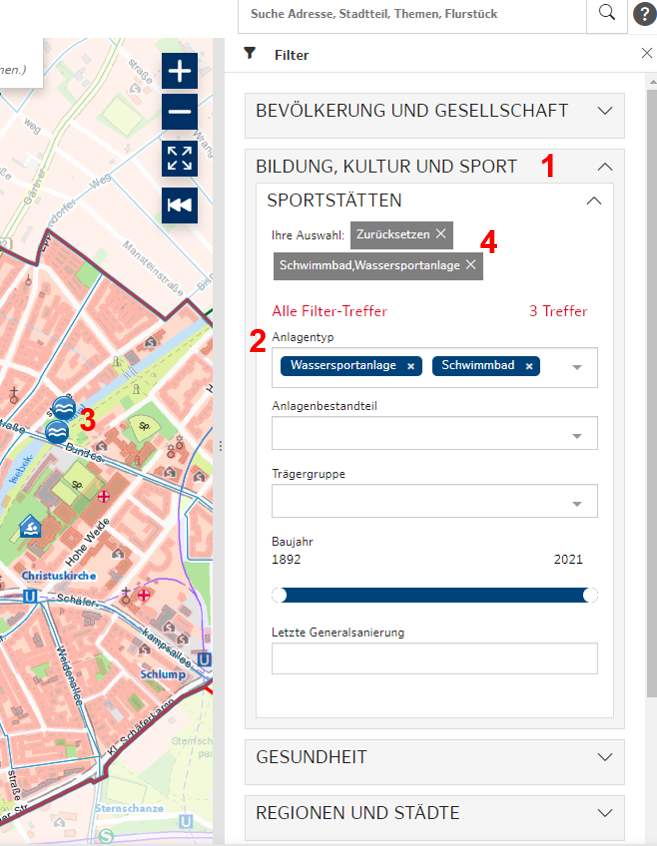

## Filter
___
Die aktiven, ausgewählten Themen können durch Klick auf den Reiter "Filter" nach den Kategorien ihrer Datensätze durchsucht und gefiltert werden. Die Karte zoomt automatisch auf die Filterergebnisse. Es werden nur Ergebnisse in den ausgewählten Gebieten einbezogen. Der Filter ist für alle Fachdatensätze verfügbar, welche sinnvolle filterbare Attribute (wie Fläche, Nutzung, Träger, etc.) aufweisen.  

Um Ihre gewünschten Fachdaten zu filtern, gehen Sie zunächst auf "Analyse" und dann auf "Filter".

*Abb.: Filter.*  

1. **Ein Thema im Filter wählen**
   > Angezeigt werden die ausgewählten Themen wie im Themenbaum. Themen können jederzeit hinzugefügt werden. Dazu Themenbaum im Filter aufklappen und Thema auswählen.
2. **Filteroptionen:**
    - es können mehrere Filteroptionen gewählt werden. Abhängig sind diese von den Inhalten der Datensätze. Kennzeichnung der Auswahl erfolgt durch die Anzeige als dunkelblauer Tag. 
    - Schieberegler (von / bis): es kann z.B. eine gewünschte Jahreszahl/Flächengröße eingegeben werden.
3. **Ergebnis wird sofort mit Wahl der Filteroption angezeigt:**
    - Ergebnis wird in der Karte durch Symbol oder Flächenfarbe angezeigt.
    - Im Ergebnisfeld der Suche werden Namen der Gebiete / Einrichtungen angezeigt. Durch Anklicken der Namen wird die Auswahl in der Karte markiert. 
4. **Filter löschen:** 
   > Einzelne Themen werden durch Anklicken des "X" gelöscht. Die gesamte Auswahl im Thema wird durch Anklicken des Buttons "Zurücksetzen” entfernt.
   > Einzelne Filtervariablen können über das "x" and den dunkelblauen Tags wieder ausgeschaltet werden.
   

