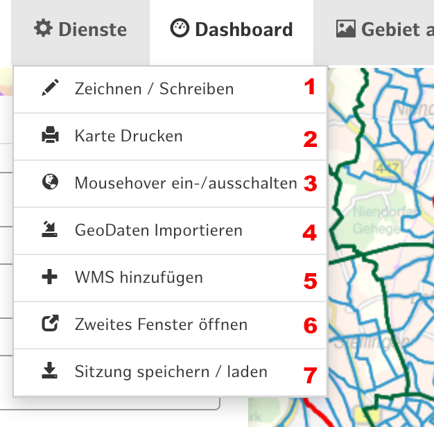

___
## Dienste
### Werkzeuge des Dienstemenüs
___

*Abb. a: Dropdown Dienste.*

1. **Zeichnen/ Schreiben**
2. **Karte drucken**
   > Den aktuellen Kartenausschnitt inkl. aktiver Layer drucken.
3. **Mousehover ein-/ ausschalten**
   > Den Tooltip, der am Mauszeiger in der Karte eingeblendet wird (de-)aktivieren
4. **[Geodaten Importieren](./013geodatenimportieren.md)**
5. **WMS hinzufügen**
   > Beliebige andere Kartendienste können aus dem FHH-Atlas oder anderen Quellen über die Webadresse (URL) des Dienstes eingebunden werden. Die URLs entnehmen Sie z.B. dem Metadatenkatalog der FHH oder dem Geoportal unter dem Info-Button im Themenbaum (s. Themenbaum).
6. **[Sitzung speichen / laden](./014sitzungspeichern.md)**
   > Die aktuelle Sitzung mit aktiven Daten, gewählten Gebieten und Filtern speichern. Sitzungen können im Browser gespeichert werden. Diese können beim Programmstart wieder aus dem Verlauf geladen werden.
   Wenn Browserverlauf oder Cache geleert werden, geht dieser Speicherstand verloren! Es kann immer nur eine Sitzung parallel vorgehalten werden.   
   Sitzungen als Datei auf dem Rechner speichern. Diese können jederzeit wieder geladen oder mit anderen CoSI Nutzer:innen geteilt werden.
7. **[Vorlagen](./015vorlagen.md)**

   >*Hinweis: Manuell hinzugefügte Kartendienste (WMS) und erstellte Berechnungen bleiben nicht erhalten. Das Speichern aller Arbeitsergebnisse ist Teil des aktuell laufenden Weiterentwicklungsprojekts.*

