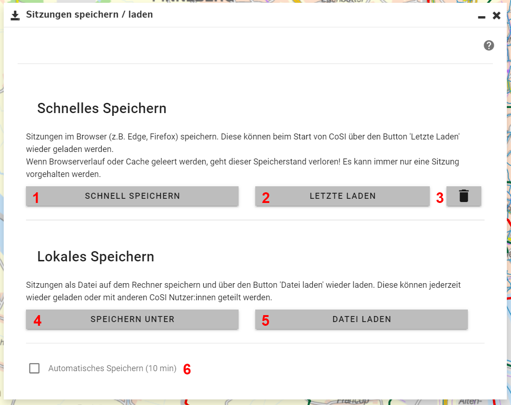

### Sitzung Speichern / Laden 

*Abb.: Sitzung speichern / laden*

Mit dem Dienst **Sitzung speichern/laden** können aktuelle diverse Informationen der aktuellen Arbeitssitzung abgespeichert werden um diese zu einem späteren Zeitpunkt wieder öffnen und weiterbearbeiten zu können. Dies umfasst:

- Die ausgewählte Verwaltungsebene und ausgewählte Gebiete
- Aktive Fachdatenthemen 
- Mit den [Simulationswerkzeugen](009einrichtungenanlegen.md) erstellte Szenarien 
- Ergebnisse und Konfigurationen der Werkzeuge [Erreichbarkeitsanalyse](003erreichbarkeitsanalyse.md) und [Versorgungsanalyse](006versorgungsanalyse.md)

Die Funktion ist unter "Dienste", "Sitzung speichern/laden" zu finden.

1. **Schnell speichern**
   > Aktuelle Sitzung im Browser (z.B. Edge, Firefox) speichern. Diese können beim Start von CoSI über den Button **Letzte Laden** wieder geladen werden. Wenn Browserverlauf oder Cache geleert werden, geht dieser Speicherstand verloren! Es kann immer nur eine Sitzung vorgehalten werden.
2. **Letzte laden**
   > Letzte im Browser gespeicherte Sitzung aus dem Cache laden
3. **Letzte löschen**
   > Letzte Sitzung aus dem Cache löschen
4. **Speichern unter**
   > Eine Sitzung benennen und als Datei auf dem Rechner speichern und über den Button **Datei laden** wieder laden. Diese können jederzeit wieder geladen oder mit anderen CoSI Nutzer:innen geteilt werden. 
   
   *Expertentipp: Die Sitzungen können mit jedem Texteditor geöffnet und als JSON-Datei bearbeitet werden.*
5. **Datei laden**
   > Sitzung aus lokaler Datei öffnen
6. **Automatisches Speichern (10min)**
   > Wenn aktiv wird die aktuelle Sitzung im Modus **Schnell speichern** alle 10min im Hintergrund gespeichert und kann über **Letzte laden** wiederhergestellt werden.
