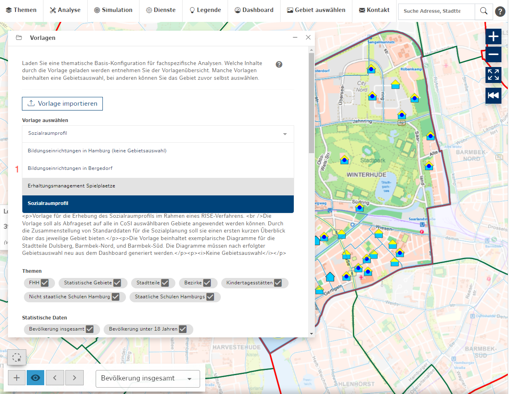
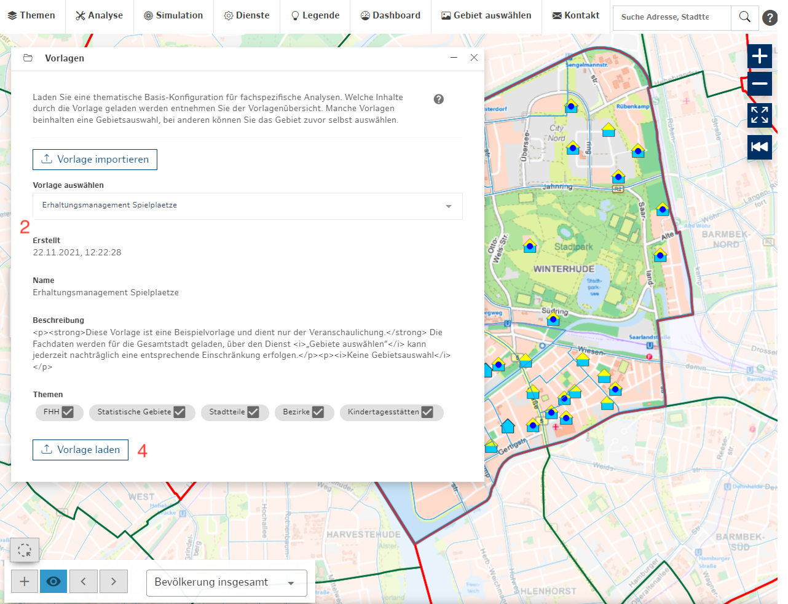

### Vorlagen

*Abb. a: Vorlagen Übersicht.*

*Abb. b: Vorlagen aufgeklappte Ansicht.*

Über den Dienst **Vorlagen** können Vorlagen zu verschieden Themenkomplexen und Arbeitsfeldern geladen werden. Diese können Fachdatenthemen, aktive Werkzeuge und eine Gebietsauswahl beinhalten. Die verfügbaren Vorlagen und ihr Inhalt werden von den Fachbehörden in Koordination mit dem CoSI-Betriebsteam gepflegt.

   > Zu den Vorlagen gelangen Sie über die Gebietsauswahl. Wenn das entsprechende Gebiet ausgewählt ist, finden Sie unter Dienste, die Option Vorlagen. Hier können Sie nun alle weiteren Optionen für die Vorlagen auswählen.

1. **Liste aller Vorlagen (zum Aufklappen)**
   > - Bildungseinrichtungen in Hamburg
   > - Bildungseinrichtungen in Bergedorf
   > - Erhaltungsmanagement Spielplätze
   > - Sozialraumprofil

2. **Inhaltsübersicht einer Vorlage**
   > - Titel
   > - Stand (Datum)
   > - Beschreibung
   > - Fachdatenthemen
   > - Aktiver Bezugsrahmen (Verwaltungsebene)
   > - Ausgewählte Gebiete
3. **optionale Gebietsauswahl**
   > Wenn keine Bezugrahmen/Gebiete definiert sind, können diese händisch im Vorfeld oder nach dem Laden ausgewählt werden. Die Inhalte werden dann für die aktive Gebietsauswahl geladen.
4. **Vorlage laden**
   > Die ausgewählte Vorlage laden.

