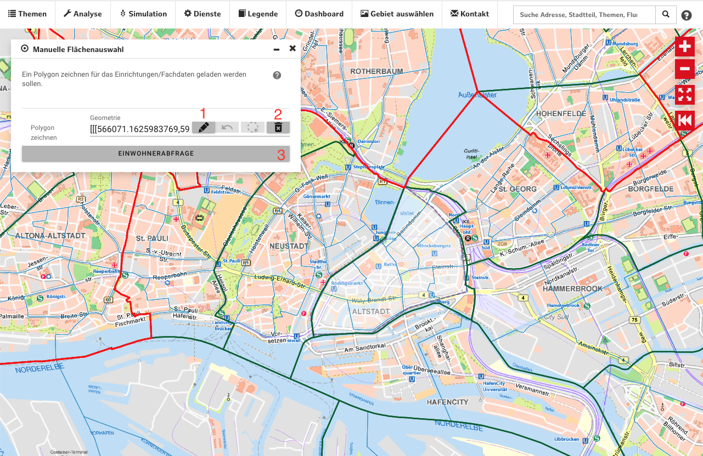

### Manuelle Flächenauswahl für Fachdaten
Mit Hilfe dieses Werkzeuges können Sie ein Polygon auf der Karte zeichnen, innerhalb dessen Fachdaten angezeigt werden. Einrichtungen oder andere Fachdatenmarker, die außerhalb dieses Polygons liegen, werden ausgeblendet.

*Abb.: Manuelle Flächenauswahl*

1. **Polygon zeichnen**
   > Klicken Sie auf diesen Button, um ein neues Polygon auf der Karte zu zeichnen.
2. **Eingabe löschen**
   > Löscht die bestehende Flächenauswahl und zeigt alle Fachdaten wieder an.
3. **Einwohnerabfrage**
   > Für die aktuelle Flächenauswahl eine [Einwohnerabfrage](./einwohnerabfrage.md) durchführen.  
4. **Ergebnisdarstellung auf der Karte**
