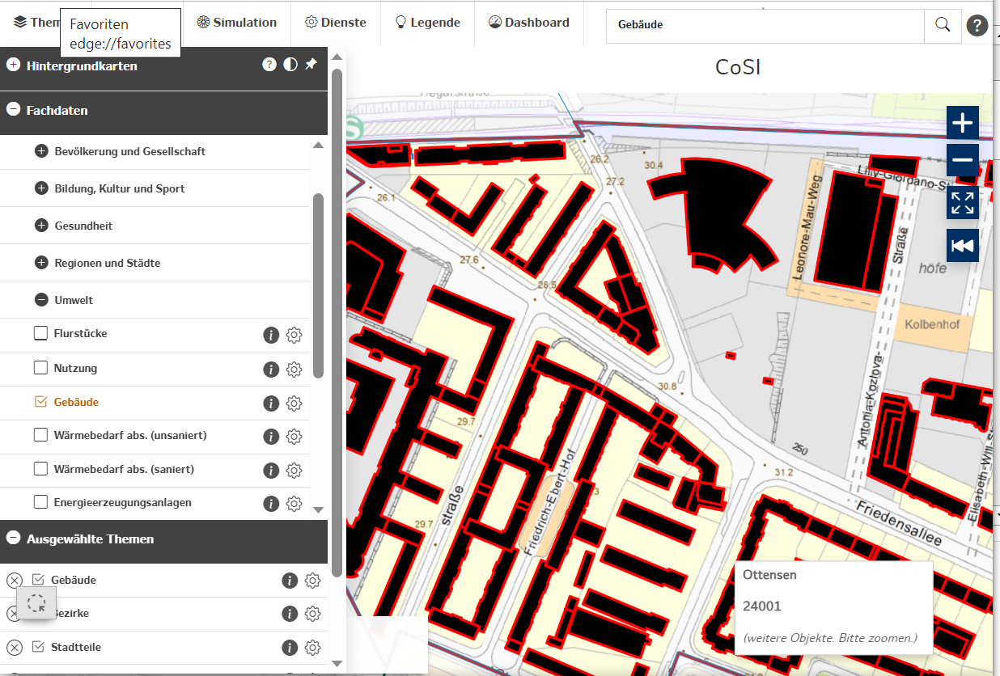
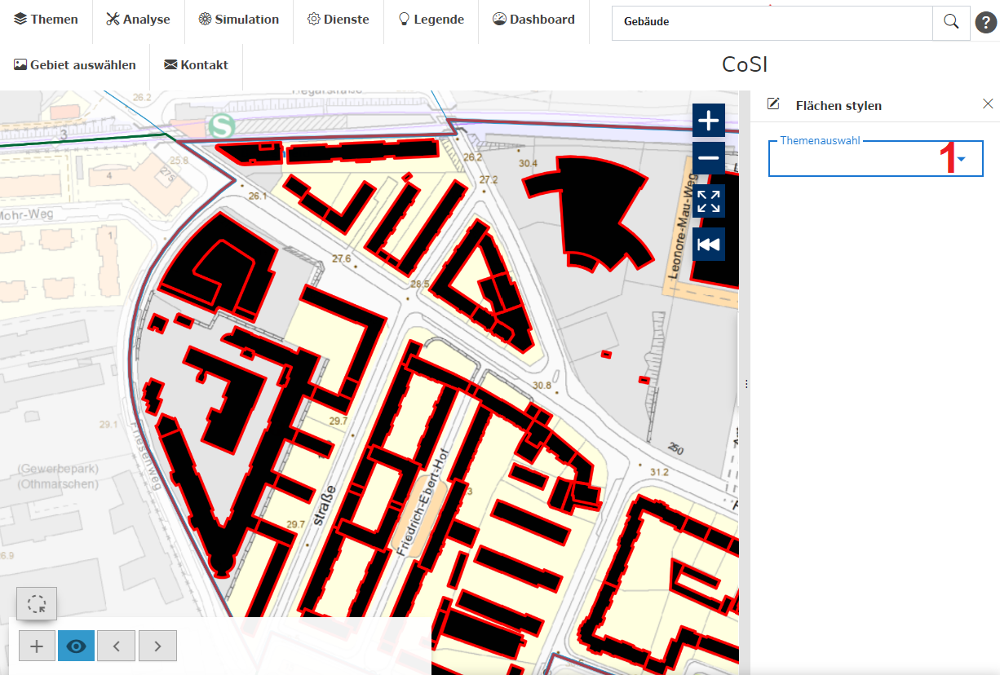
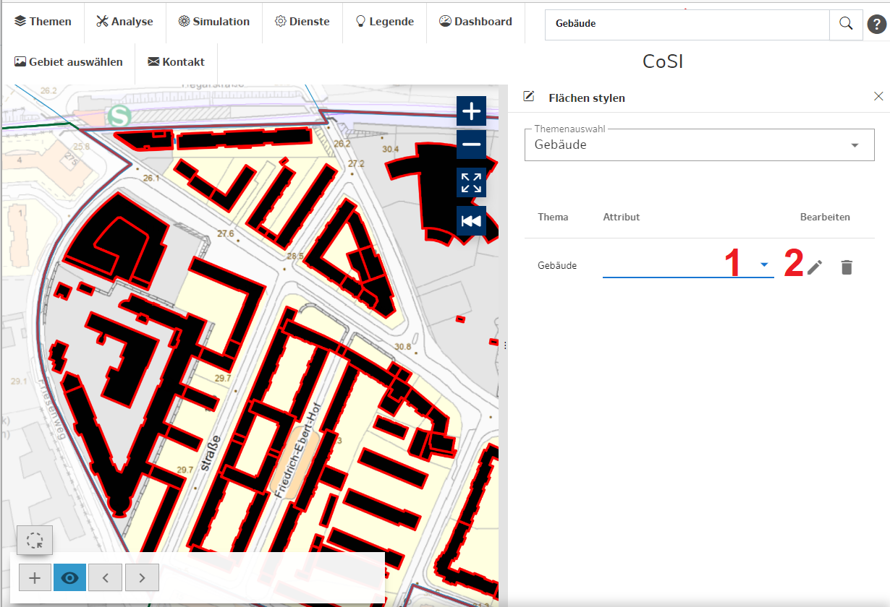
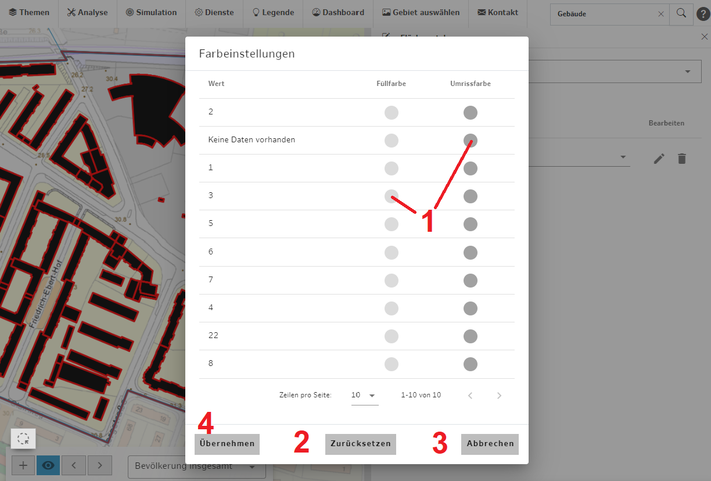
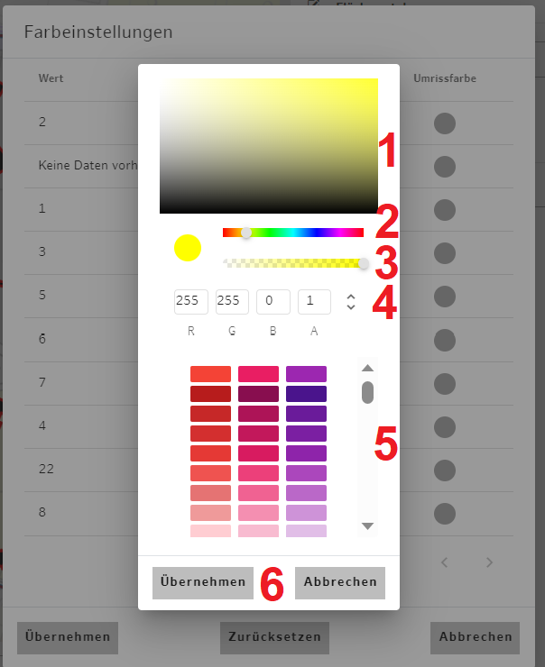

## Flächen Stylen

Mit Hilfe dieser Funktion können Sie Flächen, z.B. Gebäudegrundrisse, auf der Karte datenabhängig einfärben. Aktuell geht dies mit den Datensätzen Flurstücke, Nutzung, Gebäude und Wärmebedarf. Sie finden sich unter Fachdaten-Analyse/Simulation, Umwelt.

Wählen Sie dazu ein Gebiet und z.B. den Datensatz Gebäude.

*Abb.a: Gebietsauswahl mit Gebäuden in Standard-Darstellung*

Starten Sie die Funktion Flächen Stylen im Menü Analyse.

*Abb.b: Flächen Stylen – Datenauswahl*

1. **Thema auswählen**

> Klicken sie auf Themenauswahl und haken den gewünschten Datensatz an, hier: Gebäude.

*Abb.c: Flächen Stylen – Farbeinstellungen*

1. **Daten auswählen**

> Wählen sie die Daten aus, auf deren Basis die Flächen eingefärbt werden sollen, hier: Anzahl Geschosse.

2. **Farbeinstellungen starten**

> Klicken Sie auf das Stiftsymbol, um die Farbeinstellungen zu starten oder auch, um später Farbeinstellungen zu ändern oder zu ergänzen.

*Abb.d: Flächen Stylen – Farbeinstellungen*

1. **Farben zuweisen**

> Wählen sie den Farbkreis aus, dessen Farbe sie wählen möchten. Sie können Füllfarbe und Umrissfarbe festlegen. Siehe nachfolgenden Punkt **Farbe wählen**.

2. **Farben zurücksetzen**

> Mit der Schaltfläche Zurücksetzen werden alle Farbzuweisungen gelöscht.

3. **Zuletzt gesetzte Farben verwerfen**

> Mit der Schaltfläche Abbrechen verwerfen sie Änderungen, die sie seit dem letzten Aufruf des Dialogs Farbeinstellungen gemacht haben, und verlassen den Dialog.

4. **Änderungen bestätigen**

>Bestätigen Sie gewollte Änderungen mit der Schaltfläche Übernehmen. Sie verlassen den Dialog und die neuen Farben werden angezeigt.

*Abb.e: Flächen Stylen – Farbauswahl*

Sie haben verschiedene Möglichkeiten, die Farbe einzustellen:

1. **Helligkeit wählen**

> Klicken sie an gewünschter Position in das Rechteck, um die Helligkeit der unten gewählten Farbe einzustellen.

2. **Farbe einstellen**

> Ziehen Sie den Slider, um die Farbe einstellen.

3. **Transparenz einstellen**

> Ziehen Sie den Slider, um die Transparenz einzustellen

4. **Farbe numerisch vorgeben**

> Tragen sie Zahlenwerte von 0 bis 255 in die Felder für Rot (R), Grün (G) Blau (B) und 0 bis 1 in das Feld für die Transparenz (A) ein oder setzen Sie den Cursor in eines der Felder und ändern den Wert mit den Aufwärts- oder Abwärtspfeilen.

5. **Mischfarbe auswählen**

> Wählen sie eine der voreingestellten Mischfarben aus.

6. **Abschluss des Dialogs**

> Sie Übernehmen bzw. verwerfen Ihre Änderungen mit Klick auf die entsprechende Schaltfläche.

Die letzte Farbeinstellung wird bei der nächsten Farbzuweisung wieder angezeigt, führen sie gleiche Farbzuweisungen daher am besten nacheinander aus.