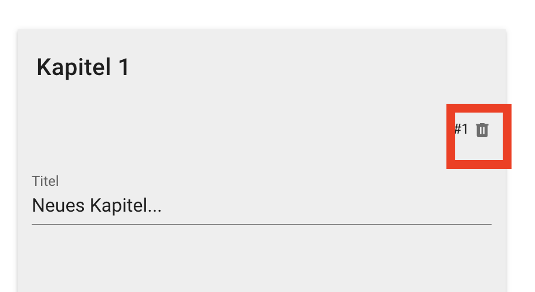
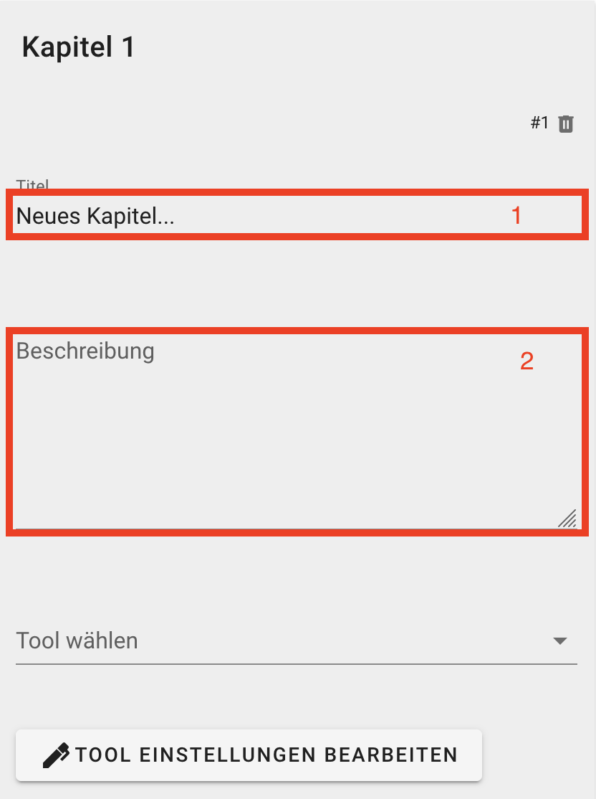

## Report Templates

Report Templates sind Dokumente mit voreingestellten Analysen, die sich dann auf Gebiete anwenden lassen. Jedes Report Template besteht aus Kapiteln. Jedes Kapitel enthält:  

- Einen Titel
- Eine Beschreibung
- Das Analyse Tool, das für das Kapitel verwendet wird
- Intern, die gewählten Einstellungen des Tools sowie die zugehörigen Datenlayer
 
Aktuell verfügbar sind die Tools "Erreichbarkeitsanalyse" und "Dashboard".

Sie können entweder ein bestehendes Template hochladen, bearbeiten und anwenden, oder ein neues Template erstellen.

1. Wählen Sie zuerst in der Gebietsauswahl das Gebiet aus, auf das Sie das Report Template anwenden wollen.
1. Öffnen Sie dann das Report Template Tool unter dem Menüpunkt "Dienste -> Report Template"

### Bestehendes Template hochladen

Klicken Sie im Report Template Tool auf "Datei Wählen", und wählen die bestehende Template Datei aus 

### Template Anwenden und als Dokument exportieren

1. Wenn Sie ein Report Template hochgeladen (s.o.) oder ein neues erstellt und eingestellt (s.u.) haben, scrollen Sie nach unten zu "Auf Gebiet anwenden"
1. Wählen Sie das gewünschte Export Format aus. Zur weiterverarbeitung in Word, wählen Sie "HTML". . 
1. Drücken Sie auf Exportieren 

Die Analysen des Templates werden nun auf das Gebiet angewendet. Die exportierte Datei wird entweder in ihrem Download Ordner abgelegt, oder direkt im Browser (als neues Fenster oder Tab) angezeigt.

### Neues Template beginnen

Um ein neues Template zu beginnen, drücken Sie unter "Template Wählen" auf das "+". Fahren Sie dann fort mit "Template bearbeiten" (s.u.).  

### Template bearbeiten

Nachdem Sie ein Template hochgeladen oder neu erstellt haben, können Sie es bearbiten.

Jedes Kapitel des Templates wird als grauer Kasten dargestellt.

*Kapitel löschen:* Sie können Kapitel über das Mülleimer Symbol in der oberen rechten Ecke löschen 

*Kapitel hinzufügen:* Sie können neue Kapitel hinzufügen in dem Sie auf das "Seite +" symbol unter dem letzten Kapitel drücken 

*Kapitel bearbeiten:*

1. Geben Sie Titel und Beschreibung für das Kapitel ein. 

1. Wählen Sie das Analyse Tool aus, das für das Kapitel verwendet werden soll. 
    - Es öffnet dann der Dialog des gewählten Analyse Tools. Ist bereits das Analyse Tool ausgewählt, das Sie verwenden wollen, drücken Sie nun auf "Tool Einstellungen bearbeiten".
1. Geben Sie die relevanten Einstellungen in der Maske des Analyse Tools (z.B. Erreichbarkeitsanalyse) ein, und drücken Sie auf "Übernehmen". 
1. Wiederholen Sie den Vorgang für alle Kapitel, die Sie hinzufügen oder bearbeiten wollen.

### Template Speichern

Um ein Template zu speichern, damit Sie es später anwenden oder mit anderen teilen können, drücken Sie auf "Template Speichern". Dabei wird eine Datei mit der Endung ".json" heruntergeladen. Diese Datei können Sie dann später wieder hochladen, um das Template zu bearbeiten oder anzuwenden (s.o.). 

