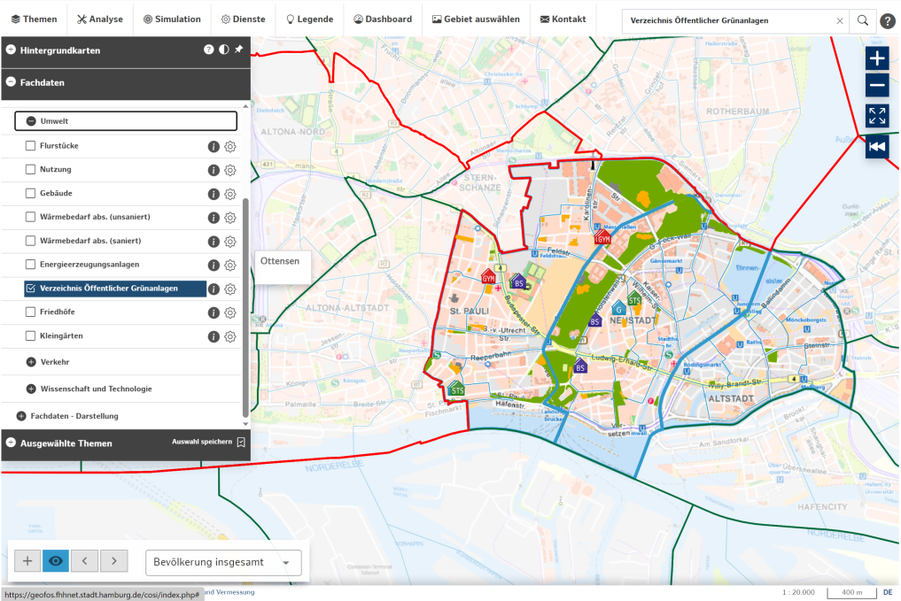
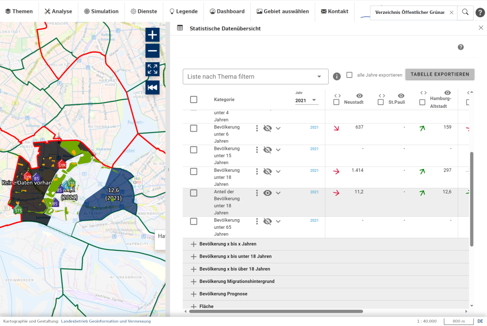

# **CoSI** 
## Cockpit Städtische Infrastrukturen
#### GIS + datenbasierte Analyse- und Planungstools in der Hamburger Stadtverwaltung
___

___

### Nutzerhandbuch

**3. Phase**   
**Version 1.3.0**  

___
### Projektmitarbeiter und -mitarbeiterinnen CoSI I bis III
___

- Alexandra Knapke, HafenCity Universität Hamburg
- Antje Widmayer, BA Hamburg-Nord
- Bertram Hillmann, a3rtgm GbR
- Christian Bähnisch, HiTec e.V.
- Daniel Schulz, HafenCity Universität Hamburg
- Dennis Rupnow, HiTec e.V.
- Feng Feng, LGV Hamburg
- Gabriela Gabbert, BA Hamburg-Nord
- Prof. Dr. Gesa Ziemer, HafenCity Universität Hamburg
- Hendrik Landgrebe, BA Hamburg-Nord
- Ingo Bruns, BA Hamburg-Nord
- Jannes Süpke, Senatskanzlei Hamburg, ITD
- Johanna Fischer, HafenCity Universität Hamburg
- Nicola Stradtmann, HafenCity Universität Hamburg
- Nihal Hegde, HafenCity Universität Hamburg
- Ogeigha Koroyin, HiTec e.V. 
- Paul Linnow, HafenCity Universität Hamburg
- Peter Duensing, Senatskanzlei Hamburg, ITD
- Sebastian Duden, LGV Hamburg
- Yuxiang Zhang, HafenCity Universität Hamburg  

### Stand
09/23

### Keywords
GIS, Dashboard, Data Driven Urban Planning, Social Infrastructure, Urban Data Platform, Data Visualization, Planning Support Tools, Demand Driven Decision Making  

___
## Zusammenfassung
___

Bei der Planung städtischer und sozialer Infrastruktur sind Entscheidungsprozesse in der öffentlichen Verwaltung häufig durch langwierige Verfahren und eine fragmentierte Datengrundlage charakterisiert. D.h. Bedarfe werden teilweise  spät erkannt, oder die Konkretisierung der Planung verzögert sich durch das aufwendige Beschaffen von strukturierten Informationen.\
Das vorliegende Handbuch beschreibt das *Cockpit Städtische Infrastrukturen* für Hamburg als digitales Analyse- und Planungswerkzeug, welches mithilfe eines leicht zugänglichen User-Interface statistische und georeferenzierte Daten bündelt, visualisiert und integriert, um Planungsbedarfe zu identifizieren und Planungsprozesse zu beschleunigen.  
  
Dazu wurden die durch die *Urban Data Platform* der Stadt Hamburg aufgebauten Datenbankstrukturen und die Funktionalität des Masterportals genutzt, um eine kartenbasierte Webapplikation zu etablieren, welche den Quartiersplanenden der Stadt eine Reihe von Analysefunktionen zur Verfügung stellt, um auf der Verwaltungsebene der statistischen Gebiete soziodemographische Zusammenhänge zu identifizieren, Trends zu erkennen sowie Verhältnisse zwischen dem existierenden Infrastrukturangebot und den relevanten Zielgruppen zu ermitteln. Das Werkzeug soll im Folgenden helfen, Standorte und Potentiale für die Entwicklung von Infrastruktur zu finden. Die Ergebnisse dieser Analysen können direkt aus CoSI heraus visualisiert und als Entscheidungs- und Diskussionsgrundlage verwendet werden. Der Workflow folgt dabei einer dreistufigen Logik von der *Visualisierung* von Daten, über die *Analyse*, also der kontextuellen Verknüpfung von Information, bis zur *Simulation* von Maßnahmen und Ableitung ihrer  Auswirkungen.  
  
Um die technischen und inhaltlichen Anforderungen des Initialisierungs-Projekts aufzustellen, wurden im Vorfeld ab Sommer 2018 eine Reihe von Stakeholder- und Userstory-Workshops mit den Mitgliedern der Hamburger Verwaltung auf verschiedenen Ebenen durchgeführt. 

CoSI wurde dann von Juni 2019 bis September 2023 in den Projekten CoSI I bis III in einem agilen Verfahren, basierend auf der SCRUM-Methode, durch ein interdisziplinäres Team der HCU Hamburg und des LGV Hamburg entwickelt. Nutzerinnen und Nutzer waren dabei von Beginn an über die AG CoSI einbezogen und konnten den jeweils neuesten Entwicklungsstand im Arbeitsalltag evaluieren, so dass aktuelle Anforderungen an Funktionen und Daten fortlaufend in die Planung der Sprints eingegangen sind. Ab Mitte 2020 wurde das Verfahren in den Produktivbetrieb überführt. Seitdem steht allen berechtigt interessierten Mitarbeiterinnen und Mitarbeitern innerhalb der FHH – im Sommer 2023 waren es über 1500 - eine fortlaufend aktualisierte Produktivversion von CoSI zur Verfügung. 

Datenbedarfe aus der AG CoSI und von den Nutzenden der Produktivversion werden fortlaufend erfasst und an den Urban Data Hub des LGV übergeben, Datenverantwortliche lokalisiert und die Datenbestände unter Berücksichtigung potenzieller Datenschutzrichtlinien öffentlich oder FHH-intern über die Urban Data Platform (UDP) zur Verfügung gestellt.
Es werden auch Integrationsmöglichkeiten für das Tool in die tägliche Arbeit von Behörden und Fachämtern eruiert. Die CoSI-Projekte haben diese Informationen gebündelt, in Workshops mit der AG CoSI und Anwendenden vertiefte Funktionskonzepte erarbeitet und diese in den Themenbereichen Visualisierung, Analyse und Simulation integriert. So wurde ein Planungs-, Kollaborations- und Kommunikationstool entwickelt, welches konzeptuell auf viele weitere Themenbereiche angewendet werden kann.

Diese Weiterentwicklung von CoSI und den zu Grunde liegenden Datenbeständen im Urban Data Portal in enger Zusammenarbeit mit den Nutzenden soll auch nach den Projekten CoSI I bis III fortgeführt werden. Dazu ist im Lebenslagenmanagement der BWFGB eine moderne fachliche Leitstelle geplant.
  

___
## Inhalt
___
- CoSI: Cockpit Städtische Infrakstrukturen
  - [Datenmodell und Infrastruktur](#-datenmodell-und-infrastruktur)
  - [Module](#module)
   - [Themen (Layer)](#themen-layer)
   - [Analyse] (#analyse)
      - [Einwohnerabfrage](#einwohnerabfrage)
      - [Erreichbarkeitsanalyse](#erreichbarkeitsanalyse)
         - [Erreichbarkeit ab einem Referenzpunkt](#erreichbarkeit-ab-einem-referenzpunkt)
         - [Erreichbarkeit im Gebiet](#erreichbarkeit-im-gebiet)
         - [Erreichbarkeit entlang einer Route](#erreichbarkeit-entlang-einer-route)
      - [Vergleichbare Gebiete ermitteln](#4vergleichbare-gebiete-ermitteln)
      - [Filter](#filter)
      - [Versorgungsanalyse](#versorgungsanalyse)
      - [DIPAS](#dipas)
      - [Graphenvisualisierung](#graphenvisualisierung)
    - [Simulation] (#simulation)
      - [Einrichtungen anlegen](#einrichtungen-anlegen)
      - [Einrichtungen bearbeiten](#einrichtungen-bearbeiten)
      - [Wohnungsbauquartiere anlegen](#wohnquartiere-anlegen)
    - [Dienste](#dienste)
      - [Geodaten Importieren](#geodaten-importieren)
      - [Sitzung Speichern/Laden](#sitzung-speichernladen)
      - [Vorlagen](#vorlagen)
    - Dashboard
      - [Statistische Datenübersicht](#statistische-datenuebersicht)
      - [Einrichtungsübersicht](#einrichtungsuebersicht)
    - [Gebietsauswahl](#gebietsauswahl)
    - [Kartenanalyse regionalstatistischer Daten](#kartenanalyse-regionalstatistischer-daten)
    - [Ergebnisverzeichnis](#ergebnisverzeichnis)
    - [Manuelle Flächenauswahl](#manuelleflaechenauswahl)
    - [Auswahlmanager](#auswahlmanager)
    - [Flächen stylen](#flaechen-stylen)

___
## Datenmodell und Infrastruktur
___
  
CoSI ermöglicht ganz ähnlich wie der FHH-Atlas auch die Anzeige verschiedener Fachdaten unterschiedlicher Behörden und Ämter in der Karte, wie z.B. dem digitalen Grünplan (BUKEA) oder den Öffentlichen Schulen (BSB).

*Abb. a: Anzeige von Themen auf der Karte wie im FHH-Atlas.*

Als wesentliche Erweiterung können zudem regionalstatistische Daten des Statistikamts Nord für statistische Gebiete, Stadtteile, Bezirke oder ganz Hamburg angezeigt werden.

*Abb. b: Anzeige statistischer Daten auf der Karte und im Dashboard.*

Die Daten werden aber nicht nur in Karte und Tabelle nebeneinander dargestellt, sondern können mit CoSIs Analysefunktionen analysiert und in Beziehung gesetzt werden, indem z.B. ein sozialräumliches Angebot wie Spielplätze, gemessen als Spielplatzfläche in Quadratmetern, mit dem Bedarf der Bevölkerung, gemessen als Anzahl der Kinder z.B. unter 6 Jahren, in der Versorgungsanalyse ausgewertet werden können.

*Abb. c: Analysefunktionen, hier Versorgungsanalyse.*

Darüber hinaus erlaubt CoSI, in die Datensätze “einzugreifen”: sie zu filtern, zu durchsuchen oder für die Darstellung von Planungsszenarien im laufenden Programm zu verändern (s. Simulation).

### Regionalstatistische Daten
Die Daten des StaNord liegen für alle Verwaltungsebenen der FHH (statistische Gebieten, Stadtteile, Bezirke und die Gesamtstadt) vor. Sie umfassen je nach Ebene über 120 Indikatoren, welche sich in folgende Kategorien gliedern:  

   - Bevölkerung
   - Bevölkerung ab x Jahren
   - Bevölkerung unter x Jahren
   - Bevölkerung x bis x Jahren
   - Bevölkerung x bis unter 18 Jahren
   - Bevölkerung x bis über 18 Jahren
   - Bevölkerung Migrationshintergrund
   - Fläche
   - Haushalte
   - Sozialversicherungspflichtige
   - Arbeitslose
   - SGB II Leistungen
   - Grundsicherung im Alter
   - Wohnen
   - Wahlbeteiligung
   - Verkehr
   - Infrastruktur
   - Bevölkerungsbewegung

Diese Datensätze beinhalten Zeitreihen, welche (je nach Datensatz) von ca. 2012 an erfasst sind und jährlich erweitert werden.

*Hinweis: Aus datenschutzrechtlichen Gründen werden bereits vom Datenbereitsteller solche Datensätze herausgefiltert, welche bei sensiblen Daten auf einzelne Individuen zurückverfolgbar wären. Diese Datensätze sind mit "–" oder mit "Keine Daten" ausgewiesen.*

### Fachdaten
CoSI bietet ganz ähnlich wie der FHH-Atlas Fachdatensätze in einem Themenbaum an. Während der FHH-Atlas grundsätzlich alle auf der Urban Data Platform verfügbaren und innerhalb der FHH freigegebenen Datensätze anzeigt, wird für CoSI in Abstimmung mit der Nutzendengruppe AG CoSI eine Auwahl getroffen. Dies dient der Übersicht und ermöglicht den Test und ggf. die Anpassung der Analysefunktionen an die angebotenen Daten.

Die Fachdatensätze, welche derzeit in CoSI eingebunden sind oder noch eingebunden werden können, werden als Geodienste von unterschiedlichsten Dateneignern (dies sind vor allem Behörden und Bezirksämter, aber prinzipiell sind auch Vereine oder Privatunternehmen denkbar.) bereitgestellt und in CoSI, wie im FHH-Atlas, über die URL des jeweiligen Dienstes abgerufen. Viele der Datensätze in ihrer aufbereiteten Form sind aus den Verhandlungs- und Koordinationsprozessen des Urban Data Hub hervorgegangen, über den sich die Behörden und Datenhalter der FHH auf gemeinsame Standards und regelmäßige Veröffentlichungen verständigen.

### Prognosedaten
Die Prognosedaten enthalten die prognostizierte jährliche Bevölkerungsentwicklung in den Stadtteilen Hamburgs nach vier Altersgruppen und Geschlecht bis zum Jahr 2035. Stichtag ist jeweils der 31.12.

Aus Gründen der statistischen Geheimhaltung der zugrunde liegenden Ausgangsdaten werden die vier kleinsten Stadtteile Hamburgs nur in Kombination mit einem größeren angrenzenden Stadtteil ausgewiesen.

Die Einzeldaten sind jeweils auf volle fünf gerundet.
Die Daten werden auf unregelmäßiger Basis vom Statistikamt Nord herausgegeben.

### Analyse
Analysedaten sind all jene (als WFS, s. Geodienste) eingebundenen Datensätze, welche für die Verwendung mit den CoSI-Analyse- (und in Zukunft Simulations-) Werkzeugen konfiguriert wurden. D.h. jedes Objekt (Feature, z.B. Kita oder Grünfläche) ist dabei einzeln hinterlegt und kann mit seiner geografischen Position und Ausdehnung betrachtet werden.

### Darstellung
Darstellungsdaten sind auf Absprache mit den Fachplanerinnen und Fachplanern ausgewählte Datensätze aus dem FHH-Netz, welche durch das zugrundeliegende Geoportal (Masterportal) in der Karte visualisiert und mit einer Legende versehen werden. Per Klick kann der Datensatz für die jeweilige Koordinate aus dem Datensatz abgerufen werden. Im Gegensatz zu den Analysedaten liegen die Darstellungsdaten gegenwärtig nicht als einzelne Objekte, sondern als gekacheltes/gerastertes Bild vor (WMS, s. Geodienste).

### Geodienste
Alle in CoSI und dem FHH-Atlas dargestellten Daten werden von den Bereitstellern als Dienst vorgehalten. Der Dienst liefert über eine URL Datensätze der jeweiligen Datenbank in einem maschinenlesbaren Format. Über zusätzliche Parameter kann die Anfrage (Request) spezifiziert oder (z.B. auf einen geografischen Ausschnitt) eingegrenzt werden. 

### WMS
Ein WMS (Web Map Service) liefert Geodaten / Karten als Rasterbilder (PNG), welche zunächst einmal ohne Hintergrundinformation in der Karte angezeigt werden. Gleichzeitig können die Legende des Datensatzes oder Informationen zu einer bestimmten Koordinate über weitere Requests abgerufen werden.

### WFS
Der WFS (Web Feature Service) liefert im Gegensatz zum WMS keine fertige Kartenansicht, sondern ein rohes Datenobjekt, bei dem der Datensatz jedes geografischen Objekts (Punkt, Linie, Fläche, etc.) inkl. seiner Attribute (z.B. eine Schule mitsamt ihrem Schultyp, ihrer Schülerzahl, Mailadresse und Nachmittagsangebot) einzeln übermittelt. Die Visualisierung (das Styling) der Daten erfolgt dann anhand vorgegebener oder mitgelieferter Konfigurationen innerhalb der Applikation. Dies ist rechenintensiver für den Anwendenden und weniger kontrollierbar von Seiten des Datenbereitstellers, bietet jedoch die Möglichkeit mit den Objekten innerhalb des Portals direkt zu interagieren oder sie zu verändern.  

___
## Module
___
### Überblick 
CoSI bietet verschiedene Module (nachfolgend oft auch als "Werkzeuge" oder "Tools" bezeichnet") an, die bestimmte Funktionen zur Erstellung, Verwaltung und Analyse von Daten bereitstellen. Nachfolgend finden Sie die Übersicht über alle im UI zur Verfügung stehenden Funktionen:

*Abb. d: Das CoSI User-Interface.*

1. **Themenbau/ Layer** (s. Themen)
2. **Analyse**
      1. [Manuelle Flächenauswahl für Fachdaten](/cosi/manuals/021manuelleflaechenauswahl)
      2. [Einwohnerabfrage](/cosi/manuals/002einwohnerabfrage)
      3. [Erreichbarkeitsanalyse](/cosi/manuals/003erreichbarkeitsanalyse)
      4. [Vergleichbare Gebiete ermitteln](/cosi/manuals/004vergleichbaregebieteermitteln)
      5. [Filter](/cosi/manuals/005filter)
      6. Strecke/ Fläche messen
      7. [Versorgungsanalyse](/cosi/manuals/006versorgungsanalyse)
      8. [DIPAS](/cosi/manuals/007dipas)
      9. [Datenvisualisierung](/cosi/manuals/008graphenvisualisierung)

3. **Simulation**
      1. [Einrichtungen anlegen](/cosi/manuals/009einrichtungenanlegen)
      2. [Einrichtungen bearbeiten](/cosi/manuals/010einrichtungenbearbeiten)
      2. [Wohnungsbauquartiere anlegen](/cosi/manuals/011wohnquartiereanlegen)

4. **Dienste**
      1. Zeichnen/ Schreiben
      2. Karte drucken
      3. Mousehover ein-/ ausschalten
      4. [Geodaten Importieren](/cosi/manuals/013geodatenimportieren)
      5. WMS hinzufügen
      6. [Sitzung speichern/laden](/cosi/manuals/014sitzungspeichern)
      7. [Vorlagen](/cosi/manuals/015vorlagen)

5. **Dashboard**
      1. [Statistische Datenübersicht](/cosi/manuals/016statistischedatenuebersicht)
      2. [Einrichtungsübersicht](/cosi/manuals/017einrichtungsuebersicht)
6. **[Gebiete auswählen](/cosi/manuals/018gebietsauswahl)**
7. **Kontaktformular**
8. **Legende** (s. Legende)
9. **Suchleiste**
10. **Werkzeugfenster**
   > Aktive Werkzeuge werden in verschiebbaren Fenstern angezeigt.
11. **Hereinzoomen**
12. **Herauszoomen**
13. **Vollbildansicht aktivieren/ deaktivieren**
14. **Zurück zur Startansicht**
15. **[Kartenanalyse regionalstatistischer Daten](/cosi/manuals/019kartenvisualisierung)**
16. **Tooltip** (sog. Mousehover)
   > Zeigt das Gebiet und andere Elemente wie Tooltipps unter dem Mauszeiger an. Kann unter "Dienste" via "Mousehover ein-/ausschalten" deaktiviert werden.
18. **Ausgewählte Gebiete**
   > Ausgewählte Gebiete werden dargestellt mit einer blauen Umrandung.
19. **Sidebar**
   > Das Dashboard und der Filter werden in einer Sidebar angezeigt. Die Sidebar kann in ihrer Breite angepasst werden. (s. Dashboard)

### Themen (Layer)
___
Layer können aus dem Reiter "Themen" jederzeit zugeschaltet oder ausgeschaltet werden. Die Themen sind unter dem Reiter Fachdaten sortiert. Beim Zuschalten sollte mit bedacht werden, dass sich Ladezeiten entsprechend verlängern können. Verzögerungen können vorkommen, wenn zu Beginn kein Planungsgebiet festgelegt wurde. Dann müssen die Daten für das gesamte Hamburger Gebiet geladen werden. 

Der Themenbaum ist gegliedert in Hintergrundkarten, einen Katalog an Fachdaten und die aktuelle Auswahl an Kartenebenen.

*Abb. e: Der Themenbaum.*

Öffnen Sie mit dem Plus die Übersicht der Themenkategorie oder minimieren sie die Ansicht wieder mit dem Minus.

1. **Hintergrundkarten**
   > Layer wie "Stadtkarte Hamburg", die als Standard automatisch aktiv sind, können auch deaktiviert werden. Die Hintergrundkarten orientieren sich am FHH Portal. Achtung beim An- und Ausschalten der Karten. Kartenlayer können andere Layer überlagern. Ihre Anzeige ist daher abhängig von der Reihenfolge der Aktivierung. Die Anordnung kann in "Ausgewählten Themen" noch nachträglich verändert und angepasst werden.
2. **Fachdaten**  
	 - **Analyse/Simulation**
      > Die aufbereiteten Layer für CoSI-spezifische Werkzeuge (bereitgestellt als WFS, s. Glossar). Die einzelnen Datenlayer sind in Kategorien eingeteilt, die regelmäßig angepasst bzw. aktualisiert werden.
	 - **Darstellung**
      > Daten zur reinen "Anzeige" in der Karte, v.a. entnommen aus dem FHH Atlas (bereitgestellt als WMS).
3. **Ausgewählte Themen**  
   > Siehe nachfolgende Abbildung.
4. **Hilfsbutton**
   > Ruft diese Anleitung auf.
5. **Kartenhintergrund**
   > Hier können Sie für den Kartenhintergrund grau oder weiß auswählen.
6. **Themenbaum fixieren/ lösen**
   > Diese Funktion fixiert den Themenbaum, so dass er auch bei Interaktionen mit der Karte angezeigt bleibt.
   
   **Ausgewählte Themen**  
      
      *Abb.f: Ausgewählte Themen.*  
      - **3.1 Informationen und Legenden**
      - **3.2 Einstellungen**  
         Über das Zahnrad öffnen sich Einstellungen für Transparenz und Ebene verschieben.
      - **3.3 Transparenz**  
         Die Transparenz lässt sich über Plus in Prozent erhöhen und über Minus verringern.
      - **3.4 Ebene nach oben/unten**  
         Über das Pfeilmenü kann die Ebene der Layer verschoben werden.

Die Themen enthalten Informationen, die symbolisch oder durch Flächen auf der Karte dargestellt werden. In der nachfolgenden Abbildung zum Beispiel stellen die grün/blauen Punkte und Icons die vorhandenen Sportstätten im Gebiet dar. Die gelben und grünen Flächen sind aus dem Verzeichnis öffentlicher Grünanlagen. Nummerierte Punkte zeigen die Anzahl der an diesem Ort vorhandenen Einrichtungen an, wenn sich Punkte überschneiden.
Eine Legende zu den aktiven Themen kann durch einen Klick auf den Reiter "Legende" eingeblendet werden. Unabhängig davon können über den Infobutton rechts neben dem Layer weitere Informationen zu dem jeweiligen Thema aufgerufen werden. Es werden folgende Informationen bereitgestellt: Kurzbeschreibung des Themas, Datenstand und Legende. Auch befinden sich hinter dem Info-Button die Links zu Downloadquellen und eine WFS - bzw. WMF -Adresse.
Ein Klick auf ein Objekt auf der Karte öffnet eine Infotafel für die aktuelle Auswahl (Sportstätte, Grünanlage, etc.). Auf der Infotafel werden Informationen über das Objekt angezeigt. Datenschutzrelevante (personenbezogene) Daten werden nicht angezeigt.

*Abb. g: Beispiel für Kartenansicht.*

## Gebietsauswahl
___
Beim Starten von CoSI wird zunächst ein Bezugsrahmen festgelegt sowie ein Planungsgebiet zusammengestellt und bestätigt.

Wenn Sie Ihren Bezugsrahmen ändern möchten, könnten Sie dies unter "Gebiete auswählen" tun.

*Abb. a: Das Werkzeug "Gebiet auswählen".*  

1. **Bezugsrahmen wählen**
   > Über ein Dropdown Menü können **"Bezirke"**, **"Stadtteile"** oder **"Statistische Gebiete"** ausgewählt werden – dies legt die Verwaltungseinheit fest, für die die statistischen Daten angezeigt und Auswertungen erstellt werden sollen. Alle Funktionen sind auf den jeweiligen Gebietsebenen verfügbar. Die Zahl der verfügbaren Indikatoren kann jedoch variieren. Der Bezugsrahmen bestimmt auch die zu ladenden übergeordneten Referenzgebiete: Stadtteile für stat. Gebiete, Bezirke für Stadtteile.
2. **Gebiete aus- und abwählen**
    - Die einzelnen Verwaltungseinheiten (statistisches Gebiet oder Stadtteil) anklicken (nochmaliges Klicken deaktiviert die Auswahl wieder), die Grenzen werden blau markiert. 
    - Auf dem Stift rechts neben "Auswahl zurücksetzen" klicken. Es wird ein Zeichentool aktiviert; damit können Nutzer:innen ein Rechteck über das Auswahlgebiet ziehen um dieses auszuwählen.
    - Beide vorher beschriebenen Möglichkeiten sind auch miteinander kombinierbar, wobei die Reihenfolge unerheblich ist. Die Nutzer:innen können also zuerst einzelne Verwaltungseinheiten auswählen und dann das Zeichentool aktivieren, um damit weitere Verwaltungseinheiten hinzuzuschalten oder auch andersherum vorgehen.
3. **Puffer festlegen**
   > Es kann ein Pufferradius in Metern festgelegt werden. Für den werden ausgewählte Fachdaten um das Planungsgebiet herum angezeig. Dies berücksichtigt die Tatsache, dass das Einzugsgebiet von einer Einrichtung nicht unbedingt übereinstimmt mit den Gebietsgrenzen der Verwaltungseinheit innerhalb derer sich die Einrichtung befindet. Die Analysefunktionen werden davon nicht beeinflusst.
4. **Auswahl bestätigen**
   > Lädt die Daten für das ausgewählte Planungsgebiet vom Server und legt den Bereich für die anzuzeigenden Fachdaten fest. Auch eine leere Auswahl kann bestätigt werden. Dann werden keine Daten geladen und Fachdaten für den gesamten Stadtbereich angezeigt. (s. unten)
5. **Auswahl zurücksetzen**
   > Setzt das aktuelle Planungsgebiet zurück. Im direkten Anschluss kann ein neues Planungsgebiet zusammengestellt und bestätigt werden.
6. **Auswahlrechteck zeichnen**
   > Ein Startpunkt wird gesetzt und ein Rechteck bis zum Endpunkt über das relevante Gebiet gezogen. Alle Verwaltungseinheiten, die innerhalb des Rechtecks oder an den Linien des Rechtecks liegen, werden in das Planungsgebiet aufgenommen.
7. **Zusätzliche Hilfsebenen ein/- ausblenden**
   > Mithilfe der Checkbox können zusätzliche Layer zur Orientierung ein- und ausgeblendet werden. Der Layer kann ebenfalls über den Themenbaum ein- und ausgeschaltet werden. Zu den Hilfsebenen gehören aktuell die "Sozialräume" und die "RISE Fördergebiete".

Das festgelegte Planungsgebiet kann jederzeit angepasst werden:  

   - Das Gebiet kann *erweitert* werden: sowohl per Klick als auch per Zeichentool.
   - Das Gebiet kann *verkleinert* werden: per Klick können markierte Verwaltungseinheiten wieder abgewählt werden.
   - Das Gebiet kann komplett zurückgesetzt werden: per Klick auf "Auswahl zurücksetzen".

Es muss nicht in jedem Nutzungskontext immer ein Planungsgebiet als erstes festgelegt werden; bestimmte Analysetools wie z.B. die [Erreichbarkeitsanalyse](/cosi/manuals/003erreichbarkeitsanalyse.md) und [Vergleichbare Gebiete](/cosi/manuals/004vergleichbaregebieteermitteln.md) können verwendet werden ohne dass vorher ein Gebiet festgelegt wird.  

Für solche Fälle gelten folgende Hinweise:  

   - Es werden keine Datensätze geladen, d.h. eine Anzeige der regionalstatistischen Daten ist nicht möglich. Auch werden keine regionalstatistischen Daten im Dashboard angezeigt.
   - Beim Zuschalten von Themen aus den Fachdaten könnte der Ladevorgang länger dauern.
   - Möglicherweise funktioniert die [Erreichbarkeitsanalyse](/cosi/manuals/003erreichbarkeitsanalyse.md) für eine sehr große Zahl von Einrichtungen nicht zuverlässig.
___

# Dashboard
___

### Statistische Datenübersicht

In der statistischen Datenübersicht können tabellarisch Informationen zu den statistischen Daten der ausgewählten Gebiete (**Statistische Datenübersicht**) angezeigt, ausgewertet und exportiert werden.

  > Um zur statistischen Datenübersicht zu gelangen, wählen Sie im Dashboard den Punkt "statistische Datenübersicht" aus. 
  

*Abb. : Statistische Datenübersicht 1*

*Abb. : Statistische Datenübersicht 2*

1. **Gruppen ein-/ausklappen**
   > Thematische Gruppen (vgl. [Regionalstatistische Daten](/cosi/manuals/019kartenvisualisierung.md)) über das **+** ein- und ausklappen.
2. **Aktionen**
   > - [Dreistrich-Menü](#dreistrich-menü) aufklappen
   > - Visualisierung ein- / ausschalten: Schaltet die Visualisierung des ausgewählten Indikators zum aktuell gewählten Jahr in der Karte ein/aus
   > - Jahre ein- / ausklappen: Klappt die Tabellenzeile auf um alle Jahre der Zeitreihe darzustellen.
3. **Jahr auswählen**
   > Aktuelles Jahr für die Darstellung in Tabelle und Karte auswählen.
4. **Spalte verschieben**
   > Mit den Pfeilen links/rechts die Spalte verschieben. Die Trennstriche grenzen die Verwaltungsebenen voneinander ab
5. **Spalte ein-/ausblenden**
   > Mit dem Auge kann eine Spalte aus- und eingeblendet werden, um die Tabelle übersichtlicher zu gestalten. Ausgeblendete Spalten werden für Exporte und Diagramme nicht berücksichtigt.
6. **Aggregationsspalten**
   > Die letzten zwei Spalten zeigen standardmäßig Durchschnitts- und Gesamtwert für die **ausgewählten Gebiete** (wie in der Karte dargestellt, nur die ausgewählte Verwaltungsebene). Für relative (anteilige) Indikatoren können keine Aggregationen berechnet werden, da der Bezugsrahmen nicht klar ist.
7. **Spalte auswählen**
   > Spalten für Export und Diagramm-Erstellung auswählen. Ist keine Spalte ausgewählt werden alle verwendet.
8. **Zeile auswählen**
   > Zeilen für Export und Diagramm-Erstellung auswählen. Ist keine Spalte ausgewählt werden alle für den Export bzw. nur die aktuelle für die Diagramme verwendet.
9. **Trendpfeil**
   > Der Trendpfeil zeigt das extrapolierte Wachstum für den nächsten Zeitschritt (in % im Tooltip) an. Für die Abschätzung werden die Steigungen der letzten 5 Zeitschritte, gewichtet nach Aktualität, herangezogen. Die Darstellung erhebt **keinen Anspruch** auf Genauigkeit und berücksichtigt keine anderen Werte über die aktuelle Zeitreihe hinaus.
   
10. **Themenfilter**
      > Über den Filter können beliebige Indikatoren (sortiert nach Gruppen) für die Darstellung und den Export ausgewählt werden. Die Liste kann im Freitext durchsucht werden.
11. **Tabelle exportieren**
      > Die aktuelle Auswahl (Spalten, Zeilen, Jahre) als XLSX für Excel exportieren. Über das Auswahlfeld *alle Jahre exportieren* kann die gesamte Zeitreihe für die ausgewählten Spalten und Zeilen exportiert werden. Ist keine Spalte oder Zeile ausgewählt werden alle verwendet.
12. **Kartenvisualisierung**
      > Die Darstellung in der Karte entspricht der des Kontrollfeldes [Kartenanalyse regionalstatistischer Daten](/cosi/manuals/kartenvisualisierung.md).

#### Dreistrich Menü

*Abb. : Statistische Datenübersicht - Dreistrich-Menü.*

1. **Visualisierung ein-/ausschalten**
   > Thematische Gruppen
2. **Zeitreihe in der Karte animieren**
   > *(Funktioniert nur bei aktiver Kartenvisualisierung)*
3. **Gebietsnamen ein-/ausblenden**
   > *(Funktioniert nur bei aktiver Kartenvisualisierung)*
4. **Für Feld A auswählen**
   > Selektiert das Thema als **Feld A** für Berechnungen und Korrelation (siehe 7, 8, 9, 10, 12)
5. **Für Feld B auswählen**
   > Selektiert das Thema als **Feld B** für Berechnungen und Korrelation (siehe 7, 8, 9, 10, 12)
6. **Auswahl aufheben**
   > Setzt die Felder **A** und **B** zurück
7. **Addieren**
   > Addiert die Werte für **A** und **B** für jede Gebietsspalte und fügt das Ergebnis der Tabelle an. Der neue Datensatz kann ebenfalls in der Karte visualisiert und in anderen Werkzeugen verwendet werden.
8. **Subtrahieren**
   > Analog zu **Addieren**, subtrahiert **A** - **B**.
9. **Multiplizieren**
   > Analog zu **Addieren**, multipliziert **A** x **B**.
10. **Dividieren**
      > Analog zu **Addieren**, dividiert **A** / **B**.
11. **Diagramme erzeugen**
      > Erzeugt Diagramme für den ausgewählten Indikator im [Graphenvisualisierung](/cosi/manuals/008graphenvisualisierung.md) (analog zu [Kartenanalyse regionalstatistischer Daten](/cosi/manuals/019kartenvisualisierung.md)). Visualisiert alle ausgewählten Spalten (s. [Statistische Datenübersicht](/cosi/manuals/0012_statistischedatenuebersicht.md)).
12. **Korrelations- / Streuungsdiagramm**
      > Visualisiert ein Streuungsdiagramm für die Felder **A** (Y-Achse) über **B** (X-Achse) im [Graphenvisualisierung](/cosi/manuals/008graphenvisualisierung.md) und berechnet die Korrelation (Pearson) zwischen den Datensätzen und zeichet eine Regressionsgerade.
# **CoSI** 
## Cockpit Städtische Infrastrukturen
#### GIS + datenbasierte Analyse- und Planungstools in der Hamburger Stadtverwaltung
___

___

### Nutzerhandbuch

**3. Phase**   
**Version 1.3.0**  

___
### Projektmitarbeiter und -mitarbeiterinnen CoSI I bis III
___

- Alexandra Knapke, HafenCity Universität Hamburg
- Antje Widmayer, BA Hamburg-Nord
- Bertram Hillmann, a3rtgm GbR
- Christian Bähnisch, HiTec e.V.
- Daniel Schulz, HafenCity Universität Hamburg
- Dennis Rupnow, HiTec e.V.
- Feng Feng, LGV Hamburg
- Gabriela Gabbert, BA Hamburg-Nord
- Prof. Dr. Gesa Ziemer, HafenCity Universität Hamburg
- Hendrik Landgrebe, BA Hamburg-Nord
- Ingo Bruns, BA Hamburg-Nord
- Jannes Süpke, Senatskanzlei Hamburg, ITD
- Johanna Fischer, HafenCity Universität Hamburg
- Nicola Stradtmann, HafenCity Universität Hamburg
- Nihal Hegde, HafenCity Universität Hamburg
- Ogeigha Koroyin, HiTec e.V. 
- Paul Linnow, HafenCity Universität Hamburg
- Peter Duensing, Senatskanzlei Hamburg, ITD
- Sebastian Duden, LGV Hamburg
- Yuxiang Zhang, HafenCity Universität Hamburg  

### Stand
08/23

### Keywords
GIS, Dashboard, Data Driven Urban Planning, Social Infrastructure, Urban Data Platform, Data Visualization, Planning Support Tools, Demand Driven Decision Making  

___
## Zusammenfassung
___

Bei der Planung städtischer und sozialer Infrastruktur sind Entscheidungsprozesse in der öffentlichen Verwaltung häufig durch langwierige Verfahren und eine fragmentierte Datengrundlage charakterisiert. D.h. Bedarfe werden teilweise  spät erkannt, oder die Konkretisierung der Planung verzögert sich durch das aufwendige Beschaffen von strukturierten Informationen.\
Das vorliegende Handbuch beschreibt das *Cockpit Städtische Infrastrukturen* für Hamburg als digitales Analyse- und Planungswerkzeug, welches mithilfe eines leicht zugänglichen User-Interface statistische und georeferenzierte Daten bündelt, visualisiert und integriert, um Planungsbedarfe zu identifizieren und Planungsprozesse zu beschleunigen.  
  
Dazu wurden die durch die *Urban Data Platform* der Stadt Hamburg aufgebauten Datenbankstrukturen und die Funktionalität des Masterportals genutzt, um eine kartenbasierte Webapplikation zu etablieren, welche den Quartiersplanenden der Stadt eine Reihe von Analysefunktionen zur Verfügung stellt, um auf der Verwaltungsebene der statistischen Gebiete soziodemographische Zusammenhänge zu identifizieren, Trends zu erkennen sowie Verhältnisse zwischen dem existierenden Infrastrukturangebot und den relevanten Zielgruppen zu ermitteln. Das Werkzeug soll im Folgenden helfen, Standorte und Potentiale für die Entwicklung von Infrastruktur zu finden. Die Ergebnisse dieser Analysen können direkt aus CoSI heraus visualisiert und als Entscheidungs- und Diskussionsgrundlage verwendet werden. Der Workflow folgt dabei einer dreistufigen Logik von der *Visualisierung* von Daten, über die *Analyse*, also der kontextuellen Verknüpfung von Information, bis zur *Simulation* von Maßnahmen und Ableitung ihrer  Auswirkungen.  
  
Um die technischen und inhaltlichen Anforderungen des Initialisierungs-Projekts aufzustellen, wurden im Vorfeld ab Sommer 2018 eine Reihe von Stakeholder- und Userstory-Workshops mit den Mitgliedern der Hamburger Verwaltung auf verschiedenen Ebenen durchgeführt. 

CoSI wurde dann von Juni 2019 bis September 2023 in den Projekten CoSI I bis III in einem agilen Verfahren, basierend auf der SCRUM-Methode, durch ein interdisziplinäres Team der HCU Hamburg und des LGV Hamburg entwickelt. Nutzerinnen und Nutzer waren dabei von Beginn an über die AG CoSI einbezogen und konnten den jeweils neuesten Entwicklungsstand im Arbeitsalltag evaluieren, so dass aktuelle Anforderungen an Funktionen und Daten fortlaufend in die Planung der Sprints eingegangen sind. Ab Mitte 2020 wurde das Verfahren in den Produktivbetrieb überführt. Seitdem steht allen berechtigt interessierten Mitarbeiterinnen und Mitarbeitern innerhalb der FHH – im Sommer 2023 waren es über 1500 - eine fortlaufend aktualisierte Produktivversion von CoSI zur Verfügung. 

Datenbedarfe aus der AG CoSI und von den Nutzenden der Produktivversion werden fortlaufend erfasst und an den Urban Data Hub des LGV übergeben, Datenverantwortliche lokalisiert und die Datenbestände unter Berücksichtigung potenzieller Datenschutzrichtlinien öffentlich oder FHH-intern über die Urban Data Platform (UDP) zur Verfügung gestellt.
Es werden auch Integrationsmöglichkeiten für das Tool in die tägliche Arbeit von Behörden und Fachämtern eruiert. Die CoSI-Projekte haben diese Informationen gebündelt, in Workshops mit der AG CoSI und Anwendenden vertiefte Funktionskonzepte erarbeitet und diese in den Themenbereichen Visualisierung, Analyse und Simulation integriert. So wurde ein Planungs-, Kollaborations- und Kommunikationstool entwickelt, welches konzeptuell auf viele weitere Themenbereiche angewendet werden kann.

Diese Weiterentwicklung von CoSI und den zu Grunde liegenden Datenbeständen im Urban Data Portal in enger Zusammenarbeit mit den Nutzenden soll auch nach den Projekten CoSI I bis III fortgeführt werden. Dazu ist im Lebenslagenmanagement der BWFGB eine moderne fachliche Leitstelle geplant.
  

___
## Inhalt
___
- CoSI: Cockpit Städtische Infrakstrukturen
  - [Datenmodell & -Infrastruktur](#markdown-header-datenmodell---infrastruktur)
  - [Module](#markdown-header-module)
   - [Themen (Layer)](#markdown-header-themen-layer)
   - [Analyse]
      - [Einwohnerabfrage](/cosi/manuals/002einwohnerabfrage)
      - [Erreichbarkeitsanalyse](/cosi/manuals/003erreichbarkeitsanalyse)
         - [Erreichbarkeit ab einem Referenzpunkt](#markdown-header-erreichbarkeit-ab-einem-referenzpunkt)
         - [Erreichbarkeit im Gebiet](#markdown-header-erreichbarkeit-im-gebiet)
         - [Erreichbarkeit entlang einer Route](#markdown-header-erreichbarkeit-entlang-einer-route)
      - [Vergleichbare Gebiete ermitteln](/cosi/manuals/004vergleichbaregebieteermitteln)
      - [Filter](/cosi/manuals/005filter)
      - [Versorgungsanalyse](/cosi/manuals/006versorgungsanalyse)
      - [DIPAS](/cosi/manuals/007dipas)
      - [Datenvisualisierung](/cosi/manuals/008graphenvisualisierung)
    - [Simulation]
      - [Einrichtungen anlegen](/cosi/manuals/009einrichtungenanlegen)
      - [Einrichtungen bearbeiten](/cosi/manuals/010einrichtungenbearbeiten)
      - [Wohnungsbauquartiere anlegen](/cosi/manuals/011wohnquartiereanlegen)
    - [Dienste](/cosi/manuals/012dienste)
      - [Geodaten Importieren](/cosi/manuals/013geodatenimportieren)
      - [Sitzung Speichern/Laden](/cosi/manuals/014sitzungspeichern)
      - [Vorlagen](/cosi/manuals/015vorlagen)
    - [Dashboard]
      - [Statistische Datenübersicht](/cosi/manuals/016statistischedatenuebersicht)
      - [Einrichtungsübersicht](/cosi/manuals/017einrichtungsuebersicht)
    - [Gebietsauswahl](/cosi/manuals/018gebietsauswahl)
    - [Kartenanalyse regionalstatistischer Daten](/cosi/manuals/019kartenvisualisierung)
    - [Ergebnisverzeichnis](/cosi/manuals/020ergebnisverzeichnis)
    - [Manuelle Flächenauswahl](/cosi/manuals/021manuelleflaechenauswahl)
    - [Auswahlmanager](/cosi/manuals/022auswahlmanager)
    - [Flächen stylen](/cosi/manuals/023flaechenstylen)
    - [Report Tool](/cosi/manuals/024reporttool)

___
## Datenmodell & -Infrastruktur
___
  
CoSI ermöglicht ganz ähnlich wie der FHH-Atlas auch die Anzeige verschiedener Fachdaten unterschiedlicher Behörden und Ämter in der Karte, wie z.B. dem digitalen Grünplan (BUKEA) oder den Öffentlichen Schulen (BSB).

*Abb.001a: Anzeige von Themen auf der Karte wie im FHH-Atlas.*

Als wesentliche Erweiterung können zudem regionalstatistische Daten des Statistikamts Nord für statistische Gebiete, Stadtteile, Bezirke oder ganz Hamburg angezeigt werden.

*Abb.001b: Anzeige statistischer Daten auf der Karte und im Dashboard.*

Die Daten werden aber nicht nur in Karte und Tabelle nebeneinander dargestellt, sondern können mit CoSIs Analysefunktionen analysiert und in Beziehung gesetzt werden, indem z.B. ein sozialräumliches Angebot wie Spielplätze, gemessen als Spielplatzfläche in Quadratmetern, mit dem Bedarf der Bevölkerung, gemessen als Anzahl der Kinder z.B. unter 6 Jahren, in der Versorgungsanalyse ausgewertet werden können.

*Abb.001c: Analysefunktionen, hier Versorgungsanalyse.*

Darüber hinaus erlaubt CoSI, in die Datensätze “einzugreifen”: sie zu filtern, zu durchsuchen oder für die Darstellung von Planungsszenarien im laufenden Programm zu verändern (s. Simulation).

### Regionalstatistische Daten
Die Daten des StaNord liegen für alle Verwaltungsebenen der FHH (statistische Gebieten, Stadtteile, Bezirke und die Gesamtstadt) vor. Sie umfassen je nach Ebene über 120 Indikatoren, welche sich in folgende Kategorien gliedern:  

   - Bevölkerung
   - Bevölkerung ab x Jahren
   - Bevölkerung unter x Jahren
   - Bevölkerung x bis x Jahren
   - Bevölkerung x bis unter 18 Jahren
   - Bevölkerung x bis über 18 Jahren
   - Bevölkerung Migrationshintergrund
   - Fläche
   - Haushalte
   - Sozialversicherungspflichtige
   - Arbeitslose
   - SGB II Leistungen
   - Grundsicherung im Alter
   - Wohnen
   - Wahlbeteiligung
   - Verkehr
   - Infrastruktur
   - Bevölkerungsbewegung

Diese Datensätze beinhalten Zeitreihen, welche (je nach Datensatz) von ca. 2012 an erfasst sind und jährlich erweitert werden.

*Hinweis: Aus datenschutzrechtlichen Gründen werden bereits vom Datenbereitsteller solche Datensätze herausgefiltert, welche bei sensiblen Daten auf einzelne Individuen zurückverfolgbar wären. Diese Datensätze sind mit "–" oder mit "Keine Daten" ausgewiesen.*

### Fachdaten
CoSI bietet ganz ähnlich wie der FHH-Atlas Fachdatensätze in einem Themenbaum an. Während der FHH-Atlas grundsätzlich alle auf der Urban Data Platform verfügbaren und innerhalb der FHH freigegebenen Datensätze anzeigt, wird für CoSI in Abstimmung mit der Nutzendengruppe AG CoSI eine Auwahl getroffen. Dies dient der Übersicht und ermöglicht den Test und ggf. die Anpassung der Analysefunktionen an die angebotenen Daten.

Die Fachdatensätze, welche derzeit in CoSI eingebunden sind oder noch eingebunden werden können, werden als Geodienste von unterschiedlichsten Dateneignern (dies sind vor allem Behörden und Bezirksämter, aber prinzipiell sind auch Vereine oder Privatunternehmen denkbar.) bereitgestellt und in CoSI, wie im FHH-Atlas, über die URL des jeweiligen Dienstes abgerufen. Viele der Datensätze in ihrer aufbereiteten Form sind aus den Verhandlungs- und Koordinationsprozessen des Urban Data Hub hervorgegangen, über den sich die Behörden und Datenhalter der FHH auf gemeinsame Standards und regelmäßige Veröffentlichungen verständigen.

### Prognosedaten
Die Prognosedaten enthalten die prognostizierte jährliche Bevölkerungsentwicklung in den Stadtteilen Hamburgs nach vier Altersgruppen und Geschlecht bis zum Jahr 2035. Stichtag ist jeweils der 31.12.

Aus Gründen der statistischen Geheimhaltung der zugrunde liegenden Ausgangsdaten werden die vier kleinsten Stadtteile Hamburgs nur in Kombination mit einem größeren angrenzenden Stadtteil ausgewiesen.

Die Einzeldaten sind jeweils auf volle fünf gerundet.
Die Daten werden auf unregelmäßiger Basis vom Statistikamt Nord herausgegeben.

### Analyse
Analysedaten sind all jene (als WFS, s. Geodienste) eingebundenen Datensätze, welche für die Verwendung mit den CoSI-Analyse- (und in Zukunft Simulations-) Werkzeugen konfiguriert wurden. D.h. jedes Objekt (Feature, z.B. Kita oder Grünfläche) ist dabei einzeln hinterlegt und kann mit seiner geografischen Position und Ausdehnung betrachtet werden.

### Darstellung
Darstellungsdaten sind auf Absprache mit den Fachplanerinnen und Fachplanern ausgewählte Datensätze aus dem FHH-Netz, welche durch das zugrundeliegende Geoportal (Masterportal) in der Karte visualisiert und mit einer Legende versehen werden. Per Klick kann der Datensatz für die jeweilige Koordinate aus dem Datensatz abgerufen werden. Im Gegensatz zu den Analysedaten liegen die Darstellungsdaten gegenwärtig nicht als einzelne Objekte, sondern als gekacheltes/gerastertes Bild vor (WMS, s. Geodienste).

### Geodienste
Alle in CoSI und dem FHH-Atlas dargestellten Daten werden von den Bereitstellern als Dienst vorgehalten. Der Dienst liefert über eine URL Datensätze der jeweiligen Datenbank in einem maschinenlesbaren Format. Über zusätzliche Parameter kann die Anfrage (Request) spezifiziert oder (z.B. auf einen geografischen Ausschnitt) eingegrenzt werden. 

### WMS
Ein WMS (Web Map Service) liefert Geodaten / Karten als Rasterbilder (PNG), welche zunächst einmal ohne Hintergrundinformation in der Karte angezeigt werden. Gleichzeitig können die Legende des Datensatzes oder Informationen zu einer bestimmten Koordinate über weitere Requests abgerufen werden.

### WFS
Der WFS (Web Feature Service) liefert im Gegensatz zum WMS keine fertige Kartenansicht, sondern ein rohes Datenobjekt, bei dem der Datensatz jedes geografischen Objekts (Punkt, Linie, Fläche, etc.) inkl. seiner Attribute (z.B. eine Schule mitsamt ihrem Schultyp, ihrer Schülerzahl, Mailadresse und Nachmittagsangebot) einzeln übermittelt. Die Visualisierung (das Styling) der Daten erfolgt dann anhand vorgegebener oder mitgelieferter Konfigurationen innerhalb der Applikation. Dies ist rechenintensiver für den Anwendenden und weniger kontrollierbar von Seiten des Datenbereitstellers, bietet jedoch die Möglichkeit mit den Objekten innerhalb des Portals direkt zu interagieren oder sie zu verändern.  

___
## Module
___
### Überblick 
CoSI bietet verschiedene Module (nachfolgend oft auch als "Werkzeuge" oder "Tools" bezeichnet") an, die bestimmte Funktionen zur Erstellung, Verwaltung und Analyse von Daten bereitstellen. Nachfolgend finden Sie die Übersicht über alle im UI zur Verfügung stehenden Funktionen:

*Abb.001d: Das CoSI User-Interface.*

1. **Themenbau/ Layer** (s. Themen)
2. **Analyse**
      1. [Manuelle Flächenauswahl für Fachdaten](/cosi/manuals/021manuelleflaechenauswahl)
      2. [Einwohnerabfrage](/cosi/manuals/002einwohnerabfrage)
      3. [Erreichbarkeitsanalyse](/cosi/manuals/003erreichbarkeitsanalyse)
      4. [Vergleichbare Gebiete ermitteln](/cosi/manuals/004vergleichbaregebieteermitteln)
      5. [Filter](/cosi/manuals/005filter)
      6. Strecke/ Fläche messen
      7. [Versorgungsanalyse](/cosi/manuals/006versorgungsanalyse)
      8. [DIPAS](/cosi/manuals/007dipas)
      9. [Datenvisualisierung](/cosi/manuals/008graphenvisualisierung)

3. **Simulation**
      1. [Einrichtungen anlegen](/cosi/manuals/009einrichtungenanlegen)
      2. [Einrichtungen bearbeiten](/cosi/manuals/010einrichtungenbearbeiten)
      2. [Wohnungsbauquartiere anlegen](/cosi/manuals/011wohnquartiereanlegen)

4. **Dienste**
      1. Zeichnen/ Schreiben
      2. Karte drucken
      3. Mousehover ein-/ ausschalten
      4. [Geodaten Importieren](/cosi/manuals/013geodatenimportieren)
      5. WMS hinzufügen
      6. [Sitzung speichern/laden](/cosi/manuals/014sitzungspeichern)
      7. [Vorlagen](/cosi/manuals/015vorlagen)

5. **Dashboard**
      1. [Statistische Datenübersicht](/cosi/manuals/016statistischedatenuebersicht)
      2. [Einrichtungsübersicht](/cosi/manuals/017einrichtungsuebersicht)
6. **[Gebiete auswählen](/cosi/manuals/018gebietsauswahl)**
7. **Kontaktformular**
8. **Legende** (s. Legende)
9. **Suchleiste**
10. **Werkzeugfenster**
   > Aktive Werkzeuge werden in verschiebbaren Fenstern angezeigt.
11. **Hereinzoomen**
12. **Herauszoomen**
13. **Vollbildansicht aktivieren/ deaktivieren**
14. **Zurück zur Startansicht**
15. **[Kartenanalyse regionalstatistischer Daten](/cosi/manuals/019kartenvisualisierung)**
16. **Tooltip** (sog. Mousehover)
   > Zeigt das Gebiet und andere Elemente wie Tooltipps unter dem Mauszeiger an. Kann unter "Dienste" via "Mousehover ein-/ausschalten" deaktiviert werden.
18. **Ausgewählte Gebiete**
   > Ausgewählte Gebiete werden dargestellt mit einer blauen Umrandung.
19. **Sidebar**
   > Das Dashboard und der Filter werden in einer Sidebar angezeigt. Die Sidebar kann in ihrer Breite angepasst werden. (s. Dashboard)

### Themen (Layer)
___
Layer können aus dem Reiter "Themen" jederzeit zugeschaltet oder ausgeschaltet werden. Die Themen sind unter dem Reiter Fachdaten sortiert. Beim Zuschalten sollte mit bedacht werden, dass sich Ladezeiten entsprechend verlängern können. Verzögerungen können vorkommen, wenn zu Beginn kein Planungsgebiet festgelegt wurde. Dann müssen die Daten für das gesamte Hamburger Gebiet geladen werden. 

Der Themenbaum ist gegliedert in Hintergrundkarten, einen Katalog an Fachdaten und die aktuelle Auswahl an Kartenebenen.

*Abb.001e: Der Themenbaum.*

Öffnen Sie mit dem Plus die Übersicht der Themenkategorie oder minimieren sie die Ansicht wieder mit dem Minus.

1. **Hintergrundkarten**
   > Layer wie "Stadtkarte Hamburg", die als Standard automatisch aktiv sind, können auch deaktiviert werden. Die Hintergrundkarten orientieren sich am FHH Portal. Achtung beim An- und Ausschalten der Karten. Kartenlayer können andere Layer überlagern. Ihre Anzeige ist daher abhängig von der Reihenfolge der Aktivierung. Die Anordnung kann in "Ausgewählten Themen" noch nachträglich verändert und angepasst werden.
2. **Fachdaten**  
	 - **Analyse/Simulation**
      > Die aufbereiteten Layer für CoSI-spezifische Werkzeuge (bereitgestellt als WFS, s. Glossar). Die einzelnen Datenlayer sind in Kategorien eingeteilt, die regelmäßig angepasst bzw. aktualisiert werden.
	 - **Darstellung**
      > Daten zur reinen "Anzeige" in der Karte, v.a. entnommen aus dem FHH Atlas (bereitgestellt als WMS).
3. **Ausgewählte Themen**  
   > Siehe nachfolgende Abbildung.
4. **Hilfsbutton**
   > Ruft diese Anleitung auf.
5. **Kartenhintergrund**
   > Hier können Sie für den Kartenhintergrund grau oder weiß auswählen.
6. **Themenbaum fixieren/ lösen**
   > Diese Funktion fixiert den Themenbaum, so dass er auch bei Interaktionen mit der Karte angezeigt bleibt.
   
   **Ausgewählte Themen**  
        
      *Abb.001f: Ausgewählte Themen.*  
      - **3.1 Informationen und Legenden**
      - **3.2 Einstellungen**  
         Über das Zahnrad öffnen sich Einstellungen für Transparenz und Ebene verschieben.
      - **3.3 Transparenz**  
         Die Transparenz lässt sich über Plus in Prozent erhöhen und über Minus verringern.
      - **3.4 Ebene nach oben/unten**  
         Über das Pfeilmenü kann die Ebene der Layer verschoben werden.

Die Themen enthalten Informationen, die symbolisch oder durch Flächen auf der Karte dargestellt werden. In der nachfolgenden Abbildung zum Beispiel stellen die grün/blauen Punkte und Icons die vorhandenen Sportstätten im Gebiet dar. Die gelben und grünen Flächen sind aus dem Verzeichnis öffentlicher Grünanlagen. Nummerierte Punkte zeigen die Anzahl der an diesem Ort vorhandenen Einrichtungen an, wenn sich Punkte überschneiden.
Eine Legende zu den aktiven Themen kann durch einen Klick auf den Reiter "Legende" eingeblendet werden. Unabhängig davon können über den Infobutton rechts neben dem Layer weitere Informationen zu dem jeweiligen Thema aufgerufen werden. Es werden folgende Informationen bereitgestellt: Kurzbeschreibung des Themas, Datenstand und Legende. Auch befinden sich hinter dem Info-Button die Links zu Downloadquellen und eine WFS - bzw. WMF -Adresse.
Ein Klick auf ein Objekt auf der Karte öffnet eine Infotafel für die aktuelle Auswahl (Sportstätte, Grünanlage, etc.). Auf der Infotafel werden Informationen über das Objekt angezeigt. Datenschutzrelevante (personenbezogene) Daten werden nicht angezeigt.

*Abb.001g: Beispiel für Kartenansicht.*

___
## Analyse
#### Werkzeuge des Analysemenüs
___
## Einwohnerabfrage
___
Über "Analyse" gelangen Sie zu "Einwohneranzahl abfragen".

Grundsätzlich bietet diese Funktion die Möglichkeit an, durch Aufziehen eines Rechtecks oder Kreises bzw. durch Einzeichnen einer Fläche die adressgenaue Einwohneranzahl zu bestimmen. Dieses Werkzeug stammt ursprünglich aus dem Masterportal und wurde u.a. in dem Modul "Erreichbarkeitsanalyse" integriert.

- Beim direkten Aufruf unter dem Reiter "Analyse" muss das Gebiet, über das man die Abfrage durchführen möchte, händisch festgelegt werden (via Rechteck oder Kreis ziehen bzw. via Zeichnen einer Fläche). 
- Bei der Nutzung innerhalb des Kontexts der Erreichbarkeitsanalyse muss das Gebiet nicht händisch festgelegt werden, sondern es wird als Gebiet das errechnete Einzugsgebiet übernommen.

### Erreichbarkeitsanalyse

Die "Erreichbarkeitsanalyse" erreichen Sie über den Bereich "Analyse". 
Eine Erreichbarkeitsanalyse kann auf drei Arten durchgeführt werden:  
1. [Ab einem Referenzpunkt](#erreichbarkeit-ab-einem-Referenzpunkt)
2. Ab einer ausgewählten Einrichtung
3. [Im Planungsgebiet](#erreichbarkeit-im-gebiet) 
4. [Entlang einer Route](#erreichbarkeit-entlang-einer-route)

Der Modus der Analyse kann im Dropdown Menü ausgewählt werden.

**Wichtige Informationen:**
Dieses Werkzeug wurde realisiert unter Verwendung von OpenRouteService, einem Dienst, der von der *Heidelberg Institute for Geoinformation Technology* entwickelt wird. Der verwendete Dienst wird vom *Bundesamt für Kartografie und Geodäsie (BKG)* bereitgestellt und betrieben.
Die Verwendung ist gedeckt durch die Creative Commons Lizenz CC BY 4.0.
Weitere Informationen finden Sie unter:  
https://heigit.org/de/ortsbasierte-dienste-und-navigation/  
https://openrouteservice.org/services/

Die Vollständige Dokumentation des OpenRouteService inkl. aller Annahmen über Modalitätsprofile und Routenparameter finden Sie unter:
https://giscience.github.io/openrouteservice/documentation/Documentation.html

Die Annahmen über einzelne Straßen und Wege können i.d.R. über die [OpenStreetMap](https://www.openstreetmap.org/#map=14/53.5492/9.9901) direkt ausgelesen oder in dringlichen Fällen beim BKG angefragt werden.

#### Erreichbarkeit ab einem Referenzpunkt
Zeigt ein Gebiet an, welches von einem ausgewählten Punkt auf der Karte innerhalb einer festgelegten Entfernung erreichbar ist. Die Entfernung kann in Zeit oder in Metern angegeben werden. Die Erreichbarkeit wird abhängig vom Verkehrsmittel berechnet. Die Polygone werden automatisch angepasst, wenn das Verkehrsmittel oder andere Parameter geändert werden.  
  
Das Modul kann verwendet werden, ohne vorherige Gebietsauswahl.
  

*Abb. a: Erreichbarkeit ab einem Referenzpunkt.*
  
1. **Auswahl des Modus**
   > Art der Einrichtungsanalyse. Ab einem Referenzpunkt, entlang einer Route oder Erreichbarkeit der gewählten Einrichtungen im Gebiet.
2. **Referenzpunkt setzen**
   > Durch Klicken auf der Karte wird der Punkt gesetzt, von dem aus berechnet wird.
3. **Verkehrsmittel festlegen** 
   > Das Verkehrsmittel wird ausgewählt aus einer Liste. Folgende Verkehrsmittel stehen aktuell zur Verfügung: Auto, Rad, Gehen, Rollstuhl / Kinderwagen.
4. **Maßeinheit der Entfernung festlegen**
   > Festlegen, ob die Entfernung in Minuten oder in Metern angegeben wird
5. **Entfernung**
   > Entfernung in zuvor festgelegter Maßeinheit (Minuten oder Metern) angeben
6. **Berechnen**
   > Berechnet die Erreichbarkeit vom Punkt. Es werden nur noch Fachdaten angezeigt, die innerhalb der Erreichbarkeit liegen. Gilt auch für die Einrichtungsübersicht und alle anderen Werkzeuge.
7. **Ergebnis ausblenden**
   > Die Ergebnisdarstellung auf der Karte wird ausgeblendet. Alle Fachdaten außerhalb der Isochronen werden wieder eingeblendet.
8. **Einwohnerabfrage**
   > [s. Einwohnerabfrage](#einwohnerabfrage)
9.  **Legende & Isochronen**
   > Eine Legende wird eingeblendet. Sie wird dynamisch für die Anfrage generiert und zeigt drei gleichmäßig verteilte Entfernungswerte. Höchstwert ist der zuvor eingegebene Wert für die Entfernung. Die Isochronen (Polygone) in der Karte sind entsprechend der Legende eingefärbt. Sie zeigen das vom Referenzpunkt aus erreichbare Gebiet abhängig von den zuvor eingegebenen Parametern. Ist "Verkehrsfluss berücksichtigen" ausgewählt, wird das theoretische Maximum bei freier Fahrt als gestrichelte Linie angezeigt.
11. **Ergebnisverzeichnis**
   > Sie können mehrere Erreichbarkeitsanalysen erstellen, die über das sog. [Ergebnisverzeichnis](/cosi/manuals/020ergebnisverzeichnis.md) verwaltet werden.

*Für **Tageszeit**, **Verkehrsfluss berücksichtigen**, und **Von Flächenaußengrenzen berechnen** siehe im folgenden "Erreichbarkeit im Gebiet"*

#### Erreichbarkeit ab einer ausgewählten Einrichtung

Diese Analyse wird genauso hergestellt, wie ab einem Referenzpunkt. Nur wird hier statt einem Referenzpunkt auf der Karte eine Einrichtung auf der Karte angeklickt.

#### Erreichbarkeit im Gebiet
Zeigt die Abdeckung und Erreichbarkeit von einer zuvor festgelegten Einrichtungsart (im Beispiel Krankenhäuser) in dem festgelegten Einzugsbereich (Planungsgebiet). Der Einzugsbereich ist die Entfernung von der jeweiligen Einrichtung und kann in Zeit oder in Metern angegeben werden. Die Erreichbarkeit ist abhängig von dem festgelegten Verkehrsmittel.

*Abb. b: Erreichbarkeit ausgewählter Einrichtungen im Gebiet.*

1. **Auswahl des Modus**
   > Art der Einrichtungsanalyse. Ab einem Referenzpunkt, entlang einer Route oder Erreichbarkeit der gewählten Einrichtungen im Gebiet.
2. **Thema auswählen**
   > Damit dieses Modul verwendet werden kann muss mindestens ein Thema aktiv sein.
3. **Verkehrsmittel festlegen**
   > Das Verkehrsmittel wird ausgewählt aus einer Liste. Folgende Verkehrsmittel stehen aktuell zur Verfügung: Auto, Rad, Gehen, Rollstuhl.
4. **Maßeinheit der Entfernung festlegen**
   > Festlegen, ob die Entfernung in Minuten oder in Metern angegeben wird.
5. **Entfernung**
   > Entfernung in zuvor festgelegter Maßeinheit (Minuten oder Metern) angeben.
6. **Tageszeit**
   > Wenn Sie als Verkehrsmittel "Auto" ausgewählt haben, können Sie hier die Tageszeit auswählen, zu der Sie die Erreichbarkeit planen wollen. Die Funktion ist nur verfügbar, wenn "Verkehrsfluss berücksichtigen" aktiv ist. Dieser *Reisezeitindex* beschreibt die Veränderung der Reisezeiten zu verschiedenen Tageszeiten gegenüber einem normierten freien Verkehrsfluss (d.h. ein Reisezeitindex von 1,3 entspricht einer Verlängerung der Reisezeiten bzw. einer Verkürzung der zurückgelegten Strecke um 30%). Die Daten wurden von der Firma INRIX erhoben und beziehen sich, aggregiert für das gesamte Stadtgebiet für die Straßenklassen 2, 3 und 4 (Bundesstraßen, Kreisstraßen, Gemeindestraßen), auf das Jahr 2020. **Der Reisezeitindex bezieht sich ausschließlich auf den Kfz-Verkehr.**
7. **Verkehrsfluss berücksichtigen**
   > Wählen Sie aus, ob Sie den Verkehrsfluss berücksichtigen wollen oder nicht. 
8. **Von Flächenaußengrenzen ermitteln**
   > Wenn Sie einen Datensatz ausgewählt haben, wie bspw. "Grünflächen" oder ähnliches, dann wird die Erreichbarkeitsanalyse von der Außengrenze dieser Fläche durchgeführt.
9. **Berechnen**
10. **Ergebnis ausblenden** 
11. **Legende & Isochronen**
    > Eine Legende wird eingeblendet. Sie wird dynamisch für die Anfrage generiert und zeigt drei gleichmäßig verteilte Entfernungswerte. Höchstwert ist der zuvor eingegebene Wert für die Entfernung. Die Isochronen (Polygone) in der Karte sind entsprechend der Legende eingefärbt. Sie zeigen die vom den Einrichtungen aus erreichbaren Gebiete abhängig von den zuvor eingegebenen Parametern. Ist "Verkehrsfluss berücksichtigen" ausgewählt, wird das theoretische Maximum bei freier Fahrt als gestrichelte Linie angezeigt.
12. **Ergebnisverzeichnis**
   > Sie können mehrere Erreichbarkeitsanalysen erstellen, die über das sog. [Ergebnisverzeichnis](/cosi/manuals/020ergebnisverzeichnis) verwaltet werden.

   ### Erreichbarkeit entlang einer Route
Wenn Sie im Routing-Tool eine Route erstellt haben, können Sie die Erreichbarkeit in einem bestimmten Umkreis um die Route herum berechnen lassen.
  
Das Modul kann ohne vorherige Gebietsauswahl verwendet werden.

*Abb. c: Erreichbarkeit entlang einer Route.*
1. **Auswahl des Modus**
   > Art der Einrichtungsanalyse. Ab einem Referenzpunkt, entlang einer Route oder Erreichbarkeit der gewählten Einrichtungen im Gebiet. Beachten Sie, dass Sie die Erreichbarkeit entlang einer Route nur auswählen können, wenn Sie im Vorfeld im Routing-Tool eine Route angelegt haben.
2. **Route auswählen**
   > Die im Routing-Tool aktive Route wird automatisch ausgewählt.
3. **Vorgegebene Felder**
   > Sie können bei der Erreichbarkeitsanalyse anhand einer Route kein Verkehrsmittel auswählen und somit auch nicht, ob die Entfernung in Metern oder Minuten berechnet werden soll. Es wird immer die Entfernung in Metern (Luftlinie) zur Berechnung herangezogen.
4. **Entfernung**
   > Entfernung in Metern angeben.
5. **Berechnen**
6. **Ergebnis ausblenden** 
7. **Legende und Isochronen**
   > Eine Legende wird eingeblendet. Sie wird dynamisch für die Anfrage generiert und zeigt drei gleichmäßig verteilte Entfernungswerte. Höchstwert ist der zuvor eingegebene Wert für die Entfernung. Die Isochronen (Polygone) in der Karte sind entsprechend der Legende eingefärbt. Sie zeigen das um die Route herum erreichbare Gebiet abhängig von den zuvor eingegebenen Parametern.
8. **Ergebnisverzeichnis**
   > Sie können mehrere Erreichbarkeitsanalysen erstellen, die über das sog. [Ergebnisverzeichnis](/cosi/manuals/020ergebnisverzeichnis) verwaltet werden.
   

## Vergleichbare Gebiete ermitteln
___
Über den Bereich der "Analyse" gelangen Sie zu "Vergleichbare Gebiete ermitteln".

Das Werkzeug erlaubt die Ermittlung aller Gebiete (Stadtteile oder statistische Gebiete), in denen die ausgewählten Parameter vorherrschen, bzw. solcher, die dem gewählten Referenzgebiet in diesen Parametern ähneln.
Wählen Sie unter Filter die gewünschten Parameter für den Vergleich, sowie ein Referenzgebiet (optional).  

 
*Abb. a: Vergleichbare Gebiete ermitteln.*  

1. **Statistische Datenfilter**
   > Gewünschte Parameter für den Vergleich auswählen. Es können beliebig viele Parameter hinzugefügt werden. Alle StaNord-Datensätze sind hierfür verfügbar. Anteilige Werte eignen sich jedoch besser für die Vergleichbarkeit. Gegenwärtig können eigene Berechnungen aus dem Dashboard nicht herangezogen werden.
2. **Referenzgebiet**
   > Optional kann eins der ausgewählten Gebiete als Referenzgebiet angegeben werden.
3. **Filter hinzufügen**
   > Die Parametereinstellungen zeigen den aktuellen Datensatz Jahr Min.- und Max.-Wert aller Hamburger Gebiete, den Referenzwert (frei wählbar oder des Referenzgebiets) sowie die Toleranz nach oben und unten. Das Toleranzintervall ist entweder in absoluten Zahlen oder in Prozent für anteilige Werte angegeben.
4. **Alle Filter zurücksetzen** 
   > Setzen Sie Ihre Eingaben zurück.  
5. **Ergebnisverzeichnis** 
   > Der "Datensatz hinzufügen" Button aus dem [Ergebnisverzeichnis](ergebnisverzeichnis.md).  

  
*Abb. b: Vergleichbare Gebiete ermitteln, Ergebnisse.*  

1. **Ergebnisverzeichnis**
   > Das [Ergebnisverzeichnis](/cosi/manuals/ergebnisverzeichnis.md) verwaltet die unterschiedlichen Datensätze. Es erscheint, sobald Sie einen zweiten Datensatz erstellt haben.
2. **Parametereinstellungen (Jahr)**
   > Wählen Sie die Grundlage für das entsprechende Jahr aus.  
3. **Parametereinstellungen (Attribute)**
   > Sofern es sich um einen Themenlayer handelt, können Sie hier ggf. Attribute der Einrichtung auswählen, anhand derer Sie nach vergleichbaren Gebieten suchen.  
4. **Parametereinstellungen (Toleranz)**
   > Stellen Sie die Toleranz ein, innerhalb derer weitere vergleichbare Gebiete gefunden werden sollen. Das Toleranzintervall ist entweder in absoluten Zahlen oder in Prozent für anteilige Werte angegeben.  
5. **Ergebnisse**
   > Eine Liste aller Gebiete, auf die die gewählten Kriterien zutreffen, wird im Fenster angezeigt. Ein Klick auf ein Gebiet legt den Kartenausschnitt auf dieses fest.
6. **Als Gebietsauswahl setzen**
   > Über *Ergebnis als Gebietsauswahl* setzen kann die aktuelle Gebietsauswahl für weitere Analysen auf die Ergebnis-Gebiete gesetzt werden.
  

## Filter
___
Die aktiven, ausgewählten Themen können durch Klick auf den Reiter "Filter" nach den Kategorien ihrer Datensätze durchsucht und gefiltert werden. Die Karte zoomt automatisch auf die Filterergebnisse. Es werden nur Ergebnisse in den ausgewählten Gebieten einbezogen. Der Filter ist für alle Fachdatensätze verfügbar, welche sinnvolle filterbare Attribute (wie Fläche, Nutzung, Träger, etc.) aufweisen.  

Um Ihre gewünschten Fachdaten zu filtern, gehen Sie zunächst auf "Analyse" und dann auf "Filter".

*Abb. a: Filter.*  

1. **Ein Thema im Filter wählen**
   > Angezeigt werden die ausgewählten Themen wie im Themenbaum. Themen können jederzeit hinzugefügt werden. Dazu Themenbaum im Filter aufklappen und Thema auswählen.
2. **Filteroptionen:**
    - es können mehrere Filteroptionen gewählt werden. Abhängig sind diese von den Inhalten der Datensätze. Kennzeichnung der Auswahl erfolgt durch die Anzeige als dunkelblauer Tag. 
    - Schieberegler (von / bis): es kann z.B. eine gewünschte Jahreszahl/Flächengröße eingegeben werden.
3. **Ergebnis wird sofort mit Wahl der Filteroption angezeigt:**
    - Ergebnis wird in der Karte durch Symbol oder Flächenfarbe angezeigt.
    - Im Ergebnisfeld der Suche werden Namen der Gebiete / Einrichtungen angezeigt. Durch Anklicken der Namen wird die Auswahl in der Karte markiert. 
4. **Filter löschen:** 
   > Einzelne Themen werden durch Anklicken des "X" gelöscht. Die gesamte Auswahl im Thema wird durch Anklicken des Buttons "Zurücksetzen” entfernt.
   > Einzelne Filtervariablen können über das "x" and den dunkelblauen Tags wieder ausgeschaltet werden.
   

## Dienste/ Versorgungsanalyse
___
Mit diesem Werkzeug kann das Verhältnis zweier Datensätze zueinander berechnet werden. Die Datensätze können entweder regionalstatistische Daten oder Einrichtungsdaten aus dem Menü "Themen/ Fachdaten" sein. Damit die Versorgungsanalyse verwendet werden kann, müssen mindestens zwei Datensätze geladen worden sein. Die "Versorgungsanalyse" finden sie im Bereich "Analyse".

*Abb. a: Versorgungsanalyse, Einstellungen.*

1. **Info** 
   > Über den Button finden Sie zu dieser Anleitung.
2. **Typ bestimmen**
   > Mit Klick auf den Button wechseln Sie zwischen Themendatensätzen (hier auch "Einrichtungen") und statistischen Regionaldaten.
3. **Thema/ Datensatz auswählen**
   > Wählen Sie das Thema/ den Datensatz aus, den Sie verrechnen möchten.
4. **Faktor F hinzufügen**
   > Bei Einrichtungsdatensätzen können Sie einen *Faktor (F)* angeben, der bestimmt, wie viele Einheiten der ausgewählten Einrichtung für den Referenzdatensatz benötigt werden. Wollen Sie beispielsweise die Anzahl der öffentlichen Schulen gegen die Anzahl der Bevölkerung unter 18 Jahren rechnen und geben einen Faktor von 0,001 an, würde das bedeuten, dass eine Schule pro 1000 Mitglieder der Referenzgruppe benötigt wird. Ist ein *Faktor (F)* angegeben, werden die Spalten "Kapazität" und "Bedarf" in der Berechnungstabelle mit angegeben.
5. **Parameter auswählen** 
   > Manche Einrichtungsdatensätze haben andere Parameter, als nur ihre Anzahl in den ausgewählten Gebieten. So kann man bei öffentlichen Schulen beispielsweise den Datensatz "Schülerzahl" abfragen oder bei Krankenhäusern die Anzahl der stationären Plätze. Nicht jeder Einrichtungsdatensatz bietet zusätzliche Parameter.
6. **Berechnung pro x der Datengrundlage**
   > Bestimmen Sie mit dieser Größe eine Einheit (x) der Datengrundlage für die die Versorgung berechnet werden soll.
7. **Auswahl vertauschen**
   > Mit einem Klick auf diesen Button können Sie Ihre Auswahl von Feld (1) und (2) vertauschen.
8. **Die gesamte Auswahl zurücksetzen**
9. **Berechnen**

*Abb. b: Versorgungsanalyse, Ergebnisse.*

1. **Ergebnisverzeichnis**
   > Das [Ergebnisverzeichnis](/cosi/manuals/020ergebnisverzeichnis.md) verwaltet alle von Ihnen erstellen Datensätze und bietet bestimmte standardisierte Funktionen wie Downloads und ähnliches an.
2. **Daten als Chart visualisieren**
   > Die Daten werden zur [Graphenvisualisierung](/cosi/manuals/008graphenvisualisierung.md) geladen und dort als Graphen dargestellt.
3. **Auf der Karte visualisieren**  
   > Die Daten werden mit Hilfe der [Kartenvisualisierung](/cosi/manuals/019kartenvisualisierung.md) auf der Karte visualisiert und je nach Wert in unterschiedlichen Farben dargestellt.
4. **Tabellenspalte für erweiterte Funktionen auswählen**
   > Hier können Sie Tabellenspalten auswählen die für die erweiterten Funktionen "Als Chart visualisieren" (3) und "Auf der Karte visualisieren" (4) herangezogen werden soll.
   
5. **Jahr auswählen**
   > Hier können Sie das Jahr auswählen, für das die entsprechenden Daten geladen werden.
6. **Ergebnistabelle**  
      - **Gebiet:** Die ausgewählten Gebiete, für die die Ergebnisse berechnet wurden. Hier finden sich auch die Indikatoren für die Zeilen "Gesamt" und "Durchschnitt".
      - **Auswahlfeld (1):**  
         Der Wert für den in Auswahlfeld (1) gewählten Datensatz.
      - **Auswahlfeld (2):**  
         Der Wert für den in Auswahlfeld (2) gewählten Datensatz.
      - **Verhältnis:**  
         Hier wurde der Wert des Auswahlfeldes (1) durch den Wert des Auswahlfeldes (2) geteilt.
      - **Bedarfsdeckung:**  
         Die Versorgungsabdeckung in Prozent, d.h. das Verhältnis zwischen der aus Auswahlfeld (1) ermittelten Kapazität und Auswahlfeld (2) im Gebiet. Wurde kein Faktor F ausgewählt, zeigt die Spalte das direkte Verhältnis beider Felder in Prozent an.

   6.1 **Ergebnisverzeichnis der Ergebnistabelle**
         
      >Wenn in Ihrer Ergebnistabelle mehr als 10 Ergebnisse angezeigt werden, können Sie hier entsprechend die Daten durchschalten.
### DIPAS
Mit dem DIPAS Werkzeug können alle Beiträge aus laufenden DIPAS Verfahren in der Karte visualisiert, nach verschiedenen Kriterien dargestellt und für alle CoSI-Werkzeuge verfügbar gemacht werden. D.h. alle Beiträge können in der [Einrichtungsübersicht](/cosi/manuals/017einrichtungsuebersicht.md) angezeigt, für [Versorgungsanalyse](/cosi/manuals/006versorgungsanalyse.md), [Erreichbarkeitsanalyse](/cosi/manuals/003erreichbarkeitsanalyse.md) und [Vergleichbare Gebiete Ermitteln](/cosi/manuals/004vergleichbaregebieteermitteln.md) verwendet und mit dem [Filter](/cosi/manuals/005filter.md) gefiltert werden. Über "Analyse" erreichen Sie "Dipas".

*Abb. a: DIPAS Menü und Anzeige.*

1. **Beteiligungsverfahren auswählen**
   > Für jedes Verfahren aus der DIPAS-Datenbank wird automatisch eine Registerkarte angelegt, welche durchs Anklicken aufgeklappt werden kann. Ein aufgeklapptes Verfahren zeigt dessen Beschreibungstext und die Kontrollfelder für die Visualisierung. Jedem Verfahren wid dabei eine zufällige Farbe zugewiesen.
2. **Indikator**
   > Das Icon in dem Indikator zeigt zum einen die Farbe an, in dem der jeweilige Datensatz visualisiert wird. Zum anderen zeigt es, ob der Datensatz gerade auf der Karte angezeigt wird.
3. **Legende**
   > Die Legende zeigt an, welche Farbe den Eintragstypen in der Visualisierung zugeordnet wird.
4. **Verfahren in der Karte anzeigen**
   > Zeigt das Verfahrensgebiet als Polygon in der Karte in der jeweiligen Farbe des Verfahrens.
   - **4.1 Auf der Karte anzeigen**
      > Die Kartenansicht fokussiert auf das jeweilige Verfahrensgebiet.
5. **Einzelne Beiträge in der Karte anzeigen**
   > Zeigt alle Einzelbeiträge des Verfahrens in der Karte. Das Styling der Beiträge kann unter *7. Styling der Beiträge* festgelegt werden.
6. **Heatmap in der Karte anzeigen** 
   > Zeigt eine Heatmap der Beiträge in der Karte. Das Gewicht eines Punktes richtet sich dabei nach der Gesamtzahl der Bewertungen des Beitrags, also der Stärke der Resonanz auf ihn.
7. **Styling der Beiträge wählen**
   * *Die Inhalte können nach verschiedenen Schwerpunkten dargestellt werden:*
   > - nach Projekt: Alle Beiträge werden gleichmäßig in der Projektfarbe dargestellt.
   > - nach Kategorien im Projektfarbraum: Jede Kategorie wird in einer Schattierung der Projektfarbe dargestellt.
   > - nach Kategorien im Regenbogenspektrum: Jeder Kategorie wird eine zufällige Farbe zugewiesen.
   > - nach Bewertung: Die Beiträge werden abhängig von den positiven- und negativen-Bewertungen dargestellt. Die Größe des Punktes richtet sich dabei nach der Gesamtzahl der Reaktionen, die Farbe nach dem Verhältnis von positiven (grün) und negativen (rot) Bewertungen.
8. **Download als GeoJson**
   > Die aktuell aktiven DIPAS Datensätze werden als GeoJson heruntergeladen.
9. **Automatisches Update**
   > Wenn diese Checkbox aktiviert ist, werden die DIPAS Daten ggf. live aktualisiert.
10. **Beiträge in der Karte**
      > Alle Beiträge werden mit Ihrer ID (einer fortlaufenden Nummer) in der Karte dargestellt.

## Graphenvisualisierung
___
Das Graphenvisualisierungswerkzeug erstellt Graphen aus Datensätzen und verwaltet diese. Darüber hinaus ermöglicht es Ihnen den Export dieser Graphen als PNG.

   > Nach dem Sie Ihre gewünschten Gebiete und Fachdaten ausgewählt haben, können Sie unter Analyse - Graphenvisualisierung, Ihre Ergebnisse visuell darstellen lassen. 
   
   > **Hinweis**: Wenn Sie die Graphenvisualisierung direkt aus dem Analyse Menü öffnen, bitte unten in der Kartenvisualisierung auf das Graph Symbol klicken. 

  
*Abb. a: Graphenvisualisierung.*

1. **Diagrammtyp auswählen**
   > Häufig werden gleich unterschiedliche Graphen erstellt. Hier können Sie zwischen den verfügbaren Diagrammen für den ausgewählten Datensatz umschalten.
2. **Graph & Legende**
   > Das augewählte Diagramm. Sie finden hier den Titel des ausgewählten Datensatzes, die Legende und den erzeugten Graphen.
3. **Y-Achse skalieren**
   > Hier wählen Sie aus, ob die Y-Achse des Graphen von 0 an beginnt oder relativ zum kleinsten verfügbaren Wert.  
   *Diese Funktion ist nur beim Liniendiagramm verfügbar.*
4. **Y-Achse stapeln**
    > Die Werte der Datensätze werden aufsummiert und farblich abgetrennt dargestellt.
5. **Ergebnisverzeichnis**
   > Das [Ergebnisverzeichnis](/cosi/manuals/020ergebnisverzeichnis.md) verwaltet die unterschiedlichen erstellten Graphen und erlaubt, sie als Bild oder gesammelt als zip-Datei herunterzuladen.
___

# Simulation
### Werkzeuge des Simulationsmenüs
___
## Einrichtungen anlegen

Sobald sie unter "Simulation" "Einrichtungen anlegen" auswählen, öffnet sich ein Fenster, in dessen oberem Bereich Sie den Szenario Manager finden. Bei der Funktion "Wohnungsbauquartiere anlegen" befindet sich der Szenario Manager an derselben Stelle.

#### Szenario Manager
 

*Abb. a: Szenario Manager*  

1. **Szenario Dropdown**
   > Zeigt bisher erstellte Szenarien an.
2. **Neues Szenario anlegen**
   > Öffnet die Maske zur Erstellung eines weiteren
Szenarios.
3. **Szenario exportieren**
   > Stellt einen Download des Szenarios zur Verfügung
4. **Szenario Löschen**
   > Löscht das ausgewählte Szenario. 
5. **Szenario leeren**
   > Löscht alle Veränderungen im Szenario. 
6. **Thema auswählen**
   > Dropdownmenü erlaubt die Auswahl aus den aktivierten Fachthemen.  
  
 *Sie **müssen** ein Thema aus den geladenen Fachdaten wählen. Sind keine Fachdaten ausgewählt, ist kein Szenario möglich. Wählen Sie mindestens ein Analysethema aus dem Themenbaum.*  

  

*Abb. b: Einrichtungen anlegen*  

1. **Einrichtung kopieren**
   > Erlaubt das Kopieren einer vorhandenen Einrichtung. 
2. **Verschieben der Einrichtung**
   > Erlaubt das Bewegen von Einrichtungen durch verschieben auf der Karte
3. **Sichern/ Öffnen** 
   > Ermöglicht geöffnet das Verschieben vorhandener Einrichtungen.
4. **Rückgängig** 
   > Stellt den vorherigen Zustand wieder her.
5. **Geometrie** 
   > Überträgt die Geometrie eines Punktes durch Klick auf der Karte.
6. **Löschen**
   > Entfernt vorhandene Geometrie.
7. **Erforderliche Spalten**
   > Notwendige Bedingung zur Erstellung einer simulierten Einrichtung.
   7.1 **Kapitelbezeichnung**
      > Art der ausgewählten Einrichtung.
   7.2 **Name**
      > Bezeichnung der jeweiligen Einrichtung, die erstellt werden soll.
8. **Optionale Spalten**
      > Können bei Bedarf ergänzt werden.
9. **Anlegen**
      > Erstellt die simulierte Einrichtung
10. **Zurücksetzen**
      > Setzt das Szenario zurück.

#### Schrittweises Vorgehen
Zur besseren Verständlichkeit des Werkzeugs wird im Folgenden Schritt für Schritt erläutert, wie erfolgreich eine neue Einrichtung angelegt werden kann.

1. #### **Schritt 1:** Neues Szenario erstellen
2. #### **Schritt 2:** Name für Szenario festlegen
3. #### **Schritt 3:** Einrichtung definieren
   1. Kopieren sie eine Einrichtung mit dem Pipetten-Symbol, indem Sie zuerst die Pipette anklicken und dann die zu kopierende Einrichtung in der Karte anwählen. Sie können Einrichtungen auch vollständig manuell anlegen, indem Sie die dazu erforderlichen Spalten selbst ausfüllen. 
   2. Positionieren Sie die Einrichtung auf der Karte, indem Sie zunächst den "Ort wählen" Stift im Feld *Geometrie/ Ort* anklicken und dann einen Punkt auf der Karte anwählen. Alternativ können Sie die geometrischen Werte in das Feld Geometrie/Ort eintragen. 
   3. *Erforderliche Spalten* werden durch das Kopieren einer Einrichtung per Pipette übernommen. Diese Spalten können jedoch manuell ergänzt oder verändert werden. 
   4. *Optionale Spalten* werden automatisch durch das Kopieren einer Einrichtung übertragen, können aber auch manuell ergänzt oder ausgefüllt werden .
4. #### **Schritt 4:** Einrichtung anlegen
   > Schließen Sie die Erstellung ab, indem Sie den blauen Button "Neue Einrichtung Erstellen" klicken. Die neue Einrichtung erscheint als Icon in der Karte. Neue Einrichtungen werden durch ein farbiges Sternchen gekennzeichnet. 
5. #### **Schritt 5:** Einrichtung bewegen
   1. Zum Verschieben von Einrichtungen klicken Sie das Bewegen-Symbol. Nun klicken sie die Einrichtung, die Sie bewegen möchten. Ist diese aktiviert, vergrößert sich das Symbol und zeigt damit an, dass die Einrichtung nun beweglich ist. Ziehen sie die Einrichtung mit gedrückter linker Maustaste an den gewünschten Platz. 
   2. Möchten Sie bestehende Einrichtungen aus dem Datensatz auf der Karte verschieben, dann lösen Sie durch einen Klick auf das Schloss die Sperre. Es erscheint eine Warnung:   
   *"Achtung: Sie können jetzt auch echte Einrichtungen verschieben. Ihre Änderungen sind nur temporär und werden nach der Sitzung nicht gespeichert."*  

Alle Analysen, die innerhalb eines Szenarios durchgeführt werden, berücksichtigen die Parameter der simulierten Einrichtungen.
### Einrichtungen bearbeiten

Haben Sie ein aktives Szenario können Sie sowohl selbst angelegte als auch bereits in den Daten vorhandene Einrichtungen bearbeiten. Sollten Sie kein Szenario angelegt haben und Sie klicken eine Einrichtung an, wird folgendes Popup angezeigt:

*Abb. a: Bitte erstellen Sie ein Szenario.*

Ein Szenario können Sie wie im [Szenario Manager](/cosi/manuals/009einrichtungenanlegen.md) beschrieben anlegen. Ist ein Szenario angelegt und Sie wählen per Mausklick eine Einrichtung an, erscheint folgendes Popup am unteren Bildschirmrand: 

*Abb. b: Einrichtung bearbeiten.*

Wählen Sie hier den Button **BEARBEITEN** an. Daraufhin wird sich das folgende Fenster öffnen:

*Abb. c: Fenster für das bearbeiten der Einrichtung.*

1. **Eingaben sperren**
   > Mit Hilfe dieses Buttons sperren Sie die Input-Felder des Fensters, so dass Sie nicht mehr bearbeitet werden können. Die Input-Felder sind standardmäßig gesperrt, so dass Sie diesen Button aktivieren müssen, ehe Sie eine vorhandene Einrichtung bearbeiten können. 
2. **Inputfelder**
   > Die verfügbaren Inputfelder für den Datensatz der ausgewählten Einrichtung. Die Inputfelder weichen je nach Einrichtung ab (Krankenhaus, Sportstätte, Schule etc.).
3. **Änderungen speichern**
   > Speichern Sie die Änderungen, die Sie an der Einrichtung vorgenommen haben.
4. **Zurücksetzen**
   > Setzen Sie alle Felder der Einrichtung auf Ihre ursprünglichen Werte zurück.
5. **Abbrechen**
   > Verwerfen Sie Ihre ungespeicherten Änderungen und schließen Sie dieses Fenster.

**Hinweis:** Wenn auf der Karte Cluster von Einrichtungen angezeigt werden, weil in der aktuellen Zoomstufe nicht alle Einrichtungen dargestellt werden können, öffnet sich bei einem Klick auf das Clustersymbol folgendes Fenster:

*Abb. d: Clusterauswahl.*

1. **Das angewählte Cluster (3)**
   > Die Darstellung von Einrichtungen wird auf der Karte gebündelt, wenn zu viele Einrichtungen an einem Ort sind, wenn diese in der aktuellen Zoomstufe nicht dargestellt werden können. 
2. **Auswahl**
   > Alle im Cluster gebundenen Einrichtungen werden angezeigt, sobald Sie auf das Cluster klicken. Sie können dann in diesem Fenster eine Einrichtung auswählen, woraufhin sich das Fenster aus *Abbildung 3* öffnet.

## Wohnungsbauquartiere anlegen 

Durch das Erstellen eines Wohnbauquartiers können Sie Wohnungsbauszenarien durchspielen. Die erstellten Wohnungsbauquartiere stehen Ihnen für weitere Analysefunktionen zur Verfügung. Die Szenarien können exportiert und gespeichert werden.

Sobald Sie über "Simulation" "Wohnungsquartiere anlegen" auswählen, öffnet sich ein Fenster, in dessen oberem Bereich Sie den Szenario Manager finden (s. Abbidlung 009a "Szenario Manager").

*Abb. a: Wohnungsbauquartiere anlegen*

  

*Abb. b: Wohnungsbauquartiere anlegen*

1. **Geometrie**
   > Mithilfe des Stiftes kann ein Polygon in der Karte gezeichnet werden. 
2. **Rückgängig**
   > Entfernt die zuvor gezeichnete Linie.
3. **Polygon in der Karte wählen**
   > Ist der Button orange markiert, kann auch ein Polygon aus der Karte angewählt und übernommen werden.
4. **Löschen**
   > Löscht das erstellte Polygon.
5. **Zurücksetzen**
   > Entleert die Eingabemaske, um weitere Wohnungsbauquartiere zu erstellen.
6. **Bearbeiten**
   > Ermöglicht die Anpassung der regionalstatistischen Datensätze.
7. **Anlegen**
   > Bestätigt die Angaben und erstellt das simulierte Wohnungsbauquartier.

#### **Die Parameter in den Feldern passen sich der gezeichneten Fläche an:**

- **Grundfläche**
   > Zeigt die Fläche des gezeichneten Polygons an. 
- **Bewohnerzahl insgesamt**
   > Zeigt die gesamte Einwohnerzahl entsprechend dem gewählten Polygon.
   > Wenn verändert, passen sich **Wohneinheiten**, **Bevölkerungsdichte**, **BGF** und **GFZ** an.
   > Berechnet sich dabei allgemein (je nach bewegtem Regler) als:
   > *Wohneinheiten x Durchschnittliche Haushaltsgröße*
- **Wohneinheiten**
   > Schieberegler lässt sich auf die gewünschte Anzahl an Wohneinheiten regeln. 
   > Wenn verändert, passen sich **Bewohner**, **Bevölkerungsdichte**, **BGF** und **GFZ** an.
   > Berechnet sich dabei allgemein (je nach bewegtem Regler) als:
   > *Bewohner / Durchschnittliche Haushaltsgröße*
- **Bruttogeschossfläche (BGF)**
   > Regelt die verfügbare Bruttogeschossfläche. 
   > Wenn verändert, passen sich **GFZ**, **Bewohner**, **Bevölkerungsdichte** und **Wohneinheiten** an.
   > Berechnet sich dabei allgemein (je nach bewegtem Regler) als:
   > *Grundfläche x GFZ*
- **Durchschnittliche Haushaltsgröße**
   > Regelt die geplante Anzahl der Personen pro Wohneinheit.
   > Wenn verändert, passen sich **BGF**, **Bevölkerungsdichte** und **Wohneinheiten** an.
   > Berechnet sich dabei allgemein (je nach bewegtem Regler) als:
   > *fester Wert*
- **Geschossflächenzahl (GFZ)**
   > Reguliert die Anzahl an Flächen auf der gezeichneten Grundfläche.
   > Wenn verändert, passen sich **BGF**, **Bewohner**, **Bevölkerungsdichte** und **Wohneinheiten** an.
   > Berechnet sich dabei allgemein (je nach bewegtem Regler) als:
   > *BGF / Grundfläche*
- **Bevölkerungsdichte**
   > Wird aus dem Referenzgebiet übernommen, kann jedoch durch Anpassung anderer Parameter variieren. 
   > Wenn verändert, passen sich **Bewohner**, **Wohneinheiten**, **BGF** und **GFZ** an. 
   > Berechnet sich dabei allgemein (je nach bewegtem Regler) als:
   > *Bewohner / Fläche*
- **Wohnfläche pro Person**
   > Reguliert die bereitgestellte Wohnfläche pro Kopf.
   > Wenn verändert, passen sich **BGF**, **Bewohner**, **Bevölkerungsdichte** und **Wohneinheiten** an. 
   > Berechnet sich dabei allgemein (je nach bewegtem Regler) als:
   > *fester Wert*
- **Verhältnis Wohnfläche/BGF**
   > Gibt an von wieviel Prozent Wohnfläche anteilig an der Gesamtfläche ausgegangen wird. *Standardeinstellung: 0.8 bzw. 80%*

#### Schrittweises Vorgehen
Zur besseren Verständlichkeit des Werkzeugs wird im Folgenden einmal Schritt für Schritt erläutert, wie man erfolgreich selbst ein neues Wohnungsquartier anlegt.

1. **Schritt 1:** Geben Sie einen Namen für das erstellte Wohnbauquartier ein 
2. **Schritt 2:** Zeichnen Sie mit dem Zeichenstiftwerkzeug den Wohnblock an der gewünschten Fläche ein oder wählen Sie ein Polygon auf dem Kartenlayer aus. 
3. **Schritt 3:** Parameter für das erstellte Quartier können per Schieberegler angepasst werden.
4. **Schritt 4:** Wählen Sie ein Referenzgebiet für die Simulation der Zusammensetzung des Gebiets aus. 
5. **Schritt 5:** Klicken Sie auf "Anlegen". Das Neue Wohnbauquartier erscheint nun als hervorgehobenes Polygon mit Angaben zur Fläche und Einwohnerzahl auf der Karte.  
___
## Dienste
### Werkzeuge des Dienstemenüs
___

*Abb. a: Dropdown Dienste.*

1. **Zeichnen/ Schreiben**
2. **Karte drucken**
   > Den aktuellen Kartenausschnitt inkl. aktiver Layer drucken.
3. **Mousehover ein-/ ausschalten**
   > Den Tooltip, der am Mauszeiger in der Karte eingeblendet wird (de-)aktivieren
4. **[Geodaten Importieren](/cosi/manuals/013geodatenimportieren.md)**
5. **WMS hinzufügen**
   > Beliebige andere Kartendienste können aus dem FHH-Atlas oder anderen Quellen über die Webadresse (URL) des Dienstes eingebunden werden. Die URLs entnehmen Sie z.B. dem Metadatenkatalog der FHH oder dem Geoportal unter dem Info-Button im Themenbaum (s. Themenbaum).
6. **[Sitzung speichen / laden](/cosi/manuals/014sitzungspeichern.md)**
   > Die aktuelle Sitzung mit aktiven Daten, gewählten Gebieten und Filtern speichern. Sitzungen können im Browser gespeichert werden. Diese können beim Programmstart wieder aus dem Verlauf geladen werden.
   Wenn Browserverlauf oder Cache geleert werden, geht dieser Speicherstand verloren! Es kann immer nur eine Sitzung parallel vorgehalten werden.   
   Sitzungen als Datei auf dem Rechner speichern. Diese können jederzeit wieder geladen oder mit anderen CoSI Nutzer:innen geteilt werden.
7. **[Vorlagen](/cosi/manuals/015vorlagen.md)**

   >*Hinweis: Manuell hinzugefügte Kartendienste (WMS) und erstellte Berechnungen bleiben nicht erhalten. Das Speichern aller Arbeitsergebnisse ist Teil des aktuell laufenden Weiterentwicklungsprojekts.*

## Geodaten Importieren
___
Mit diesem Werkzeug können Sie eigene Datensätze in Form von GeoJSONs hochladen und als Themenlayer einfügen, der anschließend visualisiert werden kann und dem alle weiteren Analysefunktionen von CoSI zur Verfügung stehen.   

  
*Abb. a: Dateien importieren.*   
1. **Info**
   > Über den Button finden Sie zu dieser Anleitung.
2. **Upload per Drag And Drop**
   > Ziehen Sie eine Datei per Drag and Drop in dieses Feld. Sie wird automatisch hochgeladen.
3. **Datei auswählen**
   > Mit einem Klick auf diesen Button öffen Sie den Dateibrowser Ihres Computers und können die hochzuladende Datei dort auswählen.
4. **Projektionssystem auswählen**
   > Geodaten sind in unterschiedlichen *Projektionssystemen* kodiert. Sollten Sie nach dem Upload feststellen, dass Ihre Daten an den falschen Orten visualisiert werden, überprüfen Sie bitte, in welchem Projektionssystem Ihre Datei kodiert ist und geben Sie die Kodierung bei einem erneuten Upload in diesem Auswahlfeld an.  
  
Sobald Ihre Datei hier hochgeladen wurde, erscheint ein neues Fenster, in welchem Sie bestimmte Funktionen haben, um den Layer aus der Datei zu generieren.  

  

*Abb. b: Geodaten Importieren, Layeroptionen festlegen* 

5. **Layername**
   > Hier können Sie den Layer frei benennen. Standardmäßig wird der Name der hochgeladenen Datei verwendet.
6. **[Styling](#styling)**
7. **[Einrichtungsdaten](#einrichtungsdaten)**
8. **[Filterdaten](#filterdaten)**
9. **[Numerische Werte](#numerische-werte)**
10. **Abbrechen/ Layer hinzufügen**
   > Mit einem Klick auf den Button "Abbrechen" brechen Sie den Vorgang ab und schließen das Fenster. Mit einem Klick auf "Layer Hinzufügen" wird der Import abgeschlossen und mit Ihren Einstellungen für die Funktionen in CoSI bereitgestellt.

#### Styling

  
*Abb. c: Geodaten Importieren, Layerstyling*  

- **6.1** Ein Icon auswählen, mit dem die jeweiligen Punkte visualisiert werden sollen. (Diese Option steht nicht zur Verfügung, wenn es sich bei denen von Ihnen hochgeladenen Geodaten um Polygone handelt).
- **6.2** Mit dieser Checkbox legen Sie fest, ob alle Entitäten des Datensatzes mit derselben Farbe dargestellt werden sollen oder basierend auf einer ihrer Attribute farblich angepasst werden sollen. Aktivieren Sie diese Checkbox, bestimmen Sie das gewünschte Attribut bitte wie in 6.2.1 beschrieben.
   - **6.2.1** Haben Sie die Checkbox "Farbe nach Attributen" aktiviert, erscheint dieses Auswahlfeld, in dem alle Attribute der Einträge Ihres Datensatzes aufgelistet werden. Bestimmen Sie hier bitte das Attribut, anhand dessen die Farben generiert werden sollen.
   - **6.2.2** Sobald Sie in 6.2.1 ein Attribut ausgewählt haben, erscheint diese Checkbox, sofern es sich nicht um ein Attribut mit numerischen Werten handelt. Hier haben Sie die Option, Ihre Daten nicht auf Basis einer ausgewählten Farbe zu visualisieren, sondern gleichmäßig verteilt über ein Regenbogenfarbspektrum. Dies kann zur besseren Unterscheidung einzelner Punkte hilfreich sein. 
- **6.3** Haben Sie weder "Farbe nach Attributen" ausgewählt bzw. bei "Farbe nach Attributen" nicht die Checkbox "Regenbogenfarbspektrum" aktiviert, können Sie hier eine Farbe bestimmen, auf deren Basis die Daten visualisiert werden. Ein Klick auf das farbige Viereck der Textbox öffnet das Farbauswahlfeld.

#### Einrichtungsdaten
  
*Abb. d: Geodaten Importieren, Einrichtungsdaten.*    

   - **7.1** Hier wählen Sie aus allen Attributen der Einträge Ihrer hochgeladenen Datei das Attribut aus, welches einen eindeutigen, individuellen Namen des Eintrags enthält. Dies ist für bestimmte Funktionen von CoSI relevant. Sollte ein solches Attribut nicht existieren, lassen Sie es bitte einfach frei.
   - **7.2** Hier wählen Sie aus allen Attributen der Einträge Ihrer hochgeladenen Datei ein Attribut aus, was den Typ des jeweiligen Eintrags am besten beschreibt. Handelt es sich bei Ihrem Datensatz beispielsweise um eine Reihe von unterschiedlichen Einrichtungen, könnte hier als Attribut eines gewählt werden, dass Werte wie "Kindergarten", "Krankenhaus" oder "Hotel" enthält.
   - **7.3** Für die korrekte Darstellung in manchen Werkzeugen von CoSI ist eine vollständige Adresse hilfreich. Sofern ein Attribut mit dem Namen "Adress" oder "address" vorhanden ist, wird Ihnen dieser Teil der Funktionen nicht angezeigt. Sollte ein solches Attribut aber nicht existieren, können Sie aus bestimmten im Vorfeld automatisch erkannten Attributen wie "Straße" oder "plz" wählen. Sie können mehrere dieser Felder auswählen und so die Adresse entsprechend zusammenstellen.
   - **7.4** Sollte keines der automatisch erkannten Attribute die korrekten Adressdaten enthalten, können Sie mit dem Button "Aus allen Objekteigenschaften wählen" alle Attribute anzeigen lassen, um daraus die Adresseigenschaften auszuwählen. Sollten in dem Datensatz keine entsprechenden Informationen hinterlegt sein, können Sie dieses Auswahlfeld ignorieren.

#### Filterdaten
  
*Abb. e: Geodaten Importieren, Filterdaten festlegen*  

   - Unter CoSIs Werkzeugen finden Sie auch das Filterwerkzeug, mit denen Sie alle Datensätze nach bestimmten Kriterien filtern können. Bitte bestimmen Sie hier, welche der Attribute Ihrer Daten für den Filter verfügbar gemacht werden sollen.
   - **8.1** Mit einem Klick auf diesen Button öffnet sich ein Auswahlfeld, mit Hilfe dessen Sie ein Attribut zur weißen Liste des Filters hinzufügen können.

#### Numerische Werte
  
*Abb. f: Geodarten Importieren, Numerische Werte festlegen*  
- Mit Hilfe des Werkzeugs [Versorgungsanalyse](/cosi/manuals/006versorgungsanalyse.md) können Sie unterschiedlichste Zahlwerte gegeneinander verrechnen. In diesem Bereich bestimmen Sie Attribute, die numerische Werte enthalten, die für die Versorgungsanalyse bereitgestellt werden sollen. Dies können alle sinnvoll quantitativ messbaren Werte sein, wie beispielswiese "Budget", "Einwohnerzahl", "Fläche" oder "Besuche pro Woche" etc.  

   - **9.1** Für die bessere Visualisierung in einer späteren Tabelle, können Sie hier dem numerischen Wert einen sinnvollen Namen geben, sollte das Attribut nicht sinnvoll benannt sein. So könnten Sie beispielsweise "budget_21" in "Verfügbare Mittel 2021" umbenennen.
   - **9.2** Hier sehen Sie die ID des Attributs und dahinter in Klammern einen Beispielwert aus dem ersten Eintrag.
   - **9.3** Mit dieser Checkbox fügen Sie das Attribut zu den numerischen Werten hinzu. 
### Sitzung Speichern / Laden 

*Abb. a: Sitzung speichern / laden*

Mit dem Dienst **Sitzung speichern/laden** können aktuelle diverse Informationen der aktuellen Arbeitssitzung abgespeichert werden um diese zu einem späteren Zeitpunkt wieder öffnen und weiterbearbeiten zu können. Dies umfasst:

- Die ausgewählte Verwaltungsebene und ausgewählte Gebiete
- Aktive Fachdatenthemen 
- Mit den [Simulationswerkzeugen](/cosi/manuals/009einrichtungenanlegen.md) erstellte Szenarien 
- Ergebnisse und Konfigurationen der Werkzeuge [Erreichbarkeitsanalyse](/cosi/manuals/003erreichbarkeitsanalyse.md) und [Versorgungsanalyse](/cosi/manuals/006versorgungsanalyse.md)

Die Funktion ist unter "Dienste", "Sitzung speichern/laden" zu finden.

1. **Schnell speichern**
   > Aktuelle Sitzung im Browser (z.B. Edge, Firefox) speichern. Diese können beim Start von CoSI über den Button **Letzte Laden** wieder geladen werden. Wenn Browserverlauf oder Cache geleert werden, geht dieser Speicherstand verloren! Es kann immer nur eine Sitzung vorgehalten werden.
2. **Letzte laden**
   > Letzte im Browser gespeicherte Sitzung aus dem Cache laden
3. **Letzte löschen**
   > Letzte Sitzung aus dem Cache löschen
4. **Speichern unter**
   > Eine Sitzung benennen und als Datei auf dem Rechner speichern und über den Button **Datei laden** wieder laden. Diese können jederzeit wieder geladen oder mit anderen CoSI Nutzer:innen geteilt werden. 
   
   *Expertentipp: Die Sitzungen können mit jedem Texteditor geöffnet und als JSON-Datei bearbeitet werden.*
5. **Datei laden**
   > Sitzung aus lokaler Datei öffnen
6. **Automatisches Speichern (10min)**
   > Wenn aktiv wird die aktuelle Sitzung im Modus **Schnell speichern** alle 10min im Hintergrund gespeichert und kann über **Letzte laden** wiederhergestellt werden.
### Vorlagen

*Abb. a: Vorlagen Übersicht.*

*Abb. b: Vorlagen aufgeklappte Ansicht.*

Über den Dienst **Vorlagen** können Vorlagen zu verschieden Themenkomplexen und Arbeitsfeldern geladen werden. Diese können Fachdatenthemen, aktive Werkzeuge und eine Gebietsauswahl beinhalten. Die verfügbaren Vorlagen und ihr Inhalt werden von den Fachbehörden in Koordination mit dem CoSI-Betriebsteam gepflegt.

   > Zu den Vorlagen gelangen Sie über die Gebietsauswahl. Wenn das entsprechende Gebiet ausgewählt ist, finden Sie unter Dienste, die Option Vorlagen. Hier können Sie nun alle weiteren Optionen für die Vorlagen auswählen.

1. **Liste aller Vorlagen (zum Aufklappen)**
   > - Bildunsgeinrichtungen in Hamburg
   > - Bildungseinrichtungen in Bergedorf
   > - Erhaltungsmanagement Spielplätze
   > - Sozialraumprofil

2. **Inhaltsübersicht einer Vorlage**
   > - Titel
   > - Stand (Datum)
   > - Beschreibung
   > - Fachdatenthemen
   > - Aktiver Bezugsrahmen (Verwaltungsebene)
   > - Ausgewählte Gebiete
3. **optionale Gebietsauswahl**
   > Wenn keine Bezugrahmen/Gebiete definiert sind, können diese händisch im Vorfeld oder nach dem Laden ausgewählt werden. Die Inhalte werden dann für die aktive Gebietsauswahl geladen.
4. **Vorlage laden**
   > Die ausgewählte Vorlage laden.

___

# Dashboard
___

### Statistische Datenübersicht

In der statistischen Datenübersicht können tabellarisch Informationen zu den statistischen Daten der ausgewählten Gebiete ([Statistische Datenübersicht](#markdown-header-statistische-datenübersicht)) angezeigt, ausgewertet und exportiert werden.

  > Um zur statistischen Datenübersicht zu gelangen, wählen Sie im Dashboard den Punkt "statistische Datenübersicht" aus. 
  

*Abb.: Statistische Datenübersicht 1*

*Abb.: Statistische Datenübersicht 2*

1. **Gruppen ein-/ausklappen**
   > Thematische Gruppen (vgl. [Regionalstatistische Daten](019kartenvisualisierung.md)) über das **+** ein- und ausklappen.
2. **Aktionen**
   > - [Dreistrich-Menü](#dreistrich-menü) aufklappen
   > - Visualisierung ein- / ausschalten: Schaltet die Visualisierung des ausgewählten Indikators zum aktuell gewählten Jahr in der Karte ein/aus
   > - Jahre ein- / ausklappen: Klappt die Tabellenzeile auf um alle Jahre der Zeitreihe darzustellen.
3. **Jahr auswählen**
   > Aktuelles Jahr für die Darstellung in Tabelle und Karte auswählen.
4. **Spalte verschieben**
   > Mit den Pfeilen links/rechts die Spalte verschieben. Die Trennstriche grenzen die Verwaltungsebenen voneinander ab
5. **Spalte ein-/ausblenden**
   > Mit dem Auge kann eine Spalte aus- und eingeblendet werden, um die Tabelle übersichtlicher zu gestalten. Ausgeblendete Spalten werden für Exporte und Diagramme nicht berücksichtigt.
6. **Aggregationsspalten**
   > Die letzten zwei Spalten zeigen standardmäßig Durchschnitts- und Gesamtwert für die **ausgewählten Gebiete** (wie in der Karte dargestellt, nur die ausgewählte Verwaltungsebene). Für relative (anteilige) Indikatoren können keine Aggregationen berechnet werden, da der Bezugsrahmen nicht klar ist.
7. **Spalte auswählen**
   > Spalten für Export und Diagramm-Erstellung auswählen. Ist keine Spalte ausgewählt werden alle verwendet.
8. **Zeile auswählen**
   > Zeilen für Export und Diagramm-Erstellung auswählen. Ist keine Spalte ausgewählt werden alle für den Export bzw. nur die aktuelle für die Diagramme verwendet.
9. **Trendpfeil**
   > Der Trendpfeil zeigt das extrapolierte Wachstum für den nächsten Zeitschritt (in % im Tooltip) an. Für die Abschätzung werden die Steigungen der letzten 5 Zeitschritte, gewichtet nach Aktualität, herangezogen. Die Darstellung erhebt **keinen Anspruch** auf Genauigkeit und berücksichtigt keine anderen Werte über die aktuelle Zeitreihe hinaus.
10. **Themenfilter**
      > Über den Filter können beliebige Indikatoren (sortiert nach Gruppen) für die Darstellung und den Export ausgewählt werden. Die Liste kann im Freitext durchsucht werden.
11. **Tabelle exportieren**
      > Die aktuelle Auswahl (Spalten, Zeilen, Jahre) als XLSX für Excel exportieren. Über das Auswahlfeld *alle Jahre exportieren* kann die gesamte Zeitreihe für die ausgewählten Spalten und Zeilen exportiert werden. Ist keine Spalte oder Zeile ausgewählt werden alle verwendet.
12. **Kartenvisualisierung**
      > Die Darstellung in der Karte entspricht der des Kontrollfeldes [Kartenanalyse regionalstatistischer Daten](./kartenvisualisierung.md).

#### Dreistrich Menü

*Abb.: Statistische Datenübersicht - Dreistrich-Menü.*

1. **Visualisierung ein-/ausschalten**
   > Thematische Gruppen
2. **Zeitreihe in der Karte animieren**
   > *(Funktioniert nur bei aktiver Kartenvisualisierung)*
3. **Gebietsnamen ein-/ausblenden**
   > *(Funktioniert nur bei aktiver Kartenvisualisierung)*
4. **Für Feld A auswählen**
   > Selektiert das Thema als **Feld A** für Berechnungen und Korrelation (siehe 7, 8, 9, 10, 12)
5. **Für Feld B auswählen**
   > Selektiert das Thema als **Feld B** für Berechnungen und Korrelation (siehe 7, 8, 9, 10, 12)
6. **Auswahl aufheben**
   > Setzt die Felder **A** und **B** zurück
7. **Addieren**
   > Addiert die Werte für **A** und **B** für jede Gebietsspalte und fügt das Ergebnis der Tabelle an. Der neue Datensatz kann ebenfalls in der Karte visualisiert und in anderen Werkzeugen verwendet werden.
8. **Subtrahieren**
   > Analog zu **Addieren**, subtrahiert **A** - **B**.
9. **Multiplizieren**
   > Analog zu **Addieren**, multipliziert **A** x **B**.
10. **Dividieren**
      > Analog zu **Addieren**, dividiert **A** / **B**.
11. **Diagramme erzeugen**
      > Erzeugt Diagramme für den ausgewählten Indikator im [Graphenvisualisierung](008graphenvisualisierung.md) (analog zu [Kartenanalyse regionalstatistischer Daten](019kartenvisualisierung.md)). Visualisiert alle ausgewählten Spalten (s. [Statistische Datenübersicht](0012_statistischedatenuebersicht.md)).
12. **Korrelations- / Streuungsdiagramm**
      > Visualisiert ein Streuungsdiagramm für die Felder **A** (Y-Achse) über **B** (X-Achse) im [Graphenvisualisierung](008graphenvisualisierung.md) und berechnet die Korrelation (Pearson) zwischen den Datensätzen und zeichet eine Regressionsgerade.
### Einrichtungsübersicht
   > Um zur Einrichtungsübersicht zu gelangen, muss zunächst ein beliebiger Stadtteil oder Bezirk ausgewählt werden. Als nächtes unter dem Bereich Themen die gewünschten Themen oder Fachdaten auswählen (z.B. Bildung und Wissenschaft). Im Dashboard unter Einrichtungsübersicht können Sie dann mit der Analyse Ihrer Einrichtung beginnen.
   

*Abb. a: Einrichtungsübersicht.*

1. **Detailansicht ein-/ausklappen**
   > Über den Pfeil können *alle* Attribute einer Einrichtung aufgeklappt werden. Die einzelnen Zeilen der Detailansicht können für den weiteren Export ausgewählt werden.
2. **Einrichtung auswählen**
   > Einrichtungen für den Export auswählen. Ausgewählte Einrichtungen werden in der Karte visuell hervorgehoben.
   *Wenn Sie die Einrichtung ausgewählt haben und unter **12** einen Fachdatensatz zur Auswertung ausgewählt haben, werden diese ebenfalls auf der Karte angezeigt. (s. Abbildung 2)*
   
*Abb. b: Weitere Fachdaten auf der Karte.*
3. **Einrichtung fokussieren**
   > Durch einen Klick auf das Symbol der Einrichtung zoomt die Karte zu den gewählten Einrichtungen. Die Einrichtungen werden dann in der Karte visuell hervorgehoben.
4. **Einrichtung ein-/ausblenden**
   > Einrichtungen können in der Karte ein- und ausgeschaltet werden. Indem auf das "Augen"-Symbol neben dem Richtungssymbol geklickt wird. Ausgeschaltete Einrichtungen werden bei allen anderen CoSI-Funktionen nicht berücksichtigt.
5. **Einrichtungsattribute**
   > - Einrichtungsname, Adresse, Layer, Typ und Thema werden dem Datensatz direkt entnommen
   > - Die Gebietszuweisung wird dynamisch für die aktuelle Verwaltungsebene generiert
   > - Symbole zeigen an, wenn eine Einrichtung simuliert oder modifiziert wurde.
6. **Einträge sortieren**
   > Alle Spalten können, durch mehrmaliges Klicken auf die Kopfzeile, neben dem Namen (z.B. Einrichtung) auf- und absteigend sortiert werden (alphabetisch oder nach Wert). Dabei kann für max. 2 Spalten erfolgen (z.B. 1. nach Typ und 2. nach numerischem Wert).
7. **Numerische Attribute**
   > Alle Attribute einer Einrichtung, die Zahlwerte abbilden (welche auch für die [Versorgungsanalyse](/cosi/manuals/006versorgungsanalyse.md) verwendet werden können) werden in einer eigenen Spalte dargestellt. Die Farbe des Balkens richtet sich dabei nach dem Dezil des Wertes in der Liste aller Einrichtungen. Die Länge des Balkens ist proportional zum Höchstwert.
8. **Durchschnittliche Anbindung (in m)**
   > Die Anbindungsspalte zeigt die durchschnittliche Laufdistanz (in m) zu den jeweils nächstgelegenen Einrichtungen der ausgewählten Typen. Durch einen Klick auf den Wert kann die entsprechende Aufschlüsselung geöffnet werden (s. 12.).
9.  **Such- und Filterfunktionen**
      > Hier können Sie die Liste nach Themen filtern oder im Freitext die Einrichtungen durchsuchen.
10. **Einrichtungsdiagramme erstellen**
      > Erzeugt für alle verfügbaren Datenspalten ein Balkendiagramm, in dem die Werte der jeweiligen Einrichtungen und ihre Verteilung über die ausgewählten Gebiete.
      - **10.1 Layer zusammenziehen**
         > Wenn Sie diese Checkbox aktivieren, werden bei "Einrichtungsdiagramme erstellen"  Einrichtungen unterschiedlichen Typs zusammengezogen, wenn sie identische Attribute haben. *Beispiel: Wenn Sie Supermärkte und Drogerien ausgewählt haben, teilen sich beide das Attribut "Verkaufsfläche in m² und werden dementsprechend im Graphen zusammen dargestellt".*
      - **10.2 Graphenvisualisierung als PNG oder Zip**
         > Die Graphenvisualisierung kann als PNG oder Zip heruntergeladen werden. Die entsprechenden Buttons befinden sich unterhalb der Graphenvisualisierung.
11. **Tabelle exportieren**
      > Die ausgewählten Einträge als XLSX für Excel exportieren. Über das Auswahlfeld *Detailansicht exportieren* können alle bzw. in der Detailansicht ausgewählte Attribute eines Einrichtungstyps exportiert werden. Ist keine Auswahl getroffen, werden alle Einrichtungen exportiert.
12. **Standortbewertung: Themenauswahl**
      > Erlaubt die Auswahl beliebiger weiterer Fachdatenthemen für eine Standortbewertung. Bei Fachdaten, welche Punkte oder Flächen in der Karte repräsentieren (i.d.R. Einrichtungen) wird der Ort des Typs gefunden, welcher jeder Einrichtung in der Tabelle am nächsten ist und die Laufdistanz in Metern angegeben. Bei der Auswahl mehrerer Themen wird ein gewichteter Mittelwert gebildet (s. 8./13.). Andere Themen, z.B. Lärmkarte, Luftqualität, etc. für die Bewertung befinden sich im Aufbau.
13. **Standortbewertung: Gewichtung**
      > Erlaubt die Gewichtung der Themen für die Standortbewertung. Ein Thema mit Wert 0,5 wird somit nur halb so stark in den Mittelwert einbezogen, wie eines mit dem Wert 1.
14. **Standortvisualisierung für alle ausgewählten**
      > Erstellt ein Balkendiagramm mit der Aufschlüsselung für alle ausgewählten Einrichtungen. Wenn Sie mehr als zwei Fachdatensätze für die Auswertung (s. 12) ausgewählt haben, dann wird ein Radardiagramm generiert. Wenn Sie keine Einrichtungen ausgewählt haben, werden *alle* verfügbaren Einrichtungen in das Diagramm mit einbezogen.
15. **Histogramm**
      > Erzeugt ein Histogramm, dass die Verteilung der ausgewählten Einrichtungen abbildet.
## Gebietsauswahl
___
Beim Starten von CoSI wird zunächst ein Bezugsrahmen festgelegt sowie ein Planungsgebiet zusammengestellt und bestätigt.

Wenn Sie Ihren Bezugsrahmen ändern möchten, könnten Sie dies unter "Gebiete auswählen" tun.

*Abb.: Das Werkzeug "Gebiet auswählen".*  

1. **Bezugsrahmen wählen**
   > Über ein Dropdown Menü können **"Bezirke"**, **"Stadtteile"** oder **"Statistische Gebiete"** ausgewählt werden – dies legt die Verwaltungseinheit fest, für die die statistischen Daten angezeigt und Auswertungen erstellt werden sollen. Alle Funktionen sind auf den jeweiligen Gebietsebenen verfügbar. Die Zahl der verfügbaren Indikatoren kann jedoch variieren. Der Bezugsrahmen bestimmt auch die zu ladenden übergeordneten Referenzgebiete: Stadtteile für stat. Gebiete, Bezirke für Stadtteile.
2. **Gebiete aus- und abwählen**
    - Die einzelnen Verwaltungseinheiten (statistisches Gebiet oder Stadtteil) anklicken (nochmaliges Klicken deaktiviert die Auswahl wieder), die Grenzen werden blau markiert. 
    - Auf dem Stift rechts neben "Auswahl zurücksetzen" klicken. Es wird ein Zeichentool aktiviert; damit können Nutzer:innen ein Rechteck über das Auswahlgebiet ziehen um dieses auszuwählen.
    - Beide vorher beschriebenen Möglichkeiten sind auch miteinander kombinierbar, wobei die Reihenfolge unerheblich ist. Die Nutzer:innen können also zuerst einzelne Verwaltungseinheiten auswählen und dann das Zeichentool aktivieren, um damit weitere Verwaltungseinheiten hinzuzuschalten oder auch andersherum vorgehen.
3. **Puffer festlegen**
   > Es kann ein Pufferradius in Metern festgelegt werden. Für den werden ausgewählte Fachdaten um das Planungsgebiet herum angezeig. Dies berücksichtigt die Tatsache, dass das Einzugsgebiet von einer Einrichtung nicht unbedingt übereinstimmt mit den Gebietsgrenzen der Verwaltungseinheit innerhalb derer sich die Einrichtung befindet. Die Analysefunktionen werden davon nicht beeinflusst.
4. **Auswahl bestätigen**
   > Lädt die Daten für das ausgewählte Planungsgebiet vom Server und legt den Bereich für die anzuzeigenden Fachdaten fest. Auch eine leere Auswahl kann bestätigt werden. Dann werden keine Daten geladen und Fachdaten für den gesamten Stadtbereich angezeigt. (s. unten)
5. **Auswahl zurücksetzen**
   > Setzt das aktuelle Planungsgebiet zurück. Im direkten Anschluss kann ein neues Planungsgebiet zusammengestellt und bestätigt werden.
6. **Auswahlrechteck zeichnen**
   > Ein Startpunkt wird gesetzt und ein Rechteck bis zum Endpunkt über das relevante Gebiet gezogen. Alle Verwaltungseinheiten, die innerhalb des Rechtecks oder an den Linien des Rechtecks liegen, werden in das Planungsgebiet aufgenommen.
7. **Zusätzliche Hilfsebenen ein/- ausblenden**
   > Mithilfe der Checkbox können zusätzliche Layer zur Orientierung ein- und ausgeblendet werden. Der Layer kann ebenfalls über den Themenbaum ein- und ausgeschaltet werden. Zu den Hilfsebenen gehören aktuell die "Sozialräume" und die "RISE Fördergebiete".

Das festgelegte Planungsgebiet kann jederzeit angepasst werden:  

   - Das Gebiet kann *erweitert* werden: sowohl per Klick als auch per Zeichentool.
   - Das Gebiet kann *verkleinert* werden: per Klick können markierte Verwaltungseinheiten wieder abgewählt werden.
   - Das Gebiet kann komplett zurückgesetzt werden: per Klick auf "Auswahl zurücksetzen".

Es muss nicht in jedem Nutzungskontext immer ein Planungsgebiet als erstes festgelegt werden; bestimmte Analysetools wie z.B. die [Erreichbarkeitsanalyse](./erreichbarkeitsanalyse.md) und [Vergleichbare Gebiete](./vergleichbaregebieteermitteln.md) können verwendet werden ohne dass vorher ein Gebiet festgelegt wird.  

Für solche Fälle gelten folgende Hinweise:  

   - Es werden keine Datensätze geladen, d.h. eine Anzeige der regionalstatistischen Daten ist nicht möglich. Auch werden keine regionalstatistischen Daten im Dashboard angezeigt.
   - Beim Zuschalten von Themen aus den Fachdaten könnte der Ladevorgang länger dauern.
   - Möglicherweise funktioniert die [Erreichbarkeitsanalyse](./erreichbarkeitsanalyse.md) für eine sehr große Zahl von Einrichtungen nicht zuverlässig.
## Kartenanalyse regionalstatistischer Daten
___
Grundlage aller CoSI-Analysefunktionen sind neben den Fachdaten-Layern die Datensätze der StaNord-Datenbank, welche für die verschiedenen Verwaltungseinheiten als Zeitreihen vorliegen. Diese können für das ausgewählte Planungsgebiet direkt und dynamisch in der Karte visualisiert werden. Die *Farbskalierung und Legende* werden hierbei *dynamisch* aus der Auswahl generiert. Es wird immer der *aktuellste Datensatz* dargestellt.
Das Werkzeug zur Visualisierung regionalstatistischer Daten ermöglicht die Auswahl von regionalstatistischen Datensätzen, die für die ausgewählten Bezirke verfügbar sind. Es kann nur verwendet werden, wenn bereits Gebiete über das Gebietsauswahlwerkzeug ausgewählt wurden.
Das Werkzeug kann die ausgewählten Datensätze auf der Karte visualisieren und generiert eine dynamische Legende. Des Weiteren können Datensätze für mehrere Jahre ausgewählt und auf Wunsch in hintereinander laufender Folge animiert werden.  

  

*Abb. a: Fenster zur Kartenanalyse statistischer Daten.*  

1.	**Werkzeug minimieren/ maximieren**  
   > Über den Button kann das Fenster des Werkzeugs minimiert bzw. wieder maximiert werden.
2.	**Daten auf Karte visualisieren**  
   > Über den Button kann die Kartenvisualisierung der regionalstatistischen Daten ein- und wieder ausgeblendet werden.
3.	**Vor/ Zurück**  
   > Mit den Vor- und Zurückbuttons können die regionalstatistischen Datensätze fließend durchgeschaltet werden.
4.	**Jahresauswahl**  
   > Hier können Sie das Jahr auswählen, für den der regionalstatistische Datensatz visualisiert wird. Standardmäßig ist das aktuellste, verfügbare Jahr ausgewählt.
5.	**Referenzjahr auswählen**  
   > Hier können Sie ein Vergleichsjahr auswählen. Die prozentuale Differenz zum ersten, ausgewählten Jahr wird dann ebenfalls auf der Karte eingeblendet.
6.	**Auswahlfeld für die verfügbaren regionalstatistischen Datensätze**     
   > Erlaubt es, die relevanten regionalstatistischen Datensätze für die ausgewählten Gebiete und den Bezugsmaßstab durchzuschalten und diese mit Farbskala auf der Karte darzustellen. Die Auswahl zeigt immer die neuesten verfügbaren Daten.
7.	**Legende**  
   > Die Legende für die farbliche Visualisierung der Karte. Wenn Sie mit der Maus über einen der Marker hovern, wird der Wert des zugehörigen, ausgewählten Gebiets angezeigt. Rechts und links werden der niedrigste und der höchste Wert noch einmal zusätzlich dargestellt.
8.	**Info**  
   > Über den Button öffnen Sie diese Anleitung.
9.	**Playbutton**  
   > Mit dem Play-Button starten Sie die Animation der Datensätze über alle verfügbaren Jahre. In dem danebenstehenden Feld können Sie einen Wert eintragen, der angibt, wie schnell die einzelnen Animationsschritte durchlaufen werden (in Sekunden).
10. **Daten als Chart visualisieren**  
   > Lädt die verfügbaren regionalstatistischen Daten der ausgewählten Gebiete in das Visualisierungs-Werkzeug und erzeugt dort einen Graphen.
11. **Gebietsnamen ein-/ ausblenden**  
   > Über den Button können Sie die Namen der ausgewählten Gebiete auf der Karte ein- und wieder ausblenden.
12. **Hilfsbutton**  
### Ergebnisverzeichnis
Das Ergebnisverzeichnis unterstützt in einigen Werkzeugen die Verwaltung mehrerer Datensätze. Die zugrunde liegenden Funktionen sind aber standardisiert und werden im Folgenden näher erläutert. 
  

*Abb. a: Ergebnisverzeichnis des Werkzeugs "Vergleichbare Gebiete ermitteln"*
  
1. **Direktanwahl eines Datensatzes**
   > Wählen Sie direkt den Datensatz mit dem jeweiligen Index an. Sie können hier auch ablesen, wieviele Datensätze sie aktuell in dem jeweiligen Werkzeug haben.
2. **Vor/ Zurück**
   > Durch Klicken auf einen der Pfeile wird der nächste/ vorherige Datensatz ausgewählt.
3. **Neuen Datensatz hinzufügen** 
   > Je nach Werkzeug wird diese Funktion nicht immer genutzt, sollte der Button aber vorhanden sein, können Sie mit seiner Hilfe einen neuen Datensatz anlegen..
4. **Export**
   > Mit diesem Button können Sie die Ergebnisse des jeweiligen Datensatzes exportieren und speichern. Es können mehrere dieser Buttons existieren, wenn mehrere Formate zum Export angegeben werden.
5. **Alle exportieren**
   > Sie führen die Exportfunktion für alle Datensätze durch. Sollten mehrere Dateitypen angeboten werden, werden alle heruntergeladen. Eventuell müssen Sie in ihrem Browser den Download für mehrere Dateien genehmigen.
6. **Datensatz entfernen**
   > Mit diesem Button löschen Sie einen Datensatz und alle dazugehörigen Ergebnisse.
7. **Alle entfernen**
   > Mit diesem Button entfernen Sie alle Datensätze und setzen das Werkzeug zurück.
### Manuelle Flächenauswahl für Fachdaten
Mit Hilfe dieses Werkzeuges können Sie ein Polygon auf der Karte zeichnen, innerhalb dessen Fachdaten angezeigt werden. Einrichtungen oder andere Fachdatenmarker, die außerhalb dieses Polygons liegen, werden ausgeblendet.

 

*Abb. a: Manuelle Flächenauswahl*

1. **Polygon zeichnen**
   > Klicken Sie auf diesen Button, um ein neues Polygon auf der Karte zu zeichnen.
2. **Eingabe löschen**
   > Löscht die bestehende Flächenauswahl und zeigt alle Fachdaten wieder an.
3. **Einwohnerabfrage**
   > Für die aktuelle Flächenauswahl eine [Einwohnerabfrage](/cosi/manuals/002einwohnerabfrage) durchführen.  
4. **Ergebnisdarstellung auf der Karte**
## Auswahlmanager

>Hier folgt noch eine Beschreibung
## Flächen Stylen

Mit Hilfe dieser Funktion können Sie Flächen, z.B. Gebäudegrundrisse, auf der Karte datenabhängig einfärben. Aktuell geht dies mit den Datensätzen Flurstücke, Nutzung, Gebäude und Wärmebedarf. Sie finden sich unter Fachdaten-Analyse/Simulation, Umwelt.

Wählen Sie dazu ein Gebiet und z.B. den Datensatz Gebäude.

*Abb. a: Gebietsauswahl mit Gebäuden in Standard-Darstellung*

Starten Sie die Funktion Flächen Stylen im Menü Analyse.

*Abb. b: Flächen Stylen – Datenauswahl*

1. **Thema auswählen**

> Klicken sie auf Themenauswahl und haken den gewünschten Datensatz an, hier: Gebäude.

*Abb. c: Flächen Stylen – Farbeinstellungen*

1. **Daten auswählen**

> Wählen sie die Daten aus, auf deren Basis die Flächen eingefärbt werden sollen, hier: Anzahl Geschosse.

2. **Farbeinstellungen starten**

> Klicken Sie auf das Stiftsymbol, um die Farbeinstellungen zu starten oder auch, um später Farbeinstellungen zu ändern oder zu ergänzen.

*Abb. d: Flächen Stylen – Farbeinstellungen*

1. **Farben zuweisen**

> Wählen sie den Farbkreis aus, dessen Farbe sie wählen möchten. Sie können Füllfarbe und Umrissfarbe festlegen.

2. **Farben zurücksetzen**

> Mit der Schaltfläche Zurücksetzen werden alle Farbzuweisungen gelöscht.

3. **Zuletzt gesetzte Farben verwerfen**

> Mit der Schaltfläche Abbrechen verwerfen sie Änderungen, die sie seit dem letzten Aufruf des Dialogs Farbeinstellungen gemacht haben, und verlassen den Dialog.

4. **Änderungen bestätigen**

>Bestätigen Sie gewollte Änderungen mit der Schaltfläche Übernehmen. Sie verlassen den Dialog und die neuen Farben werden angezeigt.

### Farbeinstellung

*Abb. e: Flächen Stylen – Farbauswahl*

Sie haben verschiedene Möglichkeiten, die Farbe einzustellen:

1. **Helligkeit wählen**

> Klicken sie an gewünschter Position in das Rechteck, um die Helligkeit der unten gewählten Farbe einzustellen.

2. **Farbe einstellen**

> Ziehen Sie den Slider, um die Farbe einstellen.

3. **Transparenz einstellen**

> Ziehen Sie den Slider, um die Transparenz einzustellen

4. **Farbe numerisch vorgeben**

> Tragen sie Zahlenwerte von 0 bis 255 in die Felder für Rot (R), Grün (G) Blau (B) und 0 bis 1 in das Feld für die Transparenz (A) ein oder setzen Sie den Cursor in eines der Felder und ändern den Wert mit den Aufwärts- oder Abwärtspfeilen.

5. **Mischfarbe auswählen**

> Wählen sie eine der voreingestellten Mischfarben aus.

6. **Abschluss des Dialogs**

> Sie Übernehmen bzw. verwerfen Ihre Änderungen mit Klick auf die entsprechende Schaltfläche.

Die letzte Farbeinstellung wird bei der nächsten Farbzuweisung wieder angezeigt, führen sie gleiche Farbzuweisungen daher am besten nacheinander aus.# Report Templates

### Beschreibung 

"Report Templates" sind Dokumente mit voreingestellten Analysen, die sich dann auf Gebiete anwenden lassen. Jedes Report Template besteht aus Kapiteln. Jedes Kapitel enthält:  

- Einen Titel
- Eine Beschreibung
- Das Analyse Tool, das für das Kapitel verwendet wird
- Intern, die gewählten Einstellungen des Tools sowie die zugehörigen Datenlayer
 
Aktuell verfügbar sind die Tools "Erreichbarkeitsanalyse" und "Dashboard".

### Anwendung

Sie können entweder ein bestehendes Template hochladen, bearbeiten und anwenden, oder ein neues Template erstellen.

1. Wählen Sie zuerst in der Gebietsauswahl das Gebiet aus, auf das Sie das ReportTemplate anwenden wollen.
1.  Öffnen Sie dann das Report Template Tool under dem Menüpunkt "Dienste -> Report Template"

#### Bestehendes Template hochladen

1. Klicken Sie im Report Template Tool auf "Datei Wählen", und wählen die bestehende Template Datei aus 

#### Template Anwenden und als Dokument exportieren

1. Wenn Sie ein Report Template hochgeladen (s.o.) oder ein neues erstellt und eingestellt (s.u.) haben, scrollen Sie nach unten zu "Auf Gebiet anwenden"
1. Wählen Sie das gewünschte Export Format aus . Zur weiterverarbeitung in Word, wählen Sie "HTML".
1. Drücken Sie auf Exportieren 

Die Analysen des Templates werden nun auf das Gebiet angewendet. Die Exportierte Datei wird entweder in ihrem Download Ordner abgelegt, oder direkt im Browser (als neues Fenster oder Tab) angezeigt.

#### Neues Template beginnen

Um ein neues Template zu beginnen, drücken Sie unter "Template Wählen" auf das "+"  

Fahren Sie dann fort mit "Template bearbeiten" (s.u.).

#### Template bearbeiten

Nachdem Sie ein template hochgeladen oder neu erstellt haben, können Sie es bearbiten.

Jedes Kapitel des Templates wird als grauer Kasten dargestellt.

*Kapitel löschen:* Sie können Kapitel über das Mülleimer Symbol in der oberen rechten Ecke löschen 

*Kapitel hinzufügen:* Sie können neue Kapitel hinzufügen in dem Sie auf das "Seite +" symbol unter dem letzten Kapitel drücken 

*Kapitel bearbeiten:*

1. Geben Sie Titel und Beschreibung für das Kapitel ein 

1. Wählen Sie das Analyse Tool aus, das für das Kapitel verwendet werden soll. 
    - Es öffnet dann der Dialog des gewählten Analyse Tools. Ist bereits das Analyse Tool ausgewählt, das Sie verwenden wollen, drücken Sie nun auf "Tool Einstellungen bearbeiten".
1. Geben Sie die relevanten Einstellungen in der Maske des Analyse Tools (z.B. Erreichbarkeitsanalyse) ein, und drücken Sie auf "Übernehmen". 
1. Wiederholen Sie den Vorgang für alle Kapitel, die Sie hinzufügen oder bearbeiten wollen.

#### Template Speichern

Um ein Template zu speichern, damit Sie es später anwenden oder mit anderen teilen können, drücken Sie auf "Template Speichern". 

Dabei wird eine Datei mit der Endung ".json" heruntergeladen. Diese Datei können Sie dann später wieder hochladen, um das Template zu bearbeiten oder anzuwenden (s.o.).# **CoSI** 
## Cockpit Städtische Infrastrukturen
#### GIS + datenbasierte Analyse- und Planungstools in der Hamburger Stadtverwaltung
___

___

### Nutzerhandbuch

**3. Phase**   
**Version 1.3.0**  

___
### Projektmitarbeiter und -mitarbeiterinnen CoSI I bis III
___

- Alexandra Knapke, HafenCity Universität Hamburg
- Antje Widmayer, BA Hamburg-Nord
- Bertram Hillmann, a3rtgm GbR
- Christian Bähnisch, HiTec e.V.
- Daniel Schulz, HafenCity Universität Hamburg
- Dennis Rupnow, HiTec e.V.
- Feng Feng, LGV Hamburg
- Gabriela Gabbert, BA Hamburg-Nord
- Prof. Dr. Gesa Ziemer, HafenCity Universität Hamburg
- Hendrik Landgrebe, BA Hamburg-Nord
- Ingo Bruns, BA Hamburg-Nord
- Jannes Süpke, Senatskanzlei Hamburg, ITD
- Johanna Fischer, HafenCity Universität Hamburg
- Nicola Stradtmann, HafenCity Universität Hamburg
- Nihal Hegde, HafenCity Universität Hamburg
- Ogeigha Koroyin, HiTec e.V. 
- Paul Linnow, HafenCity Universität Hamburg
- Peter Duensing, Senatskanzlei Hamburg, ITD
- Sebastian Duden, LGV Hamburg
- Yuxiang Zhang, HafenCity Universität Hamburg  

### Stand
09/23

### Keywords
GIS, Dashboard, Data Driven Urban Planning, Social Infrastructure, Urban Data Platform, Data Visualization, Planning Support Tools, Demand Driven Decision Making  

___
## Zusammenfassung
___

Bei der Planung städtischer und sozialer Infrastruktur sind Entscheidungsprozesse in der öffentlichen Verwaltung häufig durch langwierige Verfahren und eine fragmentierte Datengrundlage charakterisiert. D.h. Bedarfe werden teilweise  spät erkannt, oder die Konkretisierung der Planung verzögert sich durch das aufwendige Beschaffen von strukturierten Informationen.\
Das vorliegende Handbuch beschreibt das *Cockpit Städtische Infrastrukturen* für Hamburg als digitales Analyse- und Planungswerkzeug, welches mithilfe eines leicht zugänglichen User-Interface statistische und georeferenzierte Daten bündelt, visualisiert und integriert, um Planungsbedarfe zu identifizieren und Planungsprozesse zu beschleunigen.  
  
Dazu wurden die durch die *Urban Data Platform* der Stadt Hamburg aufgebauten Datenbankstrukturen und die Funktionalität des Masterportals genutzt, um eine kartenbasierte Webapplikation zu etablieren, welche den Quartiersplanenden der Stadt eine Reihe von Analysefunktionen zur Verfügung stellt, um auf der Verwaltungsebene der statistischen Gebiete soziodemographische Zusammenhänge zu identifizieren, Trends zu erkennen sowie Verhältnisse zwischen dem existierenden Infrastrukturangebot und den relevanten Zielgruppen zu ermitteln. Das Werkzeug soll im Folgenden helfen, Standorte und Potentiale für die Entwicklung von Infrastruktur zu finden. Die Ergebnisse dieser Analysen können direkt aus CoSI heraus visualisiert und als Entscheidungs- und Diskussionsgrundlage verwendet werden. Der Workflow folgt dabei einer dreistufigen Logik von der *Visualisierung* von Daten, über die *Analyse*, also der kontextuellen Verknüpfung von Information, bis zur *Simulation* von Maßnahmen und Ableitung ihrer  Auswirkungen.  
  
Um die technischen und inhaltlichen Anforderungen des Initialisierungs-Projekts aufzustellen, wurden im Vorfeld ab Sommer 2018 eine Reihe von Stakeholder- und Userstory-Workshops mit den Mitgliedern der Hamburger Verwaltung auf verschiedenen Ebenen durchgeführt. 

CoSI wurde dann von Juni 2019 bis September 2023 in den Projekten CoSI I bis III in einem agilen Verfahren, basierend auf der SCRUM-Methode, durch ein interdisziplinäres Team der HCU Hamburg und des LGV Hamburg entwickelt. Nutzerinnen und Nutzer waren dabei von Beginn an über die AG CoSI einbezogen und konnten den jeweils neuesten Entwicklungsstand im Arbeitsalltag evaluieren, so dass aktuelle Anforderungen an Funktionen und Daten fortlaufend in die Planung der Sprints eingegangen sind. Ab Mitte 2020 wurde das Verfahren in den Produktivbetrieb überführt. Seitdem steht allen berechtigt interessierten Mitarbeiterinnen und Mitarbeitern innerhalb der FHH – im Sommer 2023 waren es über 1500 - eine fortlaufend aktualisierte Produktivversion von CoSI zur Verfügung. 

Datenbedarfe aus der AG CoSI und von den Nutzenden der Produktivversion werden fortlaufend erfasst und an den Urban Data Hub des LGV übergeben, Datenverantwortliche lokalisiert und die Datenbestände unter Berücksichtigung potenzieller Datenschutzrichtlinien öffentlich oder FHH-intern über die Urban Data Platform (UDP) zur Verfügung gestellt.
Es werden auch Integrationsmöglichkeiten für das Tool in die tägliche Arbeit von Behörden und Fachämtern eruiert. Die CoSI-Projekte haben diese Informationen gebündelt, in Workshops mit der AG CoSI und Anwendenden vertiefte Funktionskonzepte erarbeitet und diese in den Themenbereichen Visualisierung, Analyse und Simulation integriert. So wurde ein Planungs-, Kollaborations- und Kommunikationstool entwickelt, welches konzeptuell auf viele weitere Themenbereiche angewendet werden kann.

Diese Weiterentwicklung von CoSI und den zu Grunde liegenden Datenbeständen im Urban Data Portal in enger Zusammenarbeit mit den Nutzenden soll auch nach den Projekten CoSI I bis III fortgeführt werden. Dazu ist im Lebenslagenmanagement der BWFGB eine moderne fachliche Leitstelle geplant.
  

___
## Inhalt
___
- CoSI: Cockpit Städtische Infrakstrukturen
  - [Datenmodell und Infrastruktur](#-datenmodell-und-infrastruktur)
  - [Module](#module)
   - [Themen (Layer)](#themen-layer)
   - [Analyse] (#analyse)
      - [Einwohnerabfrage](#einwohnerabfrage)
      - [Erreichbarkeitsanalyse](#erreichbarkeitsanalyse)
         - [Erreichbarkeit ab einem Referenzpunkt](#erreichbarkeit-ab-einem-referenzpunkt)
         - [Erreichbarkeit im Gebiet](#erreichbarkeit-im-gebiet)
         - [Erreichbarkeit entlang einer Route](#erreichbarkeit-entlang-einer-route)
      - [Vergleichbare Gebiete ermitteln](#4vergleichbare-gebiete-ermitteln)
      - [Filter](#filter)
      - [Versorgungsanalyse](#versorgungsanalyse)
      - [DIPAS](#dipas)
      - [Graphenvisualisierung](#graphenvisualisierung)
    - [Simulation] (#simulation)
      - [Einrichtungen anlegen](#einrichtungen-anlegen)
      - [Einrichtungen bearbeiten](#einrichtungen-bearbeiten)
      - [Wohnungsbauquartiere anlegen](#wohnquartiere-anlegen)
    - [Dienste](#dienste)
      - [Geodaten Importieren](#geodaten-importieren)
      - [Sitzung Speichern/Laden](#sitzung-speichernladen)
      - [Vorlagen](#vorlagen)
    - Dashboard
      - [Statistische Datenübersicht](#statistische-datenuebersicht)
      - [Einrichtungsübersicht](#einrichtungsuebersicht)
    - [Gebietsauswahl](#gebietsauswahl)
    - [Kartenanalyse regionalstatistischer Daten](#kartenanalyse-regionalstatistischer-daten)
    - [Ergebnisverzeichnis](#ergebnisverzeichnis)
    - [Manuelle Flächenauswahl](#manuelleflaechenauswahl)
    - [Auswahlmanager](#auswahlmanager)
    - [Flächen stylen](#flaechen-stylen)

___
## Datenmodell und Infrastruktur
___
  
CoSI ermöglicht ganz ähnlich wie der FHH-Atlas auch die Anzeige verschiedener Fachdaten unterschiedlicher Behörden und Ämter in der Karte, wie z.B. dem digitalen Grünplan (BUKEA) oder den Öffentlichen Schulen (BSB).

*Abb. a: Anzeige von Themen auf der Karte wie im FHH-Atlas.*

Als wesentliche Erweiterung können zudem regionalstatistische Daten des Statistikamts Nord für statistische Gebiete, Stadtteile, Bezirke oder ganz Hamburg angezeigt werden.

*Abb. b: Anzeige statistischer Daten auf der Karte und im Dashboard.*

Die Daten werden aber nicht nur in Karte und Tabelle nebeneinander dargestellt, sondern können mit CoSIs Analysefunktionen analysiert und in Beziehung gesetzt werden, indem z.B. ein sozialräumliches Angebot wie Spielplätze, gemessen als Spielplatzfläche in Quadratmetern, mit dem Bedarf der Bevölkerung, gemessen als Anzahl der Kinder z.B. unter 6 Jahren, in der Versorgungsanalyse ausgewertet werden können.

*Abb. c: Analysefunktionen, hier Versorgungsanalyse.*

Darüber hinaus erlaubt CoSI, in die Datensätze “einzugreifen”: sie zu filtern, zu durchsuchen oder für die Darstellung von Planungsszenarien im laufenden Programm zu verändern (s. Simulation).

### Regionalstatistische Daten
Die Daten des StaNord liegen für alle Verwaltungsebenen der FHH (statistische Gebieten, Stadtteile, Bezirke und die Gesamtstadt) vor. Sie umfassen je nach Ebene über 120 Indikatoren, welche sich in folgende Kategorien gliedern:  

   - Bevölkerung
   - Bevölkerung ab x Jahren
   - Bevölkerung unter x Jahren
   - Bevölkerung x bis x Jahren
   - Bevölkerung x bis unter 18 Jahren
   - Bevölkerung x bis über 18 Jahren
   - Bevölkerung Migrationshintergrund
   - Fläche
   - Haushalte
   - Sozialversicherungspflichtige
   - Arbeitslose
   - SGB II Leistungen
   - Grundsicherung im Alter
   - Wohnen
   - Wahlbeteiligung
   - Verkehr
   - Infrastruktur
   - Bevölkerungsbewegung

Diese Datensätze beinhalten Zeitreihen, welche (je nach Datensatz) von ca. 2012 an erfasst sind und jährlich erweitert werden.

*Hinweis: Aus datenschutzrechtlichen Gründen werden bereits vom Datenbereitsteller solche Datensätze herausgefiltert, welche bei sensiblen Daten auf einzelne Individuen zurückverfolgbar wären. Diese Datensätze sind mit "–" oder mit "Keine Daten" ausgewiesen.*

### Fachdaten
CoSI bietet ganz ähnlich wie der FHH-Atlas Fachdatensätze in einem Themenbaum an. Während der FHH-Atlas grundsätzlich alle auf der Urban Data Platform verfügbaren und innerhalb der FHH freigegebenen Datensätze anzeigt, wird für CoSI in Abstimmung mit der Nutzendengruppe AG CoSI eine Auwahl getroffen. Dies dient der Übersicht und ermöglicht den Test und ggf. die Anpassung der Analysefunktionen an die angebotenen Daten.

Die Fachdatensätze, welche derzeit in CoSI eingebunden sind oder noch eingebunden werden können, werden als Geodienste von unterschiedlichsten Dateneignern (dies sind vor allem Behörden und Bezirksämter, aber prinzipiell sind auch Vereine oder Privatunternehmen denkbar.) bereitgestellt und in CoSI, wie im FHH-Atlas, über die URL des jeweiligen Dienstes abgerufen. Viele der Datensätze in ihrer aufbereiteten Form sind aus den Verhandlungs- und Koordinationsprozessen des Urban Data Hub hervorgegangen, über den sich die Behörden und Datenhalter der FHH auf gemeinsame Standards und regelmäßige Veröffentlichungen verständigen.

### Prognosedaten
Die Prognosedaten enthalten die prognostizierte jährliche Bevölkerungsentwicklung in den Stadtteilen Hamburgs nach vier Altersgruppen und Geschlecht bis zum Jahr 2035. Stichtag ist jeweils der 31.12.

Aus Gründen der statistischen Geheimhaltung der zugrunde liegenden Ausgangsdaten werden die vier kleinsten Stadtteile Hamburgs nur in Kombination mit einem größeren angrenzenden Stadtteil ausgewiesen.

Die Einzeldaten sind jeweils auf volle fünf gerundet.
Die Daten werden auf unregelmäßiger Basis vom Statistikamt Nord herausgegeben.

### Analyse
Analysedaten sind all jene (als WFS, s. Geodienste) eingebundenen Datensätze, welche für die Verwendung mit den CoSI-Analyse- (und in Zukunft Simulations-) Werkzeugen konfiguriert wurden. D.h. jedes Objekt (Feature, z.B. Kita oder Grünfläche) ist dabei einzeln hinterlegt und kann mit seiner geografischen Position und Ausdehnung betrachtet werden.

### Darstellung
Darstellungsdaten sind auf Absprache mit den Fachplanerinnen und Fachplanern ausgewählte Datensätze aus dem FHH-Netz, welche durch das zugrundeliegende Geoportal (Masterportal) in der Karte visualisiert und mit einer Legende versehen werden. Per Klick kann der Datensatz für die jeweilige Koordinate aus dem Datensatz abgerufen werden. Im Gegensatz zu den Analysedaten liegen die Darstellungsdaten gegenwärtig nicht als einzelne Objekte, sondern als gekacheltes/gerastertes Bild vor (WMS, s. Geodienste).

### Geodienste
Alle in CoSI und dem FHH-Atlas dargestellten Daten werden von den Bereitstellern als Dienst vorgehalten. Der Dienst liefert über eine URL Datensätze der jeweiligen Datenbank in einem maschinenlesbaren Format. Über zusätzliche Parameter kann die Anfrage (Request) spezifiziert oder (z.B. auf einen geografischen Ausschnitt) eingegrenzt werden. 

### WMS
Ein WMS (Web Map Service) liefert Geodaten / Karten als Rasterbilder (PNG), welche zunächst einmal ohne Hintergrundinformation in der Karte angezeigt werden. Gleichzeitig können die Legende des Datensatzes oder Informationen zu einer bestimmten Koordinate über weitere Requests abgerufen werden.

### WFS
Der WFS (Web Feature Service) liefert im Gegensatz zum WMS keine fertige Kartenansicht, sondern ein rohes Datenobjekt, bei dem der Datensatz jedes geografischen Objekts (Punkt, Linie, Fläche, etc.) inkl. seiner Attribute (z.B. eine Schule mitsamt ihrem Schultyp, ihrer Schülerzahl, Mailadresse und Nachmittagsangebot) einzeln übermittelt. Die Visualisierung (das Styling) der Daten erfolgt dann anhand vorgegebener oder mitgelieferter Konfigurationen innerhalb der Applikation. Dies ist rechenintensiver für den Anwendenden und weniger kontrollierbar von Seiten des Datenbereitstellers, bietet jedoch die Möglichkeit mit den Objekten innerhalb des Portals direkt zu interagieren oder sie zu verändern.  

___
## Module
___
### Überblick 
CoSI bietet verschiedene Module (nachfolgend oft auch als "Werkzeuge" oder "Tools" bezeichnet") an, die bestimmte Funktionen zur Erstellung, Verwaltung und Analyse von Daten bereitstellen. Nachfolgend finden Sie die Übersicht über alle im UI zur Verfügung stehenden Funktionen:

*Abb. d: Das CoSI User-Interface.*

1. **Themenbau/ Layer** (s. Themen)
2. **Analyse**
      1. [Manuelle Flächenauswahl für Fachdaten](/cosi/manuals/021manuelleflaechenauswahl)
      2. [Einwohnerabfrage](/cosi/manuals/002einwohnerabfrage)
      3. [Erreichbarkeitsanalyse](/cosi/manuals/003erreichbarkeitsanalyse)
      4. [Vergleichbare Gebiete ermitteln](/cosi/manuals/004vergleichbaregebieteermitteln)
      5. [Filter](/cosi/manuals/005filter)
      6. Strecke/ Fläche messen
      7. [Versorgungsanalyse](/cosi/manuals/006versorgungsanalyse)
      8. [DIPAS](/cosi/manuals/007dipas)
      9. [Datenvisualisierung](/cosi/manuals/008graphenvisualisierung)

3. **Simulation**
      1. [Einrichtungen anlegen](/cosi/manuals/009einrichtungenanlegen)
      2. [Einrichtungen bearbeiten](/cosi/manuals/010einrichtungenbearbeiten)
      2. [Wohnungsbauquartiere anlegen](/cosi/manuals/011wohnquartiereanlegen)

4. **Dienste**
      1. Zeichnen/ Schreiben
      2. Karte drucken
      3. Mousehover ein-/ ausschalten
      4. [Geodaten Importieren](/cosi/manuals/013geodatenimportieren)
      5. WMS hinzufügen
      6. [Sitzung speichern/laden](/cosi/manuals/014sitzungspeichern)
      7. [Vorlagen](/cosi/manuals/015vorlagen)

5. **Dashboard**
      1. [Statistische Datenübersicht](/cosi/manuals/0002statistischedatenuebersicht)
      2. [Einrichtungsübersicht](/cosi/manuals/017einrichtungsuebersicht)
6. **[Gebiete auswählen](/cosi/manuals/0010_gebietsauswahl)**
7. **Kontaktformular**
8. **Legende** (s. Legende)
9. **Suchleiste**
10. **Werkzeugfenster**
   > Aktive Werkzeuge werden in verschiebbaren Fenstern angezeigt.
11. **Hereinzoomen**
12. **Herauszoomen**
13. **Vollbildansicht aktivieren/ deaktivieren**
14. **Zurück zur Startansicht**
15. **[Kartenanalyse regionalstatistischer Daten](/cosi/manuals/019kartenvisualisierung)**
16. **Tooltip** (sog. Mousehover)
   > Zeigt das Gebiet und andere Elemente wie Tooltipps unter dem Mauszeiger an. Kann unter "Dienste" via "Mousehover ein-/ausschalten" deaktiviert werden.
18. **Ausgewählte Gebiete**
   > Ausgewählte Gebiete werden dargestellt mit einer blauen Umrandung.
19. **Sidebar**
   > Das Dashboard und der Filter werden in einer Sidebar angezeigt. Die Sidebar kann in ihrer Breite angepasst werden. (s. Dashboard)

### Themen (Layer)
___
Layer können aus dem Reiter "Themen" jederzeit zugeschaltet oder ausgeschaltet werden. Die Themen sind unter dem Reiter Fachdaten sortiert. Beim Zuschalten sollte mit bedacht werden, dass sich Ladezeiten entsprechend verlängern können. Verzögerungen können vorkommen, wenn zu Beginn kein Planungsgebiet festgelegt wurde. Dann müssen die Daten für das gesamte Hamburger Gebiet geladen werden. 

Der Themenbaum ist gegliedert in Hintergrundkarten, einen Katalog an Fachdaten und die aktuelle Auswahl an Kartenebenen.

*Abb. e: Der Themenbaum.*

Öffnen Sie mit dem Plus die Übersicht der Themenkategorie oder minimieren sie die Ansicht wieder mit dem Minus.

1. **Hintergrundkarten**
   > Layer wie "Stadtkarte Hamburg", die als Standard automatisch aktiv sind, können auch deaktiviert werden. Die Hintergrundkarten orientieren sich am FHH Portal. Achtung beim An- und Ausschalten der Karten. Kartenlayer können andere Layer überlagern. Ihre Anzeige ist daher abhängig von der Reihenfolge der Aktivierung. Die Anordnung kann in "Ausgewählten Themen" noch nachträglich verändert und angepasst werden.
2. **Fachdaten**  
	 - **Analyse/Simulation**
      > Die aufbereiteten Layer für CoSI-spezifische Werkzeuge (bereitgestellt als WFS, s. Glossar). Die einzelnen Datenlayer sind in Kategorien eingeteilt, die regelmäßig angepasst bzw. aktualisiert werden.
	 - **Darstellung**
      > Daten zur reinen "Anzeige" in der Karte, v.a. entnommen aus dem FHH Atlas (bereitgestellt als WMS).
3. **Ausgewählte Themen**  
   > Siehe nachfolgende Abbildung.
4. **Hilfsbutton**
   > Ruft diese Anleitung auf.
5. **Kartenhintergrund**
   > Hier können Sie für den Kartenhintergrund grau oder weiß auswählen.
6. **Themenbaum fixieren/ lösen**
   > Diese Funktion fixiert den Themenbaum, so dass er auch bei Interaktionen mit der Karte angezeigt bleibt.
   
   **Ausgewählte Themen**  
      
      *Abb.f: Ausgewählte Themen.*  
      - **3.1 Informationen und Legenden**
      - **3.2 Einstellungen**  
         Über das Zahnrad öffnen sich Einstellungen für Transparenz und Ebene verschieben.
      - **3.3 Transparenz**  
         Die Transparenz lässt sich über Plus in Prozent erhöhen und über Minus verringern.
      - **3.4 Ebene nach oben/unten**  
         Über das Pfeilmenü kann die Ebene der Layer verschoben werden.

Die Themen enthalten Informationen, die symbolisch oder durch Flächen auf der Karte dargestellt werden. In der nachfolgenden Abbildung zum Beispiel stellen die grün/blauen Punkte und Icons die vorhandenen Sportstätten im Gebiet dar. Die gelben und grünen Flächen sind aus dem Verzeichnis öffentlicher Grünanlagen. Nummerierte Punkte zeigen die Anzahl der an diesem Ort vorhandenen Einrichtungen an, wenn sich Punkte überschneiden.
Eine Legende zu den aktiven Themen kann durch einen Klick auf den Reiter "Legende" eingeblendet werden. Unabhängig davon können über den Infobutton rechts neben dem Layer weitere Informationen zu dem jeweiligen Thema aufgerufen werden. Es werden folgende Informationen bereitgestellt: Kurzbeschreibung des Themas, Datenstand und Legende. Auch befinden sich hinter dem Info-Button die Links zu Downloadquellen und eine WFS - bzw. WMF -Adresse.
Ein Klick auf ein Objekt auf der Karte öffnet eine Infotafel für die aktuelle Auswahl (Sportstätte, Grünanlage, etc.). Auf der Infotafel werden Informationen über das Objekt angezeigt. Datenschutzrelevante (personenbezogene) Daten werden nicht angezeigt.

*Abb. g: Beispiel für Kartenansicht.*

___
## Analyse
#### Werkzeuge des Analysemenüs
___
## Einwohnerabfrage
___
Über "Analyse" gelangen Sie zu "Einwohneranzahl abfragen".

Grundsätzlich bietet diese Funktion die Möglichkeit an, durch Aufziehen eines Rechtecks oder Kreises bzw. durch Einzeichnen einer Fläche die adressgenaue Einwohneranzahl zu bestimmen. Dieses Werkzeug stammt ursprünglich aus dem Masterportal und wurde u.a. in dem Modul "Erreichbarkeitsanalyse" integriert.

- Beim direkten Aufruf unter dem Reiter "Analyse" muss das Gebiet, über das man die Abfrage durchführen möchte, händisch festgelegt werden (via Rechteck oder Kreis ziehen bzw. via Zeichnen einer Fläche). 
- Bei der Nutzung innerhalb des Kontexts der Erreichbarkeitsanalyse muss das Gebiet nicht händisch festgelegt werden, sondern es wird als Gebiet das errechnete Einzugsgebiet übernommen.

### Erreichbarkeitsanalyse

Die "Erreichbarkeitsanalyse" erreichen Sie über den Bereich "Analyse". 
Eine Erreichbarkeitsanalyse kann auf drei Arten durchgeführt werden:  
1. [Ab einem Referenzpunkt](#erreichbarkeit-ab-einem-Referenzpunkt)
2. Ab einer ausgewählten Einrichtung
3. [Im Planungsgebiet](#erreichbarkeit-im-gebiet) 
4. [Entlang einer Route](#erreichbarkeit-entlang-einer-route)

Der Modus der Analyse kann im Dropdown Menü ausgewählt werden.

**Wichtige Informationen:**
Dieses Werkzeug wurde realisiert unter Verwendung von OpenRouteService, einem Dienst, der von der *Heidelberg Institute for Geoinformation Technology* entwickelt wird. Der verwendete Dienst wird vom *Bundesamt für Kartografie und Geodäsie (BKG)* bereitgestellt und betrieben.
Die Verwendung ist gedeckt durch die Creative Commons Lizenz CC BY 4.0.
Weitere Informationen finden Sie unter:  
https://heigit.org/de/ortsbasierte-dienste-und-navigation/  
https://openrouteservice.org/services/

Die Vollständige Dokumentation des OpenRouteService inkl. aller Annahmen über Modalitätsprofile und Routenparameter finden Sie unter:
https://giscience.github.io/openrouteservice/documentation/Documentation.html

Die Annahmen über einzelne Straßen und Wege können i.d.R. über die [OpenStreetMap](https://www.openstreetmap.org/#map=14/53.5492/9.9901) direkt ausgelesen oder in dringlichen Fällen beim BKG angefragt werden.

#### Erreichbarkeit ab einem Referenzpunkt
Zeigt ein Gebiet an, welches von einem ausgewählten Punkt auf der Karte innerhalb einer festgelegten Entfernung erreichbar ist. Die Entfernung kann in Zeit oder in Metern angegeben werden. Die Erreichbarkeit wird abhängig vom Verkehrsmittel berechnet. Die Polygone werden automatisch angepasst, wenn das Verkehrsmittel oder andere Parameter geändert werden.  
  
Das Modul kann verwendet werden, ohne vorherige Gebietsauswahl.
  

*Abb. a: Erreichbarkeit ab einem Referenzpunkt.*
  
1. **Auswahl des Modus**
   > Art der Einrichtungsanalyse. Ab einem Referenzpunkt, entlang einer Route oder Erreichbarkeit der gewählten Einrichtungen im Gebiet.
2. **Referenzpunkt setzen**
   > Durch Klicken auf der Karte wird der Punkt gesetzt, von dem aus berechnet wird.
3. **Verkehrsmittel festlegen** 
   > Das Verkehrsmittel wird ausgewählt aus einer Liste. Folgende Verkehrsmittel stehen aktuell zur Verfügung: Auto, Rad, Gehen, Rollstuhl / Kinderwagen.
4. **Maßeinheit der Entfernung festlegen**
   > Festlegen, ob die Entfernung in Minuten oder in Metern angegeben wird
5. **Entfernung**
   > Entfernung in zuvor festgelegter Maßeinheit (Minuten oder Metern) angeben
6. **Berechnen**
   > Berechnet die Erreichbarkeit vom Punkt. Es werden nur noch Fachdaten angezeigt, die innerhalb der Erreichbarkeit liegen. Gilt auch für die Einrichtungsübersicht und alle anderen Werkzeuge.
7. **Ergebnis ausblenden**
   > Die Ergebnisdarstellung auf der Karte wird ausgeblendet. Alle Fachdaten außerhalb der Isochronen werden wieder eingeblendet.
8. **Einwohnerabfrage**
   > [s. Einwohnerabfrage](#einwohnerabfrage)
9.  **Legende & Isochronen**
   > Eine Legende wird eingeblendet. Sie wird dynamisch für die Anfrage generiert und zeigt drei gleichmäßig verteilte Entfernungswerte. Höchstwert ist der zuvor eingegebene Wert für die Entfernung. Die Isochronen (Polygone) in der Karte sind entsprechend der Legende eingefärbt. Sie zeigen das vom Referenzpunkt aus erreichbare Gebiet abhängig von den zuvor eingegebenen Parametern. Ist "Verkehrsfluss berücksichtigen" ausgewählt, wird das theoretische Maximum bei freier Fahrt als gestrichelte Linie angezeigt.
11. **Ergebnisverzeichnis**
   > Sie können mehrere Erreichbarkeitsanalysen erstellen, die über das sog. [Ergebnisverzeichnis](/cosi/manuals/020ergebnisverzeichnis.md) verwaltet werden.

*Für **Tageszeit**, **Verkehrsfluss berücksichtigen**, und **Von Flächenaußengrenzen berechnen** siehe im folgenden "Erreichbarkeit im Gebiet"*

#### Erreichbarkeit ab einer ausgewählten Einrichtung

Diese Analyse wird genauso hergestellt, wie ab einem Referenzpunkt. Nur wird hier statt einem Referenzpunkt auf der Karte eine Einrichtung auf der Karte angeklickt.

#### Erreichbarkeit im Gebiet
Zeigt die Abdeckung und Erreichbarkeit von einer zuvor festgelegten Einrichtungsart (im Beispiel Krankenhäuser) in dem festgelegten Einzugsbereich (Planungsgebiet). Der Einzugsbereich ist die Entfernung von der jeweiligen Einrichtung und kann in Zeit oder in Metern angegeben werden. Die Erreichbarkeit ist abhängig von dem festgelegten Verkehrsmittel.

*Abb. b: Erreichbarkeit ausgewählter Einrichtungen im Gebiet.*

1. **Auswahl des Modus**
   > Art der Einrichtungsanalyse. Ab einem Referenzpunkt, entlang einer Route oder Erreichbarkeit der gewählten Einrichtungen im Gebiet.
2. **Thema auswählen**
   > Damit dieses Modul verwendet werden kann muss mindestens ein Thema aktiv sein.
3. **Verkehrsmittel festlegen**
   > Das Verkehrsmittel wird ausgewählt aus einer Liste. Folgende Verkehrsmittel stehen aktuell zur Verfügung: Auto, Rad, Gehen, Rollstuhl.
4. **Maßeinheit der Entfernung festlegen**
   > Festlegen, ob die Entfernung in Minuten oder in Metern angegeben wird.
5. **Entfernung**
   > Entfernung in zuvor festgelegter Maßeinheit (Minuten oder Metern) angeben.
6. **Tageszeit**
   > Wenn Sie als Verkehrsmittel "Auto" ausgewählt haben, können Sie hier die Tageszeit auswählen, zu der Sie die Erreichbarkeit planen wollen. Die Funktion ist nur verfügbar, wenn "Verkehrsfluss berücksichtigen" aktiv ist. Dieser *Reisezeitindex* beschreibt die Veränderung der Reisezeiten zu verschiedenen Tageszeiten gegenüber einem normierten freien Verkehrsfluss (d.h. ein Reisezeitindex von 1,3 entspricht einer Verlängerung der Reisezeiten bzw. einer Verkürzung der zurückgelegten Strecke um 30%). Die Daten wurden von der Firma INRIX erhoben und beziehen sich, aggregiert für das gesamte Stadtgebiet für die Straßenklassen 2, 3 und 4 (Bundesstraßen, Kreisstraßen, Gemeindestraßen), auf das Jahr 2020. **Der Reisezeitindex bezieht sich ausschließlich auf den Kfz-Verkehr.**
7. **Verkehrsfluss berücksichtigen**
   > Wählen Sie aus, ob Sie den Verkehrsfluss berücksichtigen wollen oder nicht. 
8. **Von Flächenaußengrenzen ermitteln**
   > Wenn Sie einen Datensatz ausgewählt haben, wie bspw. "Grünflächen" oder ähnliches, dann wird die Erreichbarkeitsanalyse von der Außengrenze dieser Fläche durchgeführt.
9. **Berechnen**
10. **Ergebnis ausblenden** 
11. **Legende & Isochronen**
    > Eine Legende wird eingeblendet. Sie wird dynamisch für die Anfrage generiert und zeigt drei gleichmäßig verteilte Entfernungswerte. Höchstwert ist der zuvor eingegebene Wert für die Entfernung. Die Isochronen (Polygone) in der Karte sind entsprechend der Legende eingefärbt. Sie zeigen die vom den Einrichtungen aus erreichbaren Gebiete abhängig von den zuvor eingegebenen Parametern. Ist "Verkehrsfluss berücksichtigen" ausgewählt, wird das theoretische Maximum bei freier Fahrt als gestrichelte Linie angezeigt.
12. **Ergebnisverzeichnis**
   > Sie können mehrere Erreichbarkeitsanalysen erstellen, die über das sog. [Ergebnisverzeichnis](/cosi/manuals/020ergebnisverzeichnis) verwaltet werden.

   ### Erreichbarkeit entlang einer Route
Wenn Sie im Routing-Tool eine Route erstellt haben, können Sie die Erreichbarkeit in einem bestimmten Umkreis um die Route herum berechnen lassen.
  
Das Modul kann ohne vorherige Gebietsauswahl verwendet werden.

*Abb. c: Erreichbarkeit entlang einer Route.*
1. **Auswahl des Modus**
   > Art der Einrichtungsanalyse. Ab einem Referenzpunkt, entlang einer Route oder Erreichbarkeit der gewählten Einrichtungen im Gebiet. Beachten Sie, dass Sie die Erreichbarkeit entlang einer Route nur auswählen können, wenn Sie im Vorfeld im Routing-Tool eine Route angelegt haben.
2. **Route auswählen**
   > Die im Routing-Tool aktive Route wird automatisch ausgewählt.
3. **Vorgegebene Felder**
   > Sie können bei der Erreichbarkeitsanalyse anhand einer Route kein Verkehrsmittel auswählen und somit auch nicht, ob die Entfernung in Metern oder Minuten berechnet werden soll. Es wird immer die Entfernung in Metern (Luftlinie) zur Berechnung herangezogen.
4. **Entfernung**
   > Entfernung in Metern angeben.
5. **Berechnen**
6. **Ergebnis ausblenden** 
7. **Legende und Isochronen**
   > Eine Legende wird eingeblendet. Sie wird dynamisch für die Anfrage generiert und zeigt drei gleichmäßig verteilte Entfernungswerte. Höchstwert ist der zuvor eingegebene Wert für die Entfernung. Die Isochronen (Polygone) in der Karte sind entsprechend der Legende eingefärbt. Sie zeigen das um die Route herum erreichbare Gebiet abhängig von den zuvor eingegebenen Parametern.
8. **Ergebnisverzeichnis**
   > Sie können mehrere Erreichbarkeitsanalysen erstellen, die über das sog. [Ergebnisverzeichnis](/cosi/manuals/020ergebnisverzeichnis) verwaltet werden.
   

## Vergleichbare Gebiete ermitteln
___
Über den Bereich der "Analyse" gelangen Sie zu "Vergleichbare Gebiete ermitteln".

Das Werkzeug erlaubt die Ermittlung aller Gebiete (Stadtteile oder statistische Gebiete), in denen die ausgewählten Parameter vorherrschen, bzw. solcher, die dem gewählten Referenzgebiet in diesen Parametern ähneln.
Wählen Sie unter Filter die gewünschten Parameter für den Vergleich, sowie ein Referenzgebiet (optional).  

 
*Abb. a: Vergleichbare Gebiete ermitteln.*  

1. **Statistische Datenfilter**
   > Gewünschte Parameter für den Vergleich auswählen. Es können beliebig viele Parameter hinzugefügt werden. Alle StaNord-Datensätze sind hierfür verfügbar. Anteilige Werte eignen sich jedoch besser für die Vergleichbarkeit. Gegenwärtig können eigene Berechnungen aus dem Dashboard nicht herangezogen werden.
2. **Referenzgebiet**
   > Optional kann eins der ausgewählten Gebiete als Referenzgebiet angegeben werden.
3. **Filter hinzufügen**
   > Die Parametereinstellungen zeigen den aktuellen Datensatz Jahr Min.- und Max.-Wert aller Hamburger Gebiete, den Referenzwert (frei wählbar oder des Referenzgebiets) sowie die Toleranz nach oben und unten. Das Toleranzintervall ist entweder in absoluten Zahlen oder in Prozent für anteilige Werte angegeben.
4. **Alle Filter zurücksetzen** 
   > Setzen Sie Ihre Eingaben zurück.  
5. **Ergebnisverzeichnis** 
   > Der "Datensatz hinzufügen" Button aus dem [Ergebnisverzeichnis](ergebnisverzeichnis.md).  

  
*Abb. b: Vergleichbare Gebiete ermitteln, Ergebnisse.*  

1. **Ergebnisverzeichnis**
   > Das [Ergebnisverzeichnis](/cosi/manuals/ergebnisverzeichnis.md) verwaltet die unterschiedlichen Datensätze. Es erscheint, sobald Sie einen zweiten Datensatz erstellt haben.
2. **Parametereinstellungen (Jahr)**
   > Wählen Sie die Grundlage für das entsprechende Jahr aus.  
3. **Parametereinstellungen (Attribute)**
   > Sofern es sich um einen Themenlayer handelt, können Sie hier ggf. Attribute der Einrichtung auswählen, anhand derer Sie nach vergleichbaren Gebieten suchen.  
4. **Parametereinstellungen (Toleranz)**
   > Stellen Sie die Toleranz ein, innerhalb derer weitere vergleichbare Gebiete gefunden werden sollen. Das Toleranzintervall ist entweder in absoluten Zahlen oder in Prozent für anteilige Werte angegeben.  
5. **Ergebnisse**
   > Eine Liste aller Gebiete, auf die die gewählten Kriterien zutreffen, wird im Fenster angezeigt. Ein Klick auf ein Gebiet legt den Kartenausschnitt auf dieses fest.
6. **Als Gebietsauswahl setzen**
   > Über *Ergebnis als Gebietsauswahl* setzen kann die aktuelle Gebietsauswahl für weitere Analysen auf die Ergebnis-Gebiete gesetzt werden.
  

## Filter
___
Die aktiven, ausgewählten Themen können durch Klick auf den Reiter "Filter" nach den Kategorien ihrer Datensätze durchsucht und gefiltert werden. Die Karte zoomt automatisch auf die Filterergebnisse. Es werden nur Ergebnisse in den ausgewählten Gebieten einbezogen. Der Filter ist für alle Fachdatensätze verfügbar, welche sinnvolle filterbare Attribute (wie Fläche, Nutzung, Träger, etc.) aufweisen.  

Um Ihre gewünschten Fachdaten zu filtern, gehen Sie zunächst auf "Analyse" und dann auf "Filter".

*Abb. a: Filter.*  

1. **Ein Thema im Filter wählen**
   > Angezeigt werden die ausgewählten Themen wie im Themenbaum. Themen können jederzeit hinzugefügt werden. Dazu Themenbaum im Filter aufklappen und Thema auswählen.
2. **Filteroptionen:**
    - es können mehrere Filteroptionen gewählt werden. Abhängig sind diese von den Inhalten der Datensätze. Kennzeichnung der Auswahl erfolgt durch die Anzeige als dunkelblauer Tag. 
    - Schieberegler (von / bis): es kann z.B. eine gewünschte Jahreszahl/Flächengröße eingegeben werden.
3. **Ergebnis wird sofort mit Wahl der Filteroption angezeigt:**
    - Ergebnis wird in der Karte durch Symbol oder Flächenfarbe angezeigt.
    - Im Ergebnisfeld der Suche werden Namen der Gebiete / Einrichtungen angezeigt. Durch Anklicken der Namen wird die Auswahl in der Karte markiert. 
4. **Filter löschen:** 
   > Einzelne Themen werden durch Anklicken des "X" gelöscht. Die gesamte Auswahl im Thema wird durch Anklicken des Buttons "Zurücksetzen” entfernt.
   > Einzelne Filtervariablen können über das "x" and den dunkelblauen Tags wieder ausgeschaltet werden.
   

## Dienste/ Versorgungsanalyse
___
Mit diesem Werkzeug kann das Verhältnis zweier Datensätze zueinander berechnet werden. Die Datensätze können entweder regionalstatistische Daten oder Einrichtungsdaten aus dem Menü "Themen/ Fachdaten" sein. Damit die Versorgungsanalyse verwendet werden kann, müssen mindestens zwei Datensätze geladen worden sein. Die "Versorgungsanalyse" finden sie im Bereich "Analyse".

*Abb. a: Versorgungsanalyse, Einstellungen.*

1. **Info** 
   > Über den Button finden Sie zu dieser Anleitung.
2. **Typ bestimmen**
   > Mit Klick auf den Button wechseln Sie zwischen Themendatensätzen (hier auch "Einrichtungen") und statistischen Regionaldaten.
3. **Thema/ Datensatz auswählen**
   > Wählen Sie das Thema/ den Datensatz aus, den Sie verrechnen möchten.
4. **Faktor F hinzufügen**
   > Bei Einrichtungsdatensätzen können Sie einen *Faktor (F)* angeben, der bestimmt, wie viele Einheiten der ausgewählten Einrichtung für den Referenzdatensatz benötigt werden. Wollen Sie beispielsweise die Anzahl der öffentlichen Schulen gegen die Anzahl der Bevölkerung unter 18 Jahren rechnen und geben einen Faktor von 0,001 an, würde das bedeuten, dass eine Schule pro 1000 Mitglieder der Referenzgruppe benötigt wird. Ist ein *Faktor (F)* angegeben, werden die Spalten "Kapazität" und "Bedarf" in der Berechnungstabelle mit angegeben.
5. **Parameter auswählen** 
   > Manche Einrichtungsdatensätze haben andere Parameter, als nur ihre Anzahl in den ausgewählten Gebieten. So kann man bei öffentlichen Schulen beispielsweise den Datensatz "Schülerzahl" abfragen oder bei Krankenhäusern die Anzahl der stationären Plätze. Nicht jeder Einrichtungsdatensatz bietet zusätzliche Parameter.
6. **Berechnung pro x der Datengrundlage**
   > Bestimmen Sie mit dieser Größe eine Einheit (x) der Datengrundlage für die die Versorgung berechnet werden soll.
7. **Auswahl vertauschen**
   > Mit einem Klick auf diesen Button können Sie Ihre Auswahl von Feld (1) und (2) vertauschen.
8. **Die gesamte Auswahl zurücksetzen**
9. **Berechnen**

*Abb. b: Versorgungsanalyse, Ergebnisse.*

1. **Ergebnisverzeichnis**
   > Das [Ergebnisverzeichnis](/cosi/manuals/020ergebnisverzeichnis.md) verwaltet alle von Ihnen erstellen Datensätze und bietet bestimmte standardisierte Funktionen wie Downloads und ähnliches an.
2. **Daten als Chart visualisieren**
   > Die Daten werden zur [Graphenvisualisierung](/cosi/manuals/008graphenvisualisierung.md) geladen und dort als Graphen dargestellt.
3. **Auf der Karte visualisieren**  
   > Die Daten werden mit Hilfe der [Kartenvisualisierung](/cosi/manuals/019kartenvisualisierung.md) auf der Karte visualisiert und je nach Wert in unterschiedlichen Farben dargestellt.
4. **Tabellenspalte für erweiterte Funktionen auswählen**
   > Hier können Sie Tabellenspalten auswählen die für die erweiterten Funktionen "Als Chart visualisieren" (3) und "Auf der Karte visualisieren" (4) herangezogen werden soll.
   
5. **Jahr auswählen**
   > Hier können Sie das Jahr auswählen, für das die entsprechenden Daten geladen werden.
6. **Ergebnistabelle**  
      - **Gebiet:** Die ausgewählten Gebiete, für die die Ergebnisse berechnet wurden. Hier finden sich auch die Indikatoren für die Zeilen "Gesamt" und "Durchschnitt".
      - **Auswahlfeld (1):**  
         Der Wert für den in Auswahlfeld (1) gewählten Datensatz.
      - **Auswahlfeld (2):**  
         Der Wert für den in Auswahlfeld (2) gewählten Datensatz.
      - **Verhältnis:**  
         Hier wurde der Wert des Auswahlfeldes (1) durch den Wert des Auswahlfeldes (2) geteilt.
      - **Bedarfsdeckung:**  
         Die Versorgungsabdeckung in Prozent, d.h. das Verhältnis zwischen der aus Auswahlfeld (1) ermittelten Kapazität und Auswahlfeld (2) im Gebiet. Wurde kein Faktor F ausgewählt, zeigt die Spalte das direkte Verhältnis beider Felder in Prozent an.

   6.1 **Ergebnisverzeichnis der Ergebnistabelle**
         
      >Wenn in Ihrer Ergebnistabelle mehr als 10 Ergebnisse angezeigt werden, können Sie hier entsprechend die Daten durchschalten.
### DIPAS
Mit dem DIPAS Werkzeug können alle Beiträge aus laufenden DIPAS Verfahren in der Karte visualisiert, nach verschiedenen Kriterien dargestellt und für alle CoSI-Werkzeuge verfügbar gemacht werden. D.h. alle Beiträge können in der [Einrichtungsübersicht](/cosi/manuals/017einrichtungsuebersicht.md) angezeigt, für [Versorgungsanalyse](/cosi/manuals/006versorgungsanalyse.md), [Erreichbarkeitsanalyse](/cosi/manuals/003erreichbarkeitsanalyse.md) und [Vergleichbare Gebiete Ermitteln](/cosi/manuals/004vergleichbaregebieteermitteln.md) verwendet und mit dem [Filter](/cosi/manuals/005filter.md) gefiltert werden. Über "Analyse" erreichen Sie "Dipas".

*Abb. a: DIPAS Menü und Anzeige.*

1. **Beteiligungsverfahren auswählen**
   > Für jedes Verfahren aus der DIPAS-Datenbank wird automatisch eine Registerkarte angelegt, welche durchs Anklicken aufgeklappt werden kann. Ein aufgeklapptes Verfahren zeigt dessen Beschreibungstext und die Kontrollfelder für die Visualisierung. Jedem Verfahren wid dabei eine zufällige Farbe zugewiesen.
2. **Indikator**
   > Das Icon in dem Indikator zeigt zum einen die Farbe an, in dem der jeweilige Datensatz visualisiert wird. Zum anderen zeigt es, ob der Datensatz gerade auf der Karte angezeigt wird.
3. **Legende**
   > Die Legende zeigt an, welche Farbe den Eintragstypen in der Visualisierung zugeordnet wird.
4. **Verfahren in der Karte anzeigen**
   > Zeigt das Verfahrensgebiet als Polygon in der Karte in der jeweiligen Farbe des Verfahrens.
   - **4.1 Auf der Karte anzeigen**
      > Die Kartenansicht fokussiert auf das jeweilige Verfahrensgebiet.
5. **Einzelne Beiträge in der Karte anzeigen**
   > Zeigt alle Einzelbeiträge des Verfahrens in der Karte. Das Styling der Beiträge kann unter *7. Styling der Beiträge* festgelegt werden.
6. **Heatmap in der Karte anzeigen** 
   > Zeigt eine Heatmap der Beiträge in der Karte. Das Gewicht eines Punktes richtet sich dabei nach der Gesamtzahl der Bewertungen des Beitrags, also der Stärke der Resonanz auf ihn.
7. **Styling der Beiträge wählen**
   * *Die Inhalte können nach verschiedenen Schwerpunkten dargestellt werden:*
   > - nach Projekt: Alle Beiträge werden gleichmäßig in der Projektfarbe dargestellt.
   > - nach Kategorien im Projektfarbraum: Jede Kategorie wird in einer Schattierung der Projektfarbe dargestellt.
   > - nach Kategorien im Regenbogenspektrum: Jeder Kategorie wird eine zufällige Farbe zugewiesen.
   > - nach Bewertung: Die Beiträge werden abhängig von den positiven- und negativen-Bewertungen dargestellt. Die Größe des Punktes richtet sich dabei nach der Gesamtzahl der Reaktionen, die Farbe nach dem Verhältnis von positiven (grün) und negativen (rot) Bewertungen.
8. **Download als GeoJson**
   > Die aktuell aktiven DIPAS Datensätze werden als GeoJson heruntergeladen.
9. **Automatisches Update**
   > Wenn diese Checkbox aktiviert ist, werden die DIPAS Daten ggf. live aktualisiert.
10. **Beiträge in der Karte**
      > Alle Beiträge werden mit Ihrer ID (einer fortlaufenden Nummer) in der Karte dargestellt.

## Graphenvisualisierung
___
Das Graphenvisualisierungswerkzeug erstellt Graphen aus Datensätzen und verwaltet diese. Darüber hinaus ermöglicht es Ihnen den Export dieser Graphen als PNG.

   > Nach dem Sie Ihre gewünschten Gebiete und Fachdaten ausgewählt haben, können Sie unter Analyse - Graphenvisualisierung, Ihre Ergebnisse visuell darstellen lassen. 
   
   > **Hinweis**: Wenn Sie die Graphenvisualisierung direkt aus dem Analyse Menü öffnen, bitte unten in der Kartenvisualisierung auf das Graph Symbol klicken. 

  
*Abb. a: Graphenvisualisierung.*

1. **Diagrammtyp auswählen**
   > Häufig werden gleich unterschiedliche Graphen erstellt. Hier können Sie zwischen den verfügbaren Diagrammen für den ausgewählten Datensatz umschalten.
2. **Graph & Legende**
   > Das augewählte Diagramm. Sie finden hier den Titel des ausgewählten Datensatzes, die Legende und den erzeugten Graphen.
3. **Y-Achse skalieren**
   > Hier wählen Sie aus, ob die Y-Achse des Graphen von 0 an beginnt oder relativ zum kleinsten verfügbaren Wert.  
   *Diese Funktion ist nur beim Liniendiagramm verfügbar.*
4. **Y-Achse stapeln**
    > Die Werte der Datensätze werden aufsummiert und farblich abgetrennt dargestellt.
5. **Ergebnisverzeichnis**
   > Das [Ergebnisverzeichnis](/cosi/manuals/020ergebnisverzeichnis.md) verwaltet die unterschiedlichen erstellten Graphen und erlaubt, sie als Bild oder gesammelt als zip-Datei herunterzuladen.
___

# Simulation
### Werkzeuge des Simulationsmenüs
___
## Einrichtungen anlegen

Sobald sie unter "Simulation" "Einrichtungen anlegen" auswählen, öffnet sich ein Fenster, in dessen oberem Bereich Sie den Szenario Manager finden. Bei der Funktion "Wohnungsbauquartiere anlegen" befindet sich der Szenario Manager an derselben Stelle.

#### Szenario Manager
 

*Abb. a: Szenario Manager*  

1. **Szenario Dropdown**
   > Zeigt bisher erstellte Szenarien an.
2. **Neues Szenario anlegen**
   > Öffnet die Maske zur Erstellung eines weiteren
Szenarios.
3. **Szenario exportieren**
   > Stellt einen Download des Szenarios zur Verfügung
4. **Szenario Löschen**
   > Löscht das ausgewählte Szenario. 
5. **Szenario leeren**
   > Löscht alle Veränderungen im Szenario. 
6. **Thema auswählen**
   > Dropdownmenü erlaubt die Auswahl aus den aktivierten Fachthemen.  
  
 *Sie **müssen** ein Thema aus den geladenen Fachdaten wählen. Sind keine Fachdaten ausgewählt, ist kein Szenario möglich. Wählen Sie mindestens ein Analysethema aus dem Themenbaum.*  

  

*Abb. b: Einrichtungen anlegen*  

1. **Einrichtung kopieren**
   > Erlaubt das Kopieren einer vorhandenen Einrichtung. 
2. **Verschieben der Einrichtung**
   > Erlaubt das Bewegen von Einrichtungen durch verschieben auf der Karte
3. **Sichern/ Öffnen** 
   > Ermöglicht geöffnet das Verschieben vorhandener Einrichtungen.
4. **Rückgängig** 
   > Stellt den vorherigen Zustand wieder her.
5. **Geometrie** 
   > Überträgt die Geometrie eines Punktes durch Klick auf der Karte.
6. **Löschen**
   > Entfernt vorhandene Geometrie.
7. **Erforderliche Spalten**
   > Notwendige Bedingung zur Erstellung einer simulierten Einrichtung.
   7.1 **Kapitelbezeichnung**
      > Art der ausgewählten Einrichtung.
   7.2 **Name**
      > Bezeichnung der jeweiligen Einrichtung, die erstellt werden soll.
8. **Optionale Spalten**
      > Können bei Bedarf ergänzt werden.
9. **Anlegen**
      > Erstellt die simulierte Einrichtung
10. **Zurücksetzen**
      > Setzt das Szenario zurück.

#### Schrittweises Vorgehen
Zur besseren Verständlichkeit des Werkzeugs wird im Folgenden Schritt für Schritt erläutert, wie erfolgreich eine neue Einrichtung angelegt werden kann.

1. #### **Schritt 1:** Neues Szenario erstellen
2. #### **Schritt 2:** Name für Szenario festlegen
3. #### **Schritt 3:** Einrichtung definieren
   1. Kopieren sie eine Einrichtung mit dem Pipetten-Symbol, indem Sie zuerst die Pipette anklicken und dann die zu kopierende Einrichtung in der Karte anwählen. Sie können Einrichtungen auch vollständig manuell anlegen, indem Sie die dazu erforderlichen Spalten selbst ausfüllen. 
   2. Positionieren Sie die Einrichtung auf der Karte, indem Sie zunächst den "Ort wählen" Stift im Feld *Geometrie/ Ort* anklicken und dann einen Punkt auf der Karte anwählen. Alternativ können Sie die geometrischen Werte in das Feld Geometrie/Ort eintragen. 
   3. *Erforderliche Spalten* werden durch das Kopieren einer Einrichtung per Pipette übernommen. Diese Spalten können jedoch manuell ergänzt oder verändert werden. 
   4. *Optionale Spalten* werden automatisch durch das Kopieren einer Einrichtung übertragen, können aber auch manuell ergänzt oder ausgefüllt werden .
4. #### **Schritt 4:** Einrichtung anlegen
   > Schließen Sie die Erstellung ab, indem Sie den blauen Button "Neue Einrichtung Erstellen" klicken. Die neue Einrichtung erscheint als Icon in der Karte. Neue Einrichtungen werden durch ein farbiges Sternchen gekennzeichnet. 
5. #### **Schritt 5:** Einrichtung bewegen
   1. Zum Verschieben von Einrichtungen klicken Sie das Bewegen-Symbol. Nun klicken sie die Einrichtung, die Sie bewegen möchten. Ist diese aktiviert, vergrößert sich das Symbol und zeigt damit an, dass die Einrichtung nun beweglich ist. Ziehen sie die Einrichtung mit gedrückter linker Maustaste an den gewünschten Platz. 
   2. Möchten Sie bestehende Einrichtungen aus dem Datensatz auf der Karte verschieben, dann lösen Sie durch einen Klick auf das Schloss die Sperre. Es erscheint eine Warnung:   
   *"Achtung: Sie können jetzt auch echte Einrichtungen verschieben. Ihre Änderungen sind nur temporär und werden nach der Sitzung nicht gespeichert."*  

Alle Analysen, die innerhalb eines Szenarios durchgeführt werden, berücksichtigen die Parameter der simulierten Einrichtungen.
### Einrichtungen bearbeiten

Haben Sie ein aktives Szenario können Sie sowohl selbst angelegte als auch bereits in den Daten vorhandene Einrichtungen bearbeiten. Sollten Sie kein Szenario angelegt haben und Sie klicken eine Einrichtung an, wird folgendes Popup angezeigt:

*Abb. a: Bitte erstellen Sie ein Szenario.*

Ein Szenario können Sie wie im [Szenario Manager](/cosi/manuals/009einrichtungenanlegen.md) beschrieben anlegen. Ist ein Szenario angelegt und Sie wählen per Mausklick eine Einrichtung an, erscheint folgendes Popup am unteren Bildschirmrand: 

*Abb. b: Einrichtung bearbeiten.*

Wählen Sie hier den Button **BEARBEITEN** an. Daraufhin wird sich das folgende Fenster öffnen:

*Abb. c: Fenster für das bearbeiten der Einrichtung.*

1. **Eingaben sperren**
   > Mit Hilfe dieses Buttons sperren Sie die Input-Felder des Fensters, so dass Sie nicht mehr bearbeitet werden können. Die Input-Felder sind standardmäßig gesperrt, so dass Sie diesen Button aktivieren müssen, ehe Sie eine vorhandene Einrichtung bearbeiten können. 
2. **Inputfelder**
   > Die verfügbaren Inputfelder für den Datensatz der ausgewählten Einrichtung. Die Inputfelder weichen je nach Einrichtung ab (Krankenhaus, Sportstätte, Schule etc.).
3. **Änderungen speichern**
   > Speichern Sie die Änderungen, die Sie an der Einrichtung vorgenommen haben.
4. **Zurücksetzen**
   > Setzen Sie alle Felder der Einrichtung auf Ihre ursprünglichen Werte zurück.
5. **Abbrechen**
   > Verwerfen Sie Ihre ungespeicherten Änderungen und schließen Sie dieses Fenster.

**Hinweis:** Wenn auf der Karte Cluster von Einrichtungen angezeigt werden, weil in der aktuellen Zoomstufe nicht alle Einrichtungen dargestellt werden können, öffnet sich bei einem Klick auf das Clustersymbol folgendes Fenster:

*Abb. d: Clusterauswahl.*

1. **Das angewählte Cluster (3)**
   > Die Darstellung von Einrichtungen wird auf der Karte gebündelt, wenn zu viele Einrichtungen an einem Ort sind, wenn diese in der aktuellen Zoomstufe nicht dargestellt werden können. 
2. **Auswahl**
   > Alle im Cluster gebundenen Einrichtungen werden angezeigt, sobald Sie auf das Cluster klicken. Sie können dann in diesem Fenster eine Einrichtung auswählen, woraufhin sich das Fenster aus *Abbildung 3* öffnet.

## Wohnungsbauquartiere anlegen 

Durch das Erstellen eines Wohnbauquartiers können Sie Wohnungsbauszenarien durchspielen. Die erstellten Wohnungsbauquartiere stehen Ihnen für weitere Analysefunktionen zur Verfügung. Die Szenarien können exportiert und gespeichert werden.

Sobald Sie über "Simulation" "Wohnungsquartiere anlegen" auswählen, öffnet sich ein Fenster, in dessen oberem Bereich Sie den Szenario Manager finden (s. Abbidlung 009a "Szenario Manager").

*Abb. a: Wohnungsbauquartiere anlegen*

  

*Abb. b: Wohnungsbauquartiere anlegen*

1. **Geometrie**
   > Mithilfe des Stiftes kann ein Polygon in der Karte gezeichnet werden. 
2. **Rückgängig**
   > Entfernt die zuvor gezeichnete Linie.
3. **Polygon in der Karte wählen**
   > Ist der Button orange markiert, kann auch ein Polygon aus der Karte angewählt und übernommen werden.
4. **Löschen**
   > Löscht das erstellte Polygon.
5. **Zurücksetzen**
   > Entleert die Eingabemaske, um weitere Wohnungsbauquartiere zu erstellen.
6. **Bearbeiten**
   > Ermöglicht die Anpassung der regionalstatistischen Datensätze.
7. **Anlegen**
   > Bestätigt die Angaben und erstellt das simulierte Wohnungsbauquartier.

#### **Die Parameter in den Feldern passen sich der gezeichneten Fläche an:**

- **Grundfläche**
   > Zeigt die Fläche des gezeichneten Polygons an. 
- **Bewohnerzahl insgesamt**
   > Zeigt die gesamte Einwohnerzahl entsprechend dem gewählten Polygon.
   > Wenn verändert, passen sich **Wohneinheiten**, **Bevölkerungsdichte**, **BGF** und **GFZ** an.
   > Berechnet sich dabei allgemein (je nach bewegtem Regler) als:
   > *Wohneinheiten x Durchschnittliche Haushaltsgröße*
- **Wohneinheiten**
   > Schieberegler lässt sich auf die gewünschte Anzahl an Wohneinheiten regeln. 
   > Wenn verändert, passen sich **Bewohner**, **Bevölkerungsdichte**, **BGF** und **GFZ** an.
   > Berechnet sich dabei allgemein (je nach bewegtem Regler) als:
   > *Bewohner / Durchschnittliche Haushaltsgröße*
- **Bruttogeschossfläche (BGF)**
   > Regelt die verfügbare Bruttogeschossfläche. 
   > Wenn verändert, passen sich **GFZ**, **Bewohner**, **Bevölkerungsdichte** und **Wohneinheiten** an.
   > Berechnet sich dabei allgemein (je nach bewegtem Regler) als:
   > *Grundfläche x GFZ*
- **Durchschnittliche Haushaltsgröße**
   > Regelt die geplante Anzahl der Personen pro Wohneinheit.
   > Wenn verändert, passen sich **BGF**, **Bevölkerungsdichte** und **Wohneinheiten** an.
   > Berechnet sich dabei allgemein (je nach bewegtem Regler) als:
   > *fester Wert*
- **Geschossflächenzahl (GFZ)**
   > Reguliert die Anzahl an Flächen auf der gezeichneten Grundfläche.
   > Wenn verändert, passen sich **BGF**, **Bewohner**, **Bevölkerungsdichte** und **Wohneinheiten** an.
   > Berechnet sich dabei allgemein (je nach bewegtem Regler) als:
   > *BGF / Grundfläche*
- **Bevölkerungsdichte**
   > Wird aus dem Referenzgebiet übernommen, kann jedoch durch Anpassung anderer Parameter variieren. 
   > Wenn verändert, passen sich **Bewohner**, **Wohneinheiten**, **BGF** und **GFZ** an. 
   > Berechnet sich dabei allgemein (je nach bewegtem Regler) als:
   > *Bewohner / Fläche*
- **Wohnfläche pro Person**
   > Reguliert die bereitgestellte Wohnfläche pro Kopf.
   > Wenn verändert, passen sich **BGF**, **Bewohner**, **Bevölkerungsdichte** und **Wohneinheiten** an. 
   > Berechnet sich dabei allgemein (je nach bewegtem Regler) als:
   > *fester Wert*
- **Verhältnis Wohnfläche/BGF**
   > Gibt an von wieviel Prozent Wohnfläche anteilig an der Gesamtfläche ausgegangen wird. *Standardeinstellung: 0.8 bzw. 80%*

#### Schrittweises Vorgehen
Zur besseren Verständlichkeit des Werkzeugs wird im Folgenden einmal Schritt für Schritt erläutert, wie man erfolgreich selbst ein neues Wohnungsquartier anlegt.

1. **Schritt 1:** Geben Sie einen Namen für das erstellte Wohnbauquartier ein 
2. **Schritt 2:** Zeichnen Sie mit dem Zeichenstiftwerkzeug den Wohnblock an der gewünschten Fläche ein oder wählen Sie ein Polygon auf dem Kartenlayer aus. 
3. **Schritt 3:** Parameter für das erstellte Quartier können per Schieberegler angepasst werden.
4. **Schritt 4:** Wählen Sie ein Referenzgebiet für die Simulation der Zusammensetzung des Gebiets aus. 
5. **Schritt 5:** Klicken Sie auf "Anlegen". Das Neue Wohnbauquartier erscheint nun als hervorgehobenes Polygon mit Angaben zur Fläche und Einwohnerzahl auf der Karte.  
___
## Dienste
### Werkzeuge des Dienstemenüs
___

*Abb. a: Dropdown Dienste.*

1. **Zeichnen/ Schreiben**
2. **Karte drucken**
   > Den aktuellen Kartenausschnitt inkl. aktiver Layer drucken.
3. **Mousehover ein-/ ausschalten**
   > Den Tooltip, der am Mauszeiger in der Karte eingeblendet wird (de-)aktivieren
4. **[Geodaten Importieren](/cosi/manuals/013geodatenimportieren.md)**
5. **WMS hinzufügen**
   > Beliebige andere Kartendienste können aus dem FHH-Atlas oder anderen Quellen über die Webadresse (URL) des Dienstes eingebunden werden. Die URLs entnehmen Sie z.B. dem Metadatenkatalog der FHH oder dem Geoportal unter dem Info-Button im Themenbaum (s. Themenbaum).
6. **[Sitzung speichen / laden](/cosi/manuals/014sitzungspeichern.md)**
   > Die aktuelle Sitzung mit aktiven Daten, gewählten Gebieten und Filtern speichern. Sitzungen können im Browser gespeichert werden. Diese können beim Programmstart wieder aus dem Verlauf geladen werden.
   Wenn Browserverlauf oder Cache geleert werden, geht dieser Speicherstand verloren! Es kann immer nur eine Sitzung parallel vorgehalten werden.   
   Sitzungen als Datei auf dem Rechner speichern. Diese können jederzeit wieder geladen oder mit anderen CoSI Nutzer:innen geteilt werden.
7. **[Vorlagen](/cosi/manuals/015vorlagen.md)**

   >*Hinweis: Manuell hinzugefügte Kartendienste (WMS) und erstellte Berechnungen bleiben nicht erhalten. Das Speichern aller Arbeitsergebnisse ist Teil des aktuell laufenden Weiterentwicklungsprojekts.*

## Geodaten Importieren
___
Mit diesem Werkzeug können Sie eigene Datensätze in Form von GeoJSONs hochladen und als Themenlayer einfügen, der anschließend visualisiert werden kann und dem alle weiteren Analysefunktionen von CoSI zur Verfügung stehen.   

  
*Abb. a: Dateien importieren.*   
1. **Info**
   > Über den Button finden Sie zu dieser Anleitung.
2. **Upload per Drag And Drop**
   > Ziehen Sie eine Datei per Drag and Drop in dieses Feld. Sie wird automatisch hochgeladen.
3. **Datei auswählen**
   > Mit einem Klick auf diesen Button öffen Sie den Dateibrowser Ihres Computers und können die hochzuladende Datei dort auswählen.
4. **Projektionssystem auswählen**
   > Geodaten sind in unterschiedlichen *Projektionssystemen* kodiert. Sollten Sie nach dem Upload feststellen, dass Ihre Daten an den falschen Orten visualisiert werden, überprüfen Sie bitte, in welchem Projektionssystem Ihre Datei kodiert ist und geben Sie die Kodierung bei einem erneuten Upload in diesem Auswahlfeld an.  
  
Sobald Ihre Datei hier hochgeladen wurde, erscheint ein neues Fenster, in welchem Sie bestimmte Funktionen haben, um den Layer aus der Datei zu generieren.  

  

*Abb. b: Geodaten Importieren, Layeroptionen festlegen* 

5. **Layername**
   > Hier können Sie den Layer frei benennen. Standardmäßig wird der Name der hochgeladenen Datei verwendet.
6. **[Styling](#styling)**
7. **[Einrichtungsdaten](#einrichtungsdaten)**
8. **[Filterdaten](#filterdaten)**
9. **[Numerische Werte](#numerische-werte)**
10. **Abbrechen/ Layer hinzufügen**
   > Mit einem Klick auf den Button "Abbrechen" brechen Sie den Vorgang ab und schließen das Fenster. Mit einem Klick auf "Layer Hinzufügen" wird der Import abgeschlossen und mit Ihren Einstellungen für die Funktionen in CoSI bereitgestellt.

#### Styling

  
*Abb. c: Geodaten Importieren, Layerstyling*  

- **6.1** Ein Icon auswählen, mit dem die jeweiligen Punkte visualisiert werden sollen. (Diese Option steht nicht zur Verfügung, wenn es sich bei denen von Ihnen hochgeladenen Geodaten um Polygone handelt).
- **6.2** Mit dieser Checkbox legen Sie fest, ob alle Entitäten des Datensatzes mit derselben Farbe dargestellt werden sollen oder basierend auf einer ihrer Attribute farblich angepasst werden sollen. Aktivieren Sie diese Checkbox, bestimmen Sie das gewünschte Attribut bitte wie in 6.2.1 beschrieben.
   - **6.2.1** Haben Sie die Checkbox "Farbe nach Attributen" aktiviert, erscheint dieses Auswahlfeld, in dem alle Attribute der Einträge Ihres Datensatzes aufgelistet werden. Bestimmen Sie hier bitte das Attribut, anhand dessen die Farben generiert werden sollen.
   - **6.2.2** Sobald Sie in 6.2.1 ein Attribut ausgewählt haben, erscheint diese Checkbox, sofern es sich nicht um ein Attribut mit numerischen Werten handelt. Hier haben Sie die Option, Ihre Daten nicht auf Basis einer ausgewählten Farbe zu visualisieren, sondern gleichmäßig verteilt über ein Regenbogenfarbspektrum. Dies kann zur besseren Unterscheidung einzelner Punkte hilfreich sein. 
- **6.3** Haben Sie weder "Farbe nach Attributen" ausgewählt bzw. bei "Farbe nach Attributen" nicht die Checkbox "Regenbogenfarbspektrum" aktiviert, können Sie hier eine Farbe bestimmen, auf deren Basis die Daten visualisiert werden. Ein Klick auf das farbige Viereck der Textbox öffnet das Farbauswahlfeld.

#### Einrichtungsdaten
  
*Abb. d: Geodaten Importieren, Einrichtungsdaten.*    

   - **7.1** Hier wählen Sie aus allen Attributen der Einträge Ihrer hochgeladenen Datei das Attribut aus, welches einen eindeutigen, individuellen Namen des Eintrags enthält. Dies ist für bestimmte Funktionen von CoSI relevant. Sollte ein solches Attribut nicht existieren, lassen Sie es bitte einfach frei.
   - **7.2** Hier wählen Sie aus allen Attributen der Einträge Ihrer hochgeladenen Datei ein Attribut aus, was den Typ des jeweiligen Eintrags am besten beschreibt. Handelt es sich bei Ihrem Datensatz beispielsweise um eine Reihe von unterschiedlichen Einrichtungen, könnte hier als Attribut eines gewählt werden, dass Werte wie "Kindergarten", "Krankenhaus" oder "Hotel" enthält.
   - **7.3** Für die korrekte Darstellung in manchen Werkzeugen von CoSI ist eine vollständige Adresse hilfreich. Sofern ein Attribut mit dem Namen "Adress" oder "address" vorhanden ist, wird Ihnen dieser Teil der Funktionen nicht angezeigt. Sollte ein solches Attribut aber nicht existieren, können Sie aus bestimmten im Vorfeld automatisch erkannten Attributen wie "Straße" oder "plz" wählen. Sie können mehrere dieser Felder auswählen und so die Adresse entsprechend zusammenstellen.
   - **7.4** Sollte keines der automatisch erkannten Attribute die korrekten Adressdaten enthalten, können Sie mit dem Button "Aus allen Objekteigenschaften wählen" alle Attribute anzeigen lassen, um daraus die Adresseigenschaften auszuwählen. Sollten in dem Datensatz keine entsprechenden Informationen hinterlegt sein, können Sie dieses Auswahlfeld ignorieren.

#### Filterdaten
  
*Abb. e: Geodaten Importieren, Filterdaten festlegen*  

   - Unter CoSIs Werkzeugen finden Sie auch das Filterwerkzeug, mit denen Sie alle Datensätze nach bestimmten Kriterien filtern können. Bitte bestimmen Sie hier, welche der Attribute Ihrer Daten für den Filter verfügbar gemacht werden sollen.
   - **8.1** Mit einem Klick auf diesen Button öffnet sich ein Auswahlfeld, mit Hilfe dessen Sie ein Attribut zur weißen Liste des Filters hinzufügen können.

#### Numerische Werte
  
*Abb. f: Geodarten Importieren, Numerische Werte festlegen*  
- Mit Hilfe des Werkzeugs [Versorgungsanalyse](/cosi/manuals/006versorgungsanalyse.md) können Sie unterschiedlichste Zahlwerte gegeneinander verrechnen. In diesem Bereich bestimmen Sie Attribute, die numerische Werte enthalten, die für die Versorgungsanalyse bereitgestellt werden sollen. Dies können alle sinnvoll quantitativ messbaren Werte sein, wie beispielswiese "Budget", "Einwohnerzahl", "Fläche" oder "Besuche pro Woche" etc.  

   - **9.1** Für die bessere Visualisierung in einer späteren Tabelle, können Sie hier dem numerischen Wert einen sinnvollen Namen geben, sollte das Attribut nicht sinnvoll benannt sein. So könnten Sie beispielsweise "budget_21" in "Verfügbare Mittel 2021" umbenennen.
   - **9.2** Hier sehen Sie die ID des Attributs und dahinter in Klammern einen Beispielwert aus dem ersten Eintrag.
   - **9.3** Mit dieser Checkbox fügen Sie das Attribut zu den numerischen Werten hinzu. 
### Sitzung Speichern / Laden 

*Abb. a: Sitzung speichern / laden*

Mit dem Dienst **Sitzung speichern/laden** können aktuelle diverse Informationen der aktuellen Arbeitssitzung abgespeichert werden um diese zu einem späteren Zeitpunkt wieder öffnen und weiterbearbeiten zu können. Dies umfasst:

- Die ausgewählte Verwaltungsebene und ausgewählte Gebiete
- Aktive Fachdatenthemen 
- Mit den [Simulationswerkzeugen](/cosi/manuals/009einrichtungenanlegen.md) erstellte Szenarien 
- Ergebnisse und Konfigurationen der Werkzeuge [Erreichbarkeitsanalyse](/cosi/manuals/003erreichbarkeitsanalyse.md) und [Versorgungsanalyse](/cosi/manuals/006versorgungsanalyse.md)

Die Funktion ist unter "Dienste", "Sitzung speichern/laden" zu finden.

1. **Schnell speichern**
   > Aktuelle Sitzung im Browser (z.B. Edge, Firefox) speichern. Diese können beim Start von CoSI über den Button **Letzte Laden** wieder geladen werden. Wenn Browserverlauf oder Cache geleert werden, geht dieser Speicherstand verloren! Es kann immer nur eine Sitzung vorgehalten werden.
2. **Letzte laden**
   > Letzte im Browser gespeicherte Sitzung aus dem Cache laden
3. **Letzte löschen**
   > Letzte Sitzung aus dem Cache löschen
4. **Speichern unter**
   > Eine Sitzung benennen und als Datei auf dem Rechner speichern und über den Button **Datei laden** wieder laden. Diese können jederzeit wieder geladen oder mit anderen CoSI Nutzer:innen geteilt werden. 
   
   *Expertentipp: Die Sitzungen können mit jedem Texteditor geöffnet und als JSON-Datei bearbeitet werden.*
5. **Datei laden**
   > Sitzung aus lokaler Datei öffnen
6. **Automatisches Speichern (10min)**
   > Wenn aktiv wird die aktuelle Sitzung im Modus **Schnell speichern** alle 10min im Hintergrund gespeichert und kann über **Letzte laden** wiederhergestellt werden.
### Vorlagen

*Abb. a: Vorlagen Übersicht.*

*Abb. b: Vorlagen aufgeklappte Ansicht.*

Über den Dienst **Vorlagen** können Vorlagen zu verschieden Themenkomplexen und Arbeitsfeldern geladen werden. Diese können Fachdatenthemen, aktive Werkzeuge und eine Gebietsauswahl beinhalten. Die verfügbaren Vorlagen und ihr Inhalt werden von den Fachbehörden in Koordination mit dem CoSI-Betriebsteam gepflegt.

   > Zu den Vorlagen gelangen Sie über die Gebietsauswahl. Wenn das entsprechende Gebiet ausgewählt ist, finden Sie unter Dienste, die Option Vorlagen. Hier können Sie nun alle weiteren Optionen für die Vorlagen auswählen.

1. **Liste aller Vorlagen (zum Aufklappen)**
   > - Bildunsgeinrichtungen in Hamburg
   > - Bildungseinrichtungen in Bergedorf
   > - Erhaltungsmanagement Spielplätze
   > - Sozialraumprofil

2. **Inhaltsübersicht einer Vorlage**
   > - Titel
   > - Stand (Datum)
   > - Beschreibung
   > - Fachdatenthemen
   > - Aktiver Bezugsrahmen (Verwaltungsebene)
   > - Ausgewählte Gebiete
3. **optionale Gebietsauswahl**
   > Wenn keine Bezugrahmen/Gebiete definiert sind, können diese händisch im Vorfeld oder nach dem Laden ausgewählt werden. Die Inhalte werden dann für die aktive Gebietsauswahl geladen.
4. **Vorlage laden**
   > Die ausgewählte Vorlage laden.

___

# Dashboard
___

### Statistische Datenübersicht

In der statistischen Datenübersicht können tabellarisch Informationen zu den statistischen Daten der ausgewählten Gebiete (**Statistische Datenübersicht**) angezeigt, ausgewertet und exportiert werden.

  > Um zur statistischen Datenübersicht zu gelangen, wählen Sie im Dashboard den Punkt "statistische Datenübersicht" aus. 
  

*Abb. : Statistische Datenübersicht 1*

*Abb. : Statistische Datenübersicht 2*

1. **Gruppen ein-/ausklappen**
   > Thematische Gruppen (vgl. [Regionalstatistische Daten](/cosi/manuals/019kartenvisualisierung.md)) über das **+** ein- und ausklappen.
2. **Aktionen**
   > - [Dreistrich-Menü](#dreistrich-menü) aufklappen
   > - Visualisierung ein- / ausschalten: Schaltet die Visualisierung des ausgewählten Indikators zum aktuell gewählten Jahr in der Karte ein/aus
   > - Jahre ein- / ausklappen: Klappt die Tabellenzeile auf um alle Jahre der Zeitreihe darzustellen.
3. **Jahr auswählen**
   > Aktuelles Jahr für die Darstellung in Tabelle und Karte auswählen.
4. **Spalte verschieben**
   > Mit den Pfeilen links/rechts die Spalte verschieben. Die Trennstriche grenzen die Verwaltungsebenen voneinander ab
5. **Spalte ein-/ausblenden**
   > Mit dem Auge kann eine Spalte aus- und eingeblendet werden, um die Tabelle übersichtlicher zu gestalten. Ausgeblendete Spalten werden für Exporte und Diagramme nicht berücksichtigt.
6. **Aggregationsspalten**
   > Die letzten zwei Spalten zeigen standardmäßig Durchschnitts- und Gesamtwert für die **ausgewählten Gebiete** (wie in der Karte dargestellt, nur die ausgewählte Verwaltungsebene). Für relative (anteilige) Indikatoren können keine Aggregationen berechnet werden, da der Bezugsrahmen nicht klar ist.
7. **Spalte auswählen**
   > Spalten für Export und Diagramm-Erstellung auswählen. Ist keine Spalte ausgewählt werden alle verwendet.
8. **Zeile auswählen**
   > Zeilen für Export und Diagramm-Erstellung auswählen. Ist keine Spalte ausgewählt werden alle für den Export bzw. nur die aktuelle für die Diagramme verwendet.
9. **Trendpfeil**
   > Der Trendpfeil zeigt das extrapolierte Wachstum für den nächsten Zeitschritt (in % im Tooltip) an. Für die Abschätzung werden die Steigungen der letzten 5 Zeitschritte, gewichtet nach Aktualität, herangezogen. Die Darstellung erhebt **keinen Anspruch** auf Genauigkeit und berücksichtigt keine anderen Werte über die aktuelle Zeitreihe hinaus.
   
10. **Themenfilter**
      > Über den Filter können beliebige Indikatoren (sortiert nach Gruppen) für die Darstellung und den Export ausgewählt werden. Die Liste kann im Freitext durchsucht werden.
11. **Tabelle exportieren**
      > Die aktuelle Auswahl (Spalten, Zeilen, Jahre) als XLSX für Excel exportieren. Über das Auswahlfeld *alle Jahre exportieren* kann die gesamte Zeitreihe für die ausgewählten Spalten und Zeilen exportiert werden. Ist keine Spalte oder Zeile ausgewählt werden alle verwendet.
12. **Kartenvisualisierung**
      > Die Darstellung in der Karte entspricht der des Kontrollfeldes [Kartenanalyse regionalstatistischer Daten](/cosi/manuals/kartenvisualisierung.md).

#### Dreistrich Menü

*Abb. : Statistische Datenübersicht - Dreistrich-Menü.*

1. **Visualisierung ein-/ausschalten**
   > Thematische Gruppen
2. **Zeitreihe in der Karte animieren**
   > *(Funktioniert nur bei aktiver Kartenvisualisierung)*
3. **Gebietsnamen ein-/ausblenden**
   > *(Funktioniert nur bei aktiver Kartenvisualisierung)*
4. **Für Feld A auswählen**
   > Selektiert das Thema als **Feld A** für Berechnungen und Korrelation (siehe 7, 8, 9, 10, 12)
5. **Für Feld B auswählen**
   > Selektiert das Thema als **Feld B** für Berechnungen und Korrelation (siehe 7, 8, 9, 10, 12)
6. **Auswahl aufheben**
   > Setzt die Felder **A** und **B** zurück
7. **Addieren**
   > Addiert die Werte für **A** und **B** für jede Gebietsspalte und fügt das Ergebnis der Tabelle an. Der neue Datensatz kann ebenfalls in der Karte visualisiert und in anderen Werkzeugen verwendet werden.
8. **Subtrahieren**
   > Analog zu **Addieren**, subtrahiert **A** - **B**.
9. **Multiplizieren**
   > Analog zu **Addieren**, multipliziert **A** x **B**.
10. **Dividieren**
      > Analog zu **Addieren**, dividiert **A** / **B**.
11. **Diagramme erzeugen**
      > Erzeugt Diagramme für den ausgewählten Indikator im [Graphenvisualisierung](/cosi/manuals/008graphenvisualisierung.md) (analog zu [Kartenanalyse regionalstatistischer Daten](/cosi/manuals/019kartenvisualisierung.md)). Visualisiert alle ausgewählten Spalten (s. [Statistische Datenübersicht](/cosi/manuals/0012_statistischedatenuebersicht.md)).
12. **Korrelations- / Streuungsdiagramm**
      > Visualisiert ein Streuungsdiagramm für die Felder **A** (Y-Achse) über **B** (X-Achse) im [Graphenvisualisierung](/cosi/manuals/008graphenvisualisierung.md) und berechnet die Korrelation (Pearson) zwischen den Datensätzen und zeichet eine Regressionsgerade.
### Einrichtungsübersicht
   > Um zur Einrichtungsübersicht zu gelangen, muss zunächst ein beliebiger Stadtteil oder Bezirk ausgewählt werden. Als nächtes unter dem Bereich Themen die gewünschten Themen oder Fachdaten auswählen (z.B. Bildung und Wissenschaft). Im Dashboard unter Einrichtungsübersicht können Sie dann mit der Analyse Ihrer Einrichtung beginnen.
   

*Abb. a: Einrichtungsübersicht.*

1. **Detailansicht ein-/ausklappen**
   > Über den Pfeil können *alle* Attribute einer Einrichtung aufgeklappt werden. Die einzelnen Zeilen der Detailansicht können für den weiteren Export ausgewählt werden.
2. **Einrichtung auswählen**
   > Einrichtungen für den Export auswählen. Ausgewählte Einrichtungen werden in der Karte visuell hervorgehoben.
   *Wenn Sie die Einrichtung ausgewählt haben und unter **12** einen Fachdatensatz zur Auswertung ausgewählt haben, werden diese ebenfalls auf der Karte angezeigt. (s. Abbildung 2)*
   
*Abb. b: Weitere Fachdaten auf der Karte.*
3. **Einrichtung fokussieren**
   > Durch einen Klick auf das Symbol der Einrichtung zoomt die Karte zu den gewählten Einrichtungen. Die Einrichtungen werden dann in der Karte visuell hervorgehoben.
4. **Einrichtung ein-/ausblenden**
   > Einrichtungen können in der Karte ein- und ausgeschaltet werden. Indem auf das "Augen"-Symbol neben dem Richtungssymbol geklickt wird. Ausgeschaltete Einrichtungen werden bei allen anderen CoSI-Funktionen nicht berücksichtigt.
5. **Einrichtungsattribute**
   > - Einrichtungsname, Adresse, Layer, Typ und Thema werden dem Datensatz direkt entnommen
   > - Die Gebietszuweisung wird dynamisch für die aktuelle Verwaltungsebene generiert
   > - Symbole zeigen an, wenn eine Einrichtung simuliert oder modifiziert wurde.
6. **Einträge sortieren**
   > Alle Spalten können, durch mehrmaliges Klicken auf die Kopfzeile, neben dem Namen (z.B. Einrichtung) auf- und absteigend sortiert werden (alphabetisch oder nach Wert). Dabei kann für max. 2 Spalten erfolgen (z.B. 1. nach Typ und 2. nach numerischem Wert).
7. **Numerische Attribute**
   > Alle Attribute einer Einrichtung, die Zahlwerte abbilden (welche auch für die [Versorgungsanalyse](/cosi/manuals/006versorgungsanalyse.md) verwendet werden können) werden in einer eigenen Spalte dargestellt. Die Farbe des Balkens richtet sich dabei nach dem Dezil des Wertes in der Liste aller Einrichtungen. Die Länge des Balkens ist proportional zum Höchstwert.
8. **Durchschnittliche Anbindung (in m)**
   > Die Anbindungsspalte zeigt die durchschnittliche Laufdistanz (in m) zu den jeweils nächstgelegenen Einrichtungen der ausgewählten Typen. Durch einen Klick auf den Wert kann die entsprechende Aufschlüsselung geöffnet werden (s. 12.).
9.  **Such- und Filterfunktionen**
      > Hier können Sie die Liste nach Themen filtern oder im Freitext die Einrichtungen durchsuchen.
10. **Einrichtungsdiagramme erstellen**
      > Erzeugt für alle verfügbaren Datenspalten ein Balkendiagramm, in dem die Werte der jeweiligen Einrichtungen und ihre Verteilung über die ausgewählten Gebiete.
      - **10.1 Layer zusammenziehen**
         > Wenn Sie diese Checkbox aktivieren, werden bei "Einrichtungsdiagramme erstellen"  Einrichtungen unterschiedlichen Typs zusammengezogen, wenn sie identische Attribute haben. *Beispiel: Wenn Sie Supermärkte und Drogerien ausgewählt haben, teilen sich beide das Attribut "Verkaufsfläche in m² und werden dementsprechend im Graphen zusammen dargestellt".*
      - **10.2 Graphenvisualisierung als PNG oder Zip**
         > Die Graphenvisualisierung kann als PNG oder Zip heruntergeladen werden. Die entsprechenden Buttons befinden sich unterhalb der Graphenvisualisierung.
11. **Tabelle exportieren**
      > Die ausgewählten Einträge als XLSX für Excel exportieren. Über das Auswahlfeld *Detailansicht exportieren* können alle bzw. in der Detailansicht ausgewählte Attribute eines Einrichtungstyps exportiert werden. Ist keine Auswahl getroffen, werden alle Einrichtungen exportiert.
12. **Standortbewertung: Themenauswahl**
      > Erlaubt die Auswahl beliebiger weiterer Fachdatenthemen für eine Standortbewertung. Bei Fachdaten, welche Punkte oder Flächen in der Karte repräsentieren (i.d.R. Einrichtungen) wird der Ort des Typs gefunden, welcher jeder Einrichtung in der Tabelle am nächsten ist und die Laufdistanz in Metern angegeben. Bei der Auswahl mehrerer Themen wird ein gewichteter Mittelwert gebildet (s. 8./13.). Andere Themen, z.B. Lärmkarte, Luftqualität, etc. für die Bewertung befinden sich im Aufbau.
13. **Standortbewertung: Gewichtung**
      > Erlaubt die Gewichtung der Themen für die Standortbewertung. Ein Thema mit Wert 0,5 wird somit nur halb so stark in den Mittelwert einbezogen, wie eines mit dem Wert 1.
14. **Standortvisualisierung für alle ausgewählten**
      > Erstellt ein Balkendiagramm mit der Aufschlüsselung für alle ausgewählten Einrichtungen. Wenn Sie mehr als zwei Fachdatensätze für die Auswertung (s. 12) ausgewählt haben, dann wird ein Radardiagramm generiert. Wenn Sie keine Einrichtungen ausgewählt haben, werden *alle* verfügbaren Einrichtungen in das Diagramm mit einbezogen.
15. **Histogramm**
      > Erzeugt ein Histogramm, dass die Verteilung der ausgewählten Einrichtungen abbildet.
## Gebietsauswahl
___
Beim Starten von CoSI wird zunächst ein Bezugsrahmen festgelegt sowie ein Planungsgebiet zusammengestellt und bestätigt.

Wenn Sie Ihren Bezugsrahmen ändern möchten, könnten Sie dies unter "Gebiete auswählen" tun.

*Abb. a: Das Werkzeug "Gebiet auswählen".*  

1. **Bezugsrahmen wählen**
   > Über ein Dropdown Menü können **"Bezirke"**, **"Stadtteile"** oder **"Statistische Gebiete"** ausgewählt werden – dies legt die Verwaltungseinheit fest, für die die statistischen Daten angezeigt und Auswertungen erstellt werden sollen. Alle Funktionen sind auf den jeweiligen Gebietsebenen verfügbar. Die Zahl der verfügbaren Indikatoren kann jedoch variieren. Der Bezugsrahmen bestimmt auch die zu ladenden übergeordneten Referenzgebiete: Stadtteile für stat. Gebiete, Bezirke für Stadtteile.
2. **Gebiete aus- und abwählen**
    - Die einzelnen Verwaltungseinheiten (statistisches Gebiet oder Stadtteil) anklicken (nochmaliges Klicken deaktiviert die Auswahl wieder), die Grenzen werden blau markiert. 
    - Auf dem Stift rechts neben "Auswahl zurücksetzen" klicken. Es wird ein Zeichentool aktiviert; damit können Nutzer:innen ein Rechteck über das Auswahlgebiet ziehen um dieses auszuwählen.
    - Beide vorher beschriebenen Möglichkeiten sind auch miteinander kombinierbar, wobei die Reihenfolge unerheblich ist. Die Nutzer:innen können also zuerst einzelne Verwaltungseinheiten auswählen und dann das Zeichentool aktivieren, um damit weitere Verwaltungseinheiten hinzuzuschalten oder auch andersherum vorgehen.
3. **Puffer festlegen**
   > Es kann ein Pufferradius in Metern festgelegt werden. Für den werden ausgewählte Fachdaten um das Planungsgebiet herum angezeig. Dies berücksichtigt die Tatsache, dass das Einzugsgebiet von einer Einrichtung nicht unbedingt übereinstimmt mit den Gebietsgrenzen der Verwaltungseinheit innerhalb derer sich die Einrichtung befindet. Die Analysefunktionen werden davon nicht beeinflusst.
4. **Auswahl bestätigen**
   > Lädt die Daten für das ausgewählte Planungsgebiet vom Server und legt den Bereich für die anzuzeigenden Fachdaten fest. Auch eine leere Auswahl kann bestätigt werden. Dann werden keine Daten geladen und Fachdaten für den gesamten Stadtbereich angezeigt. (s. unten)
5. **Auswahl zurücksetzen**
   > Setzt das aktuelle Planungsgebiet zurück. Im direkten Anschluss kann ein neues Planungsgebiet zusammengestellt und bestätigt werden.
6. **Auswahlrechteck zeichnen**
   > Ein Startpunkt wird gesetzt und ein Rechteck bis zum Endpunkt über das relevante Gebiet gezogen. Alle Verwaltungseinheiten, die innerhalb des Rechtecks oder an den Linien des Rechtecks liegen, werden in das Planungsgebiet aufgenommen.
7. **Zusätzliche Hilfsebenen ein/- ausblenden**
   > Mithilfe der Checkbox können zusätzliche Layer zur Orientierung ein- und ausgeblendet werden. Der Layer kann ebenfalls über den Themenbaum ein- und ausgeschaltet werden. Zu den Hilfsebenen gehören aktuell die "Sozialräume" und die "RISE Fördergebiete".

Das festgelegte Planungsgebiet kann jederzeit angepasst werden:  

   - Das Gebiet kann *erweitert* werden: sowohl per Klick als auch per Zeichentool.
   - Das Gebiet kann *verkleinert* werden: per Klick können markierte Verwaltungseinheiten wieder abgewählt werden.
   - Das Gebiet kann komplett zurückgesetzt werden: per Klick auf "Auswahl zurücksetzen".

Es muss nicht in jedem Nutzungskontext immer ein Planungsgebiet als erstes festgelegt werden; bestimmte Analysetools wie z.B. die [Erreichbarkeitsanalyse](/cosi/manuals/003erreichbarkeitsanalyse.md) und [Vergleichbare Gebiete](/cosi/manuals/004vergleichbaregebieteermitteln.md) können verwendet werden ohne dass vorher ein Gebiet festgelegt wird.  

Für solche Fälle gelten folgende Hinweise:  

   - Es werden keine Datensätze geladen, d.h. eine Anzeige der regionalstatistischen Daten ist nicht möglich. Auch werden keine regionalstatistischen Daten im Dashboard angezeigt.
   - Beim Zuschalten von Themen aus den Fachdaten könnte der Ladevorgang länger dauern.
   - Möglicherweise funktioniert die [Erreichbarkeitsanalyse](/cosi/manuals/003erreichbarkeitsanalyse.md) für eine sehr große Zahl von Einrichtungen nicht zuverlässig.
## Kartenanalyse regionalstatistischer Daten
___
Grundlage aller CoSI-Analysefunktionen sind neben den Fachdaten-Layern die Datensätze der StaNord-Datenbank, welche für die verschiedenen Verwaltungseinheiten als Zeitreihen vorliegen. Diese können für das ausgewählte Planungsgebiet direkt und dynamisch in der Karte visualisiert werden. Die *Farbskalierung und Legende* werden hierbei *dynamisch* aus der Auswahl generiert. Es wird immer der *aktuellste Datensatz* dargestellt.
Das Werkzeug zur Visualisierung regionalstatistischer Daten ermöglicht die Auswahl von regionalstatistischen Datensätzen, die für die ausgewählten Bezirke verfügbar sind. Es kann nur verwendet werden, wenn bereits Gebiete über das Gebietsauswahlwerkzeug ausgewählt wurden.
Das Werkzeug kann die ausgewählten Datensätze auf der Karte visualisieren und generiert eine dynamische Legende. Des Weiteren können Datensätze für mehrere Jahre ausgewählt und auf Wunsch in hintereinander laufender Folge animiert werden.  

  

*Abb. a: Fenster zur Kartenanalyse statistischer Daten.*  

1.	**Werkzeug minimieren/ maximieren**  
   > Über den Button kann das Fenster des Werkzeugs minimiert bzw. wieder maximiert werden.
2.	**Daten auf Karte visualisieren**  
   > Über den Button kann die Kartenvisualisierung der regionalstatistischen Daten ein- und wieder ausgeblendet werden.
3.	**Vor/ Zurück**  
   > Mit den Vor- und Zurückbuttons können die regionalstatistischen Datensätze fließend durchgeschaltet werden.
4.	**Jahresauswahl**  
   > Hier können Sie das Jahr auswählen, für den der regionalstatistische Datensatz visualisiert wird. Standardmäßig ist das aktuellste, verfügbare Jahr ausgewählt.
5.	**Referenzjahr auswählen**  
   > Hier können Sie ein Vergleichsjahr auswählen. Die prozentuale Differenz zum ersten, ausgewählten Jahr wird dann ebenfalls auf der Karte eingeblendet.
6.	**Auswahlfeld für die verfügbaren regionalstatistischen Datensätze**     
   > Erlaubt es, die relevanten regionalstatistischen Datensätze für die ausgewählten Gebiete und den Bezugsmaßstab durchzuschalten und diese mit Farbskala auf der Karte darzustellen. Die Auswahl zeigt immer die neuesten verfügbaren Daten.
7.	**Legende**  
   > Die Legende für die farbliche Visualisierung der Karte. Wenn Sie mit der Maus über einen der Marker hovern, wird der Wert des zugehörigen, ausgewählten Gebiets angezeigt. Rechts und links werden der niedrigste und der höchste Wert noch einmal zusätzlich dargestellt.
8.	**Info**  
   > Über den Button öffnen Sie diese Anleitung.
9.	**Playbutton**  
   > Mit dem Play-Button starten Sie die Animation der Datensätze über alle verfügbaren Jahre. In dem danebenstehenden Feld können Sie einen Wert eintragen, der angibt, wie schnell die einzelnen Animationsschritte durchlaufen werden (in Sekunden).
10. **Daten als Chart visualisieren**  
   > Lädt die verfügbaren regionalstatistischen Daten der ausgewählten Gebiete in das Visualisierungs-Werkzeug und erzeugt dort einen Graphen.
11. **Gebietsnamen ein-/ ausblenden**  
   > Über den Button können Sie die Namen der ausgewählten Gebiete auf der Karte ein- und wieder ausblenden.
12. **Hilfsbutton**  
### Ergebnisverzeichnis
Das Ergebnisverzeichnis unterstützt in einigen Werkzeugen die Verwaltung mehrerer Datensätze. Die zugrunde liegenden Funktionen sind aber standardisiert und werden im Folgenden näher erläutert. 
  

*Abb. a: Ergebnisverzeichnis des Werkzeugs "Vergleichbare Gebiete ermitteln"*
  
1. **Direktanwahl eines Datensatzes**
   > Wählen Sie direkt den Datensatz mit dem jeweiligen Index an. Sie können hier auch ablesen, wieviele Datensätze sie aktuell in dem jeweiligen Werkzeug haben.
2. **Vor/ Zurück**
   > Durch Klicken auf einen der Pfeile wird der nächste/ vorherige Datensatz ausgewählt.
3. **Neuen Datensatz hinzufügen** 
   > Je nach Werkzeug wird diese Funktion nicht immer genutzt, sollte der Button aber vorhanden sein, können Sie mit seiner Hilfe einen neuen Datensatz anlegen..
4. **Export**
   > Mit diesem Button können Sie die Ergebnisse des jeweiligen Datensatzes exportieren und speichern. Es können mehrere dieser Buttons existieren, wenn mehrere Formate zum Export angegeben werden.
5. **Alle exportieren**
   > Sie führen die Exportfunktion für alle Datensätze durch. Sollten mehrere Dateitypen angeboten werden, werden alle heruntergeladen. Eventuell müssen Sie in ihrem Browser den Download für mehrere Dateien genehmigen.
6. **Datensatz entfernen**
   > Mit diesem Button löschen Sie einen Datensatz und alle dazugehörigen Ergebnisse.
7. **Alle entfernen**
   > Mit diesem Button entfernen Sie alle Datensätze und setzen das Werkzeug zurück.
### Manuelle Flächenauswahl für Fachdaten
Mit Hilfe dieses Werkzeuges können Sie ein Polygon auf der Karte zeichnen, innerhalb dessen Fachdaten angezeigt werden. Einrichtungen oder andere Fachdatenmarker, die außerhalb dieses Polygons liegen, werden ausgeblendet.

 

*Abb. a: Manuelle Flächenauswahl*

1. **Polygon zeichnen**
   > Klicken Sie auf diesen Button, um ein neues Polygon auf der Karte zu zeichnen.
2. **Eingabe löschen**
   > Löscht die bestehende Flächenauswahl und zeigt alle Fachdaten wieder an.
3. **Einwohnerabfrage**
   > Für die aktuelle Flächenauswahl eine [Einwohnerabfrage](/cosi/manuals/002einwohnerabfrage) durchführen.  
4. **Ergebnisdarstellung auf der Karte**
## Auswahlmanager

>Hier folgt noch eine Beschreibung
## Flächen Stylen

Mit Hilfe dieser Funktion können Sie Flächen, z.B. Gebäudegrundrisse, auf der Karte datenabhängig einfärben. Aktuell geht dies mit den Datensätzen Flurstücke, Nutzung, Gebäude und Wärmebedarf. Sie finden sich unter Fachdaten-Analyse/Simulation, Umwelt.

Wählen Sie dazu ein Gebiet und z.B. den Datensatz Gebäude.

*Abb. a: Gebietsauswahl mit Gebäuden in Standard-Darstellung*

Starten Sie die Funktion Flächen Stylen im Menü Analyse.

*Abb. b: Flächen Stylen – Datenauswahl*

1. **Thema auswählen**

> Klicken sie auf Themenauswahl und haken den gewünschten Datensatz an, hier: Gebäude.

*Abb. c: Flächen Stylen – Farbeinstellungen*

1. **Daten auswählen**

> Wählen sie die Daten aus, auf deren Basis die Flächen eingefärbt werden sollen, hier: Anzahl Geschosse.

2. **Farbeinstellungen starten**

> Klicken Sie auf das Stiftsymbol, um die Farbeinstellungen zu starten oder auch, um später Farbeinstellungen zu ändern oder zu ergänzen.

*Abb. d: Flächen Stylen – Farbeinstellungen*

1. **Farben zuweisen**

> Wählen sie den Farbkreis aus, dessen Farbe sie wählen möchten. Sie können Füllfarbe und Umrissfarbe festlegen.

2. **Farben zurücksetzen**

> Mit der Schaltfläche Zurücksetzen werden alle Farbzuweisungen gelöscht.

3. **Zuletzt gesetzte Farben verwerfen**

> Mit der Schaltfläche Abbrechen verwerfen sie Änderungen, die sie seit dem letzten Aufruf des Dialogs Farbeinstellungen gemacht haben, und verlassen den Dialog.

4. **Änderungen bestätigen**

>Bestätigen Sie gewollte Änderungen mit der Schaltfläche Übernehmen. Sie verlassen den Dialog und die neuen Farben werden angezeigt.

### Farbeinstellung

*Abb. e: Flächen Stylen – Farbauswahl*

Sie haben verschiedene Möglichkeiten, die Farbe einzustellen:

1. **Helligkeit wählen**

> Klicken sie an gewünschter Position in das Rechteck, um die Helligkeit der unten gewählten Farbe einzustellen.

2. **Farbe einstellen**

> Ziehen Sie den Slider, um die Farbe einstellen.

3. **Transparenz einstellen**

> Ziehen Sie den Slider, um die Transparenz einzustellen

4. **Farbe numerisch vorgeben**

> Tragen sie Zahlenwerte von 0 bis 255 in die Felder für Rot (R), Grün (G) Blau (B) und 0 bis 1 in das Feld für die Transparenz (A) ein oder setzen Sie den Cursor in eines der Felder und ändern den Wert mit den Aufwärts- oder Abwärtspfeilen.

5. **Mischfarbe auswählen**

> Wählen sie eine der voreingestellten Mischfarben aus.

6. **Abschluss des Dialogs**

> Sie Übernehmen bzw. verwerfen Ihre Änderungen mit Klick auf die entsprechende Schaltfläche.

Die letzte Farbeinstellung wird bei der nächsten Farbzuweisung wieder angezeigt, führen sie gleiche Farbzuweisungen daher am besten nacheinander aus.# Report Templates

### Beschreibung 

"Report Templates" sind Dokumente mit voreingestellten Analysen, die sich dann auf Gebiete anwenden lassen. Jedes Report Template besteht aus Kapiteln. Jedes Kapitel enthält:  

- Einen Titel
- Eine Beschreibung
- Das Analyse Tool, das für das Kapitel verwendet wird
- Intern, die gewählten Einstellungen des Tools sowie die zugehörigen Datenlayer
 
Aktuell verfügbar sind die Tools "Erreichbarkeitsanalyse" und "Dashboard".

### Anwendung

Sie können entweder ein bestehendes Template hochladen, bearbeiten und anwenden, oder ein neues Template erstellen.

1. Wählen Sie zuerst in der Gebietsauswahl das Gebiet aus, auf das Sie das ReportTemplate anwenden wollen.
1.  Öffnen Sie dann das Report Template Tool under dem Menüpunkt "Dienste -> Report Template"

#### Bestehendes Template hochladen

1. Klicken Sie im Report Template Tool auf "Datei Wählen", und wählen die bestehende Template Datei aus 

#### Template Anwenden und als Dokument exportieren

1. Wenn Sie ein Report Template hochgeladen (s.o.) oder ein neues erstellt und eingestellt (s.u.) haben, scrollen Sie nach unten zu "Auf Gebiet anwenden"
1. Wählen Sie das gewünschte Export Format aus . Zur weiterverarbeitung in Word, wählen Sie "HTML".
1. Drücken Sie auf Exportieren 

Die Analysen des Templates werden nun auf das Gebiet angewendet. Die Exportierte Datei wird entweder in ihrem Download Ordner abgelegt, oder direkt im Browser (als neues Fenster oder Tab) angezeigt.

#### Neues Template beginnen

Um ein neues Template zu beginnen, drücken Sie unter "Template Wählen" auf das "+"  

Fahren Sie dann fort mit "Template bearbeiten" (s.u.).

#### Template bearbeiten

Nachdem Sie ein template hochgeladen oder neu erstellt haben, können Sie es bearbiten.

Jedes Kapitel des Templates wird als grauer Kasten dargestellt.

*Kapitel löschen:* Sie können Kapitel über das Mülleimer Symbol in der oberen rechten Ecke löschen 

*Kapitel hinzufügen:* Sie können neue Kapitel hinzufügen in dem Sie auf das "Seite +" symbol unter dem letzten Kapitel drücken 

*Kapitel bearbeiten:*

1. Geben Sie Titel und Beschreibung für das Kapitel ein 

1. Wählen Sie das Analyse Tool aus, das für das Kapitel verwendet werden soll. 
    - Es öffnet dann der Dialog des gewählten Analyse Tools. Ist bereits das Analyse Tool ausgewählt, das Sie verwenden wollen, drücken Sie nun auf "Tool Einstellungen bearbeiten".
1. Geben Sie die relevanten Einstellungen in der Maske des Analyse Tools (z.B. Erreichbarkeitsanalyse) ein, und drücken Sie auf "Übernehmen". 
1. Wiederholen Sie den Vorgang für alle Kapitel, die Sie hinzufügen oder bearbeiten wollen.

#### Template Speichern

Um ein Template zu speichern, damit Sie es später anwenden oder mit anderen teilen können, drücken Sie auf "Template Speichern". 

Dabei wird eine Datei mit der Endung ".json" heruntergeladen. Diese Datei können Sie dann später wieder hochladen, um das Template zu bearbeiten oder anzuwenden (s.o.).